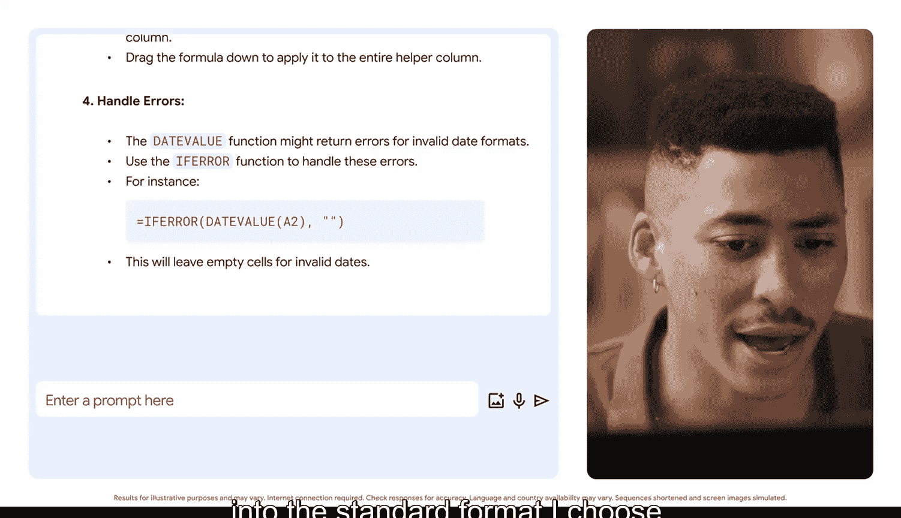

#  124：借助人工智能清洗与准备数据 🧹🤖

在本节课中，我们将学习如何利用人工智能工具来高效地清洗和准备数据，从而节省大量手动处理时间，为深入分析奠定坚实基础。

## 概述

数据清洗是数据分析中至关重要但耗时的一环。分析师通常需要花费大量时间处理不完整、格式错误或含义模糊的数据集。人工智能，特别是生成式AI工具，能够帮助我们自动化或指导完成许多这类繁琐任务，例如识别数据质量问题、标准化日期格式、检测重复项以及澄清字段名称。

## 数据清洗的挑战

你曾花费多少小时为分析准备数据？例如清理电子表格、修正错误数据、更改数据类型以确保准确性，或者重命名列。对于许多分析师而言，答案是相当多的时间。

在我们的领域，**干净的数据是任何分析的基础**。分析师通常会从利益相关者、外部供应商甚至旧代码和数据库中获取庞大、不完整且有时包含错误的数据集。对于每一份数据，我可能花费高达30%的时间来清洗、验证和准备分析。这个过程可能非常枯燥。

## 人工智能的助力

人工智能帮助我收回了部分时间，用于进行我真正热爱的深度分析工作。像Gemini这样的生成式AI工具可以帮助数据分析师识别数据质量问题、标准化日期格式、检测并移除重复项，以及在短时间内识别数据集中的潜在特征。

例如，Gemini可以提供实现高质量数据的详细流程。而借助更高级的工具，如Gemini for Google Workspace，我们可以授予其对数据集的访问权限，并让工具直接为我们完成更改。

## 实践思考

回想一个你最近处理过的数据集。它可以是本证书课程中的数据集，也可以是你最近完成的工作项目。如果需要，可以暂停视频，认真思考一下。

你在尝试清洗该数据时遇到的最常见问题是什么？是错误的数据类型、缺失的信息，还是含义不清的字段名称？如果人工智能能在你的一些提示下帮助解决所有这些问题呢？

## 实例演示

让我展示一个例子。假设我有一个描述每日销售数据的数据集。这个数据集的日期格式不一致。这很令人沮丧，对吧？我该如何修复它们呢？

我可以输入如下提示：

> “我收到了一个销售数据集，其中包含许多格式问题。具体来说，是日期格式不一致。我将输入一些通用日期作为示例。请描述在Google Sheets中专门用于清理和标准化日期格式的分步过程，以确保数据已准备好进行准确分析。”

现在，让我们看看输出结果。Gemini提供了如何识别数据中可能包含日期的列的步骤。然后，它提供了技巧，以便更容易找出哪些字段包含日期，以及如何选择一种标准格式，使所有日期都以相同的方式显示。它甚至提供了关于错误处理的说明，并让我知道将信息转换为我所选标准格式的最安全方法。

这很酷，对吧？人人都能获得干净的数据。

## 人工智能的潜力

在这个例子中，Gemini指导我们完成了清理和标准化日期格式的过程。但这只是生成式AI在数据分析中能力的冰山一角。许多企业级AI工具可以更进一步，自动化此类数据清洗任务。这可以节省宝贵的时间和资源，让你能够专注于战略决策等事务。

## 动手尝试

现在，请亲自尝试一下。玩耍和试验提示词是找出如何获得对你有用结果的最佳方式。打开一个你正在处理的数据集，看看生成式AI工具如何提供帮助。

有时，获得你想要的输出可能需要一个过程。到达目的地的唯一方法是适应、探索并学习适合你的路径。

## 总结

本节课中，我们一起学习了人工智能如何变革数据清洗流程。我们了解到，通过向AI工具提供清晰的提示，可以高效解决日期格式不一致等常见数据问题，从而将更多时间投入到有价值的分析工作中。关键在于积极尝试和探索，找到最适合你工作流的AI应用方式。