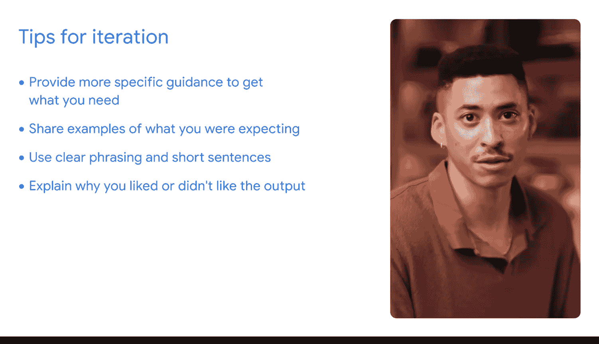

#  125：使用人工智能组织数据与构建公式 📊🤖

在本节课中，我们将学习如何利用生成式人工智能工具来高效地组织电子表格数据并构建公式。我们将通过一个具体的销售数据分析案例，演示从明确目标、构思提示词到迭代优化的完整工作流程。

## 概述

整理和维护一份结构清晰的电子表格需要投入大量时间。这包括组织数据、建立公式、创建数据透视表以及记忆复杂的菜单和格式。幸运的是，生成式人工智能工具不仅能帮助清理数据，还能协助组织数据。这意味着你可以将更多精力集中在深度分析上，减少在前期设置上的耗时，同时还能获得一份可供深入研究的、组织良好的数据集。

## 数据准备与目标设定

上一节我们介绍了利用AI工具的优势，本节中我们来看看如何开始一个具体的数据整理项目。

想象一下，我正在处理一个包含不同地区、不同时间段产品销售信息的数据集。我的目标是重构这些数据，以展示每个地区每种产品的月度销售摘要。

我选择这个例子是因为它与我最近在工作中遇到的一个情况类似，当时我依靠Gemini获得了帮助。我必须找到我们在美洲推出的一个新产品的月度销售增长数据，但原始数据只是电子表格中数据表的原始输出。

那么，我应该如何开始？
首先，我会打开我的电子表格，确保数据尽可能干净。我甚至可能会借助AI来帮忙。我会确认自己了解相关的字段名称和结构，并检查潜在的问题。

## 构思与提交初始提示

数据准备就绪后，下一步是向AI工具清晰地描述我们的任务。

然后，我会打开一个生成式AI工具。在这个案例中是Gemini，但同样的流程也适用于其他工具。我会开始构思提示词。和往常一样，我会专注于描述我希望模型执行的任务，添加上下文所需的足够细节，并提供任何必要的参考信息。

我可以输入这样一个提示词：
> “我在Google Sheets中有一个数据集，包含不同地区和不同时间段的产品销售信息。我的目标是重构数据，以展示每个地区每种产品的月度销售摘要。请帮助我构思开始这项工作前需要考虑的关键事项，并找出可能对此任务有用的具体公式。”

正如你所注意到的，我们从一个简单的提示词开始，描述了将销售数据重构为月度摘要的目标。我们不需要向Gemini提供任何代码或复杂的指令，只需对我们期望的结果进行清晰的解释。

## 评估AI的初步响应

现在，让我们查看Gemini的响应。可以把Gemini想象成一个项目顾问，指导我们完成关键的规划阶段。

我们可以看到，Gemini强调理解数据结构的重要性，并突出了一些关键字段。然后，Gemini推荐使用数据透视表作为此类数据转换的强大工具。它甚至建议了几个我们可以实施的有用公式。

从这个输出中，我特别喜欢的一个公式是 **`SUMIFS`**，它展示了如何根据我们设定的参数创建聚合。

请记住，我们的提示词越具体，输出结果就越好。在这个例子中，让Gemini知道我们正在使用Google Sheets，可以使响应针对该工具进行定制，这会让我们的工作轻松很多。

## 迭代优化提示词

记住提示词框架TCR EI，现在我们要将其中的“E”（评估）付诸实践。在理想情况下，Gemini会直接给出我组织数据集所需的一切，但我需要检查。

如果第一次的输出不完全符合我的期望，那么“I”（迭代）就会派上用场。很可能，我会希望迭代我的提示词，以获得更准确或更有用的结果，这取决于我的偏好。

提醒一下，迭代是通过反复的测试和调整周期来改进你的AI提示词和输出的过程。

以下是你可以记住的几个技巧：

*   **评估输出偏差**：当你评估你的提示词时，是否发现输出有任何不符合你预期的领域？如果是，可能有机会为AI工具提供关于你需求的更具体指导。记住，AI工具只能根据你告诉它的内容提供结果。因此，请确保你的提示词有足够的细节来获得有用的响应。
*   **提供参考示例**：回想一下我们提示词框架中的“R”（参考）。你能分享一个你期望结果的例子吗？在你的提示词中提供示例可以帮助AI工具理解你想要什么。如果你希望找到特定的格式或分析类型，可以向AI工具展示一个例子。
*   **检查措辞清晰度**：你的表达尽可能清晰了吗？尝试将你的指令分解成更短的句子。这可以帮助你在下一次改进输出。
*   **利用偏好反馈**：输出中有你喜欢的部分吗？例如，假设AI工具为你提供了五个头脑风暴的想法，而你喜欢其中两个。在你的下一个提示词中，解释你为什么喜欢那两个，并要求AI工具根据你的理由提供一个新的想法列表。你甚至可以指出你为什么不喜欢另外三个想法，并要求工具在下次也考虑到这一点。

## 迭代实践示例

那么，我将如何迭代我之前分享的提示词呢？
假设AI工具的响应只包含关于数据透视表的一般信息，而我想了解更多。我可能需要包含输入数据的字段名称，或者指定我希望在数据透视表中包含数据的哪些字段。

或者，如果响应没有包含关于自变量与因变量（分别对应我们数据透视表的行和列）的具体信息，我可能会添加上下文，以便这些信息也出现在我的输出中。

通过有效的提示词构思和创造性的迭代，我可以与Gemini合作，为组织我的销售数据开发一个流程。而像Gemini和Google Sheets这样的更高级的AI工具，甚至可以超越流程建议，直接为你生成数据透视表，甚至提供多个选项供你选择。

## 总结

本节课中，我们一起学习了如何利用生成式AI工具来组织数据和构建公式。我们从明确一个具体的销售数据分析目标开始，演示了如何构思清晰的初始提示词。接着，我们评估了AI的响应，并将其视为项目顾问的建议。最后，我们深入探讨了迭代优化提示词的技巧，包括提供更具体的指导、分享参考示例、优化措辞以及基于偏好进行反馈，从而逐步获得更符合期望、更实用的输出结果。通过这套方法，你可以让AI成为处理电子表格数据的强大助手，从而专注于更有价值的分析工作。