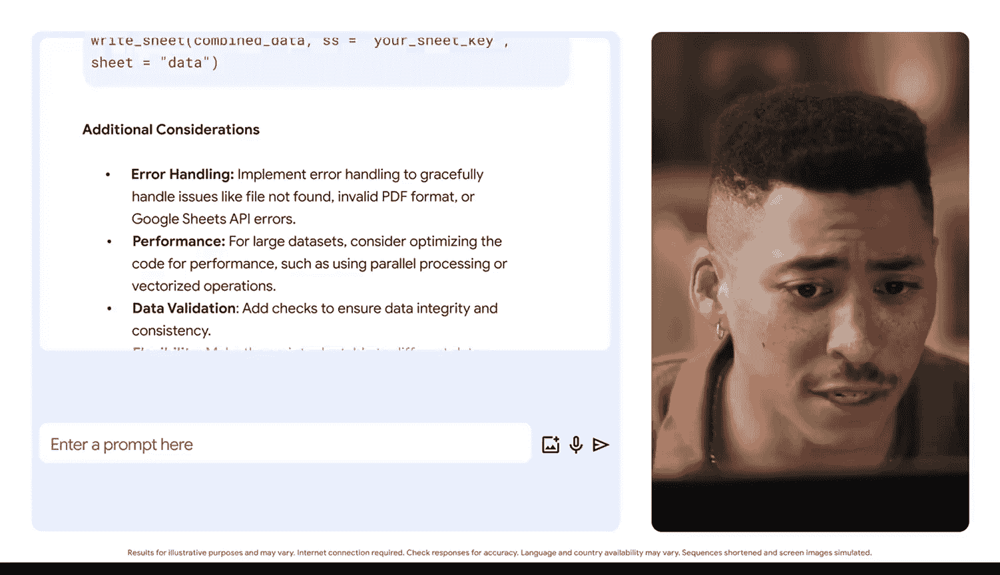

#  128：借助人工智能优化R代码

在本节课中，我们将学习如何利用人工智能工具来优化R语言编程工作流。我们将探讨AI如何辅助代码生成、调试以及处理多源数据，从而提升数据分析的效率和准确性。

## 🛠️ 代码生成与优化

编写代码有时会感觉像在迷宫中穿行。生成式人工智能可以帮助解决这个问题。

作为数据分析师，你可能需要清理和转换数据集。你可以提示Gemini或其他AI工具来生成初始的R脚本。

例如，你可以提示AI工具：“生成一个R脚本，用于读取CSV文件并通过移除空值来清理数据。”

AI可以提供一个结构良好的脚本，然后你可以对其进行优化。这可以为像我们这样的数据分析师节省时间，并有助于提高工作的准确性。

## 🔍 调试与错误修正

调试代码是AI真正大放异彩的另一个领域。常见的R错误，如语法错误或逻辑错误，可以借助AI快速识别和纠正。

例如，如果你在运行脚本时遇到错误，可以向AI工具描述该问题，它会建议可能的解决方案。

所以，如果你在尝试合并两个数据框时遇到错误，AI可能会指出你可能遗漏了列名或使用了错误的函数。

你可以开始理解AI如何减少你的调试时间。

## 🔗 处理多源数据

我们的优势之一是处理来自各种来源的数据。AI可以通过生成代码来读取和聚合数据，从而帮助简化这个过程。

例如，你可能需要从CSV文件、数据库和API读取数据。通过提示AI工具，你可以获得一个从这些来源读取数据并将其合并到单个数据框中的脚本。

那么，我该如何构建一个提示来应对这样的挑战呢？

我可以尝试写一个这样的提示：“我是一名具有R语言基础知识的初级数据分析师。我需要帮助创建一个R脚本的基本框架，用于自动从各种来源（即PDF和Google Sheets）加载数据。我希望代码能扫描每个文档，组织数据，并生成一个不包含重复数据的、组织良好的Google Sheet。”

除了提供基本框架，Gemini还要求澄清数据结构、来源之间的一致性以及其他元素。该模型生成了一个R脚本的基本框架，用于自动化数据加载、清理和合并过程，并附有解释以帮助构建它。此外，它还提供了一些我应该考虑的问题的提示。

还不错，只需一个提示，我就得到了R编码方面的一些帮助。

## 💡 总结与行动建议

将生成式AI集成到你的R工作流中不仅仅是关于效率，也是关于赋能。你可以处理更复杂的项目并发现更深入的见解。

请记住，你不需要成为R专家也能利用AI的力量。只需开始尝试。

就像任何新技术一样，我们都需要尝试、测试和探索，以学习如何使用AI。

我很高兴能分享一些我作为数据专业人士在工作中使用AI的方式，从帮助数据清理到为数据可视化构思想法。

我希望这能帮助你开始在你的角色中使用AI。

我给你的挑战是：思考你已经在做的工作。是否有某件事花费了你大量时间？或者某个项目你需要一些想法来开始？承诺尝试使用AI来完成一些对你和你的工作真正有影响的事情。