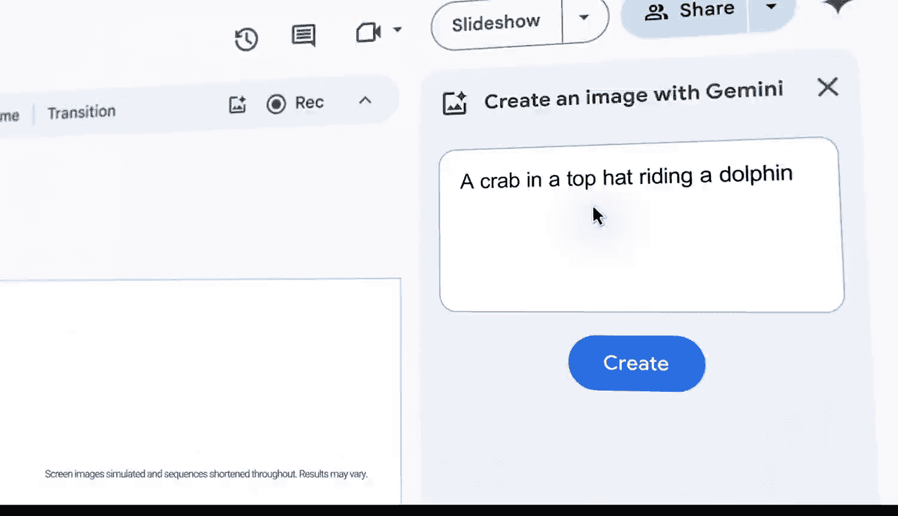

#  129：课程介绍与概述

在本节课中，我们将学习谷歌人工智能基础课程的核心内容与结构。课程旨在为初学者构建一个清晰的学习路径，从商业智能基础到利用人工智能进行决策。

## 课程概述

本课程围绕商业智能与人工智能的应用展开。课程分为三个主要部分：**商业智能基础**、**洞察路线**以及**决策制定**。每一部分都旨在帮助学习者理解如何利用数据驱动业务决策。

## 课程核心模块

以下是本课程的三个核心模块：

1.  **商业智能基础**
    此模块介绍商业智能的基本概念，包括数据收集、处理与初步分析。目标是建立对数据价值的基本认识。

2.  **洞察路线：模型与管道**
    上一节我们介绍了数据基础，本节中我们来看看如何从数据中提取洞察。此模块深入探讨构建分析模型和数据管道的方法，将原始数据转化为可操作的见解。

3.  **决策：数据看板**
    在获得洞察之后，关键在于如何利用它们。本模块重点介绍如何通过创建数据看板来可视化信息，从而支持高效、准确的商业决策。

## 核心概念与工具

课程中会涉及一些核心的技术概念，它们通常通过以下形式进行描述：

*   **公式**：例如，一个简单的线性回归模型可以表示为 `y = β₀ + β₁x + ε`，用于预测变量之间的关系。
*   **代码**：在演示数据处理步骤时，可能会使用类似 `df.groupby(‘category’).mean()` 的伪代码来展示如何按类别对数据进行分组并计算平均值。

## 学习目标

完成本课程后，学习者应能够理解商业智能的工作流程，知晓如何构建从数据到洞察的管道，并掌握利用数据看板辅助决策的基本方法。

---

本节课中我们一起学习了谷歌人工智能基础课程的整体框架与核心模块。课程从BI基础出发，经过洞察路线的模型与管道构建，最终落脚于通过数据看板进行决策，为初学者提供了一条完整的数据驱动决策学习路径。