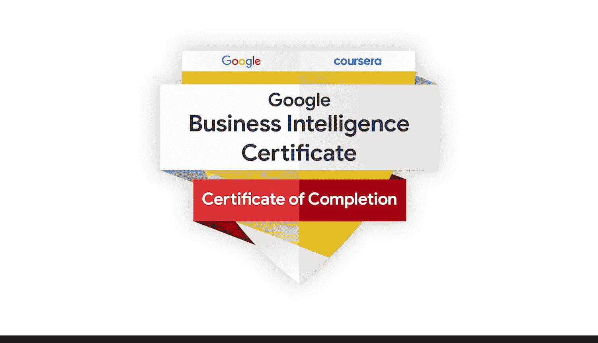

#  130：课程完成与展望

在本节课中，我们将回顾整个谷歌商业智能证书课程的完成，并展望未来的职业发展路径。

## 课程完成祝贺

带领大家完成本项目的最后部分，是一段非常美好的经历。我们知道你已经为开启一段精彩的职业生涯做好了充分准备。我们所有人都非常高兴能与你分享这段学习旅程，并迫不及待地欢迎你加入商业智能的世界。

恭喜你，你完成得非常出色。我们为你感到无比自豪。祝贺你成功完成了整个课程项目，你做得非常棒，我们认为你已经为成功做好了准备。

## 获取你的证书

现在，剩下要做的就是领取你的谷歌商业智能证书。你可以将这份证书展示在你的简历和领英个人资料中。

这份证书代表了你为完成这个项目所付出的所有辛勤努力。你取得了巨大的成就，并展现了对该领域的认真投入。

## 持续学习与职业发展

因此，请保持好奇心。毕竟，学习不会在此停止。当你进入这个新时代，请务必跟上商业智能的发展趋势。与同行建立联系。持续更新你的职业材料。

现在，请花些时间来庆祝你的成就。这是你应得的。

---

**本节课总结**

本节课中，我们一起庆祝了谷歌商业智能证书课程的完成。我们回顾了你的努力与成就，领取了代表学习成果的证书，并探讨了如何保持学习、紧跟行业趋势以及规划未来的职业发展。恭喜你成功完成课程，开启了商业智能领域的专业旅程。