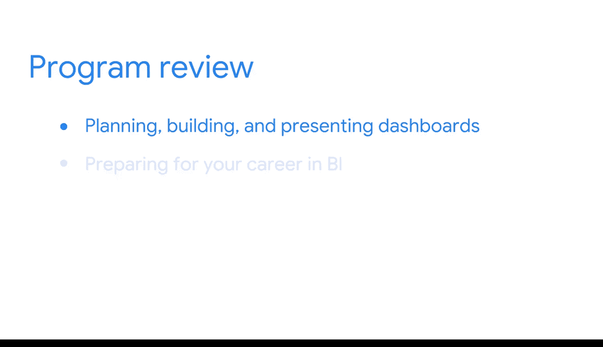
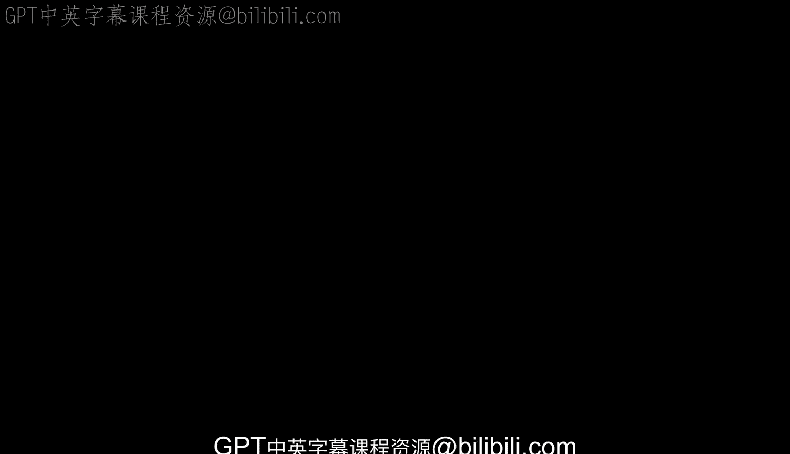

#  131：项目总览回顾 🎉

在本节课中，我们将回顾整个谷歌商业智能职业证书课程的学习历程与核心成就。课程涵盖了从商业智能基础到数据建模、管道构建，再到数据看板设计与展示的完整知识体系。

## 课程成就与价值 💼

你刚刚获得了谷歌商业智能职业证书。这是一项巨大的成就，表明你为未来投入了学习新技能。

现在你已获得商业智能认证，你的证书可以在领英、Indeed和Glassdoor等求职平台上展示。同时，请务必通过谷歌的雇主联盟，与渴望招聘你所在领域人才的公司建立联系。

正如你在项目开始时所学到的，市场对商业智能专业人才的需求正以惊人的速度增长。凭借你已掌握的技能和知识，你可以在这个高增长、高影响力的领域中不断探索商业智能相关职位，以推动你的职业发展。

## 课程核心内容回顾 📚

接下来，让我们回顾你在整个项目中取得的所有成就。

### 第一阶段：商业智能基础

你从探究商业智能的基础开始。在此阶段，你发现了商业智能专业人员在组织内扮演的角色和发挥的功能。随后，你学习了商业智能工具、它们能揭示的洞察类型，以及**上下文**在商业智能项目中的重要性。

### 第二阶段：数据建模与管道

在下一门课程中，你探索了数据建模以及数据库的设计方式。你学习了如何创建管道，将数据移动到需要的位置。你还发现了用于数据库和管道系统的**优化技术**，以保持团队工作流程的顺畅运行。

### 第三阶段：数据看板与决策

最后，在这最后一门课程中，你专注于构建数据看板以监控随时间变化的数据。你在特定场景中构建了图表和数据看板来回答业务问题。然后，你学习了如何向利益相关者展示你的工作。最后，你完成了作品集并为求职面试流程做好了准备。

## 总结与展望 🚀

这是一项极其大量的工作，显然你已经准备好开启一段激动人心且回报丰厚的职业生涯。走出去，在商业智能的世界里发挥你的影响力吧。

在本节课中，我们一起回顾了谷歌商业智能证书课程的全貌，从基础概念、核心工具与技术，到最终的成果展示与职业准备。你已掌握了开启商业智能职业生涯所需的关键技能与知识。