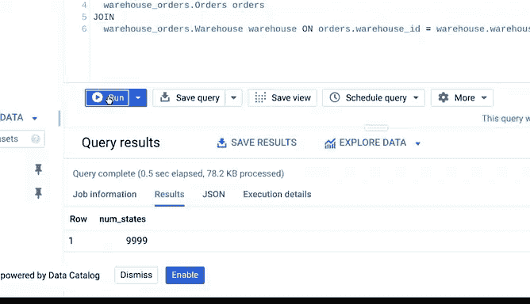
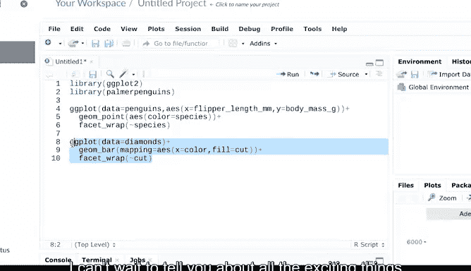
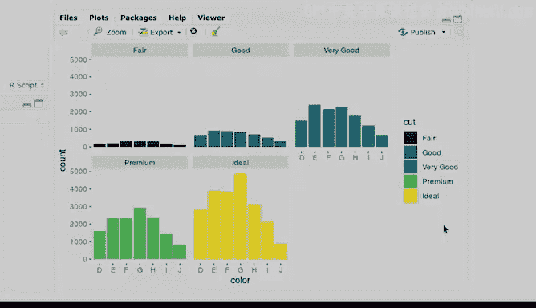
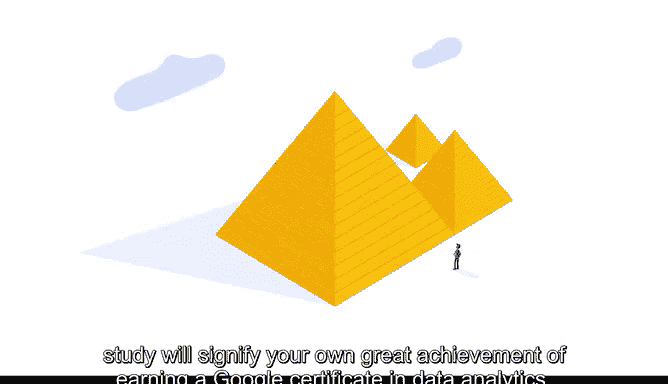

# 001：欢迎加入谷歌数据分析证书课程 🎉

在本节课中，我们将要学习数据分析的基础概念，了解数据在当今世界的重要性，并预览整个谷歌数据分析证书课程的结构与内容。无论你来自何种背景，这都是开启数据分析职业生涯的绝佳起点。

## 无处不在的数据 🌐

电子商务、娱乐、医疗保健、制造业、市场营销、金融、科技以及数百个其他行业的企业有什么共同点？答案是它们都使用数据。

各类组织都需要数据分析师来帮助其改进流程、识别机会与趋势、推出新产品、提供优质的客户服务以及做出明智的决策。

## 什么是数据与分析？🔍

数据是事实的集合。这个集合可以包括数字、图片、视频、文字、测量值、观察结果等等。

一旦拥有了数据，分析便通过处理使其发挥作用。**数据分析**是为了得出结论、进行预测和推动明智决策，而对数据进行收集、转换和组织的过程。这个过程不会停止，因为数据会随时间演变，这意味着分析能在数据的整个生命周期中持续提供新信息。

**公式表示：**
`数据分析 = 收集(数据) + 转换(数据) + 组织(数据) → 结论 + 预测 + 决策`

## 数据就在我们身边 📱

你每天都在使用和创造数据。例如，在决定是否购买某产品前阅读评论，这就是数据分析。佩戴健身追踪器计算步数以保持全天活跃，这也是数据分析。

你不仅使用数据，每天还创造着海量数据。每次使用手机、在线搜索、流媒体听音乐、用信用卡购物、在社交媒体发帖或使用GPS规划路线，你都在创造数据。我们的数字世界及其内部数以百万计的智能设备，使得可用数据的数量达到了惊人的规模。

以下是数据规模的例子：
*   谷歌每秒处理超过 **40，000** 次搜索。
*   每天 **35亿** 次搜索。
*   每年 **1.2万亿** 次搜索。

如果YouTube用户组成一个国家，它将是世界上人口最多的国家。《经济学人》杂志最近称数据为“世界上最有价值的资源”。因此，数据分析师受到组织的高度重视也就不足为奇了。

## 数据分析师做什么？💼

简而言之，数据分析师是收集、转换和组织数据，以帮助做出明智决策的人。

除了角色本身，成为数据分析师最令人兴奋的部分之一是大量的工作机会。市场对数据分析师的需求远大于合格人才的数量。本证书课程是你迈向心仪工作的绝佳第一步。

数据分析师来自不同的背景，拥有各种各样的生活经验。你不需要数十年的工作经验或昂贵的教育就能入门。许多数据分析师都是自学了获得第一份工作所需的技能，就像你现在正在做的一样。

## 课程内容与结构 📚

谷歌数据分析证书根据数据分析的不同流程划分为多个课程，即：**提问、准备、处理、分析、分享和行动**。

建议按顺序观看视频。每个视频涵盖一个新主题，且每个主题都建立在你之前所学的基础上，便于你跟踪进度。学习节奏由你掌控，所有内容都可以按照你自己的步调完成。

在课程结束时，你将运用所学知识完成一个项目，用于在面试中向招聘经理展示你的技能。

在学习过程中，你还将听到来自谷歌员工（我们称之为Googlers）的分享。他们将为你提供行业内部视角，分享他们进入该领域的个人故事，并提供一些关于如何获得理想工作的优秀建议。

## 来自谷歌团队的问候 👋

以下是将在后续课程中指导你的部分谷歌专家：

*   **Angie**（工程项目经理）：坚信数据清洗是数据的核心与灵魂。
*   **Alex**（研究科学家）：研究人工智能对社会和用户的不同影响。
*   **Liah Jones**（云团队）：领导团队帮助客户上云。
*   **Evan**（学习产品组合经理）：负责将影响大数据的不同技术整合到本课程等培训中。
*   **Tony**（项目经理，本课程讲师）：将引导你完成第一个课程的每个模块。
*   **Ka**（财务分析师）：将帮助你学习如何对数据、项目和待解决的问题提出正确的问题。
*   **Hallally**（分析团队负责人）：将展示如何准备数据以进行分析。
*   **Sally**（测量与分析负责人）：将共同介绍如何处理和清洗数据。
*   **Aana**（全球洞察经理）：将深入探讨分析，教你如何收集、转换和组织数据以发现有用信息。
*   **Kevin**（分析总监）：将指导你完成数据分析过程中最令人兴奋的部分——规划、创建和呈现有效且引人注目的数据可视化。
*   **Carrie**：将告诉你如何使用编程语言R完成各种激动人心的事情。
*   **Rishi**（全球分析技能课程经理）：将通过创建一个能让任何招聘经理眼前一亮的案例研究，帮助你整合在本课程中学到的一切。

## 准备好启程了吗？ 🚀

你是否对成为数据分析师、探索数据的无限潜力感到兴奋？你即将进入一个全新的世界。

我们开始吧！

---

**本节课总结：**
我们一起学习了数据的基本定义及其在当今世界的普遍性与价值，明确了数据分析师的角色和职责，并预览了整个谷歌数据分析证书课程的结构与教学团队。你已经迈出了进入数据分析世界的第一步。