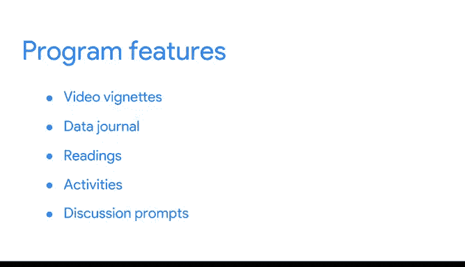

# 002：数据，数据，无处不在》课程简介 🧩

在本节课中，我们将要学习数据分析的基础概念，了解数据如何成为决策的基石，并预览整个课程的结构与学习方式。

---

没有黏土，我无法制造砖块。这是谁说的？给你一个提示：说这句话的人并非著名的科技公司CEO或数据分析师。他生活在科技公司出现之前。但你很可能听说过他。这句话出自夏洛克·福尔摩斯之口，他是阿瑟·柯南·道尔爵士笔下的著名侦探。

道尔的意思是，福尔摩斯如果没有数据（即他提到的黏土），就无法得出任何结论（即他提到的砖块）。你可能并非想成为世界著名的侦探，但数据仍将是你作为数据分析师职业生涯中一切工作的基础。夏洛克·福尔摩斯会同意这一点。通过开始这个课程，你已经证明你和福尔摩斯有一个共同点：你们都渴望学习更多知识。这是数据分析师可以拥有的最重要品质之一。

探索数据有多种不同方式，但数据分析的一大优点是，你通常可以按照自己想要的方式和时间来学习。这可能意味着进行自己的研究、与业内人士交流，或参加在线课程。话虽如此，欢迎来到你的第一门课程。这是你进入精彩数据分析世界的入门介绍。

既然数据分析是数据的科学，你将通过这门课程开始学习关于数据的一切。**数据本质上是事实或信息的集合**。通过分析，你将学习如何利用数据得出结论、做出预测和决策。

就我个人而言，我并非直接进入数据分析领域。我曾认为数据分析是计算机工程师的工作。相反，我最初梦想在金融领域工作。然而，在一次实习之后，我意识到那并非我想走的职业道路。我开始学习财务规划与分析，以及财务分析师如何利用数据开展工作。我认识到，财务分析师本质上就是在财务部门工作的数据分析师。这些分析师通过懂得如何使用数据来帮助指导商业决策。那时，我意识到了数据的强大力量，并开始拥抱它。很快，我意识到我自己也能进行这种数据分析。

数据分析是一个充满机遇的广阔开放世界。你的分析技能可以应用于众多领域，并以各种不同的方式发挥作用。😊

如果你是这个领域的新手，你将学习如何识别行业中哪条路径最适合你的技能和兴趣。对于那些已有一些经验的学习者，我们将帮助你打开通往新的、令人兴奋的机会的大门。

你将从本课程中获得的一项技能是，如何遵循分析师用来帮助做出数据驱动决策的最佳实践。计算机是这个过程的一部分，但分析师依赖的远不止于此来做出决策。这就是为什么学习如何进行分析性思考，并在工作中运用你的其他技能和特质，将使你的工作更轻松。😊

我知道你已经知道如何做出好的决策。毕竟，你选择来到这里。

在这第一门课程中，你将详细了解数据分析过程的每个阶段：**提问、准备、处理、分析、分享和行动**。作为一名数据分析师，当你使用数据为决策提供信息时，你将经历这些步骤。最终，你会发现这个课程本身在某种程度上也是这个过程的一个版本。

虽然我知道你会喜欢观看这些视频，但你在第一门课程中的旅程将包含更多内容。其他视频将以短片形式呈现，你将向已在职业生涯中立足的数据分析专业人士学习。😊 他们将提供智慧之言，以及他们职业生涯起步时的经验故事。

你将开始自己的**数据日志**，帮助你记录在整个课程中学到的内容。你还将在整个课程中添加自己对所学内容的思考。你将阅读如何在这个数据分析世界中驾驭本课程，完成各项活动，包括一些帮助你进入数据分析师思维模式的活动。

在此过程中，你还将有机会与你的学习伙伴们建立联系。讨论提示将给你一个机会分享你的想法，同时了解你的同伴对你所学内容的看法。

这些提示将帮助你建立一个贯穿整个课程的社区支持系统。

好了，说得够多了。让我们开始这段激动人心的旅程吧，你的下一步正在等待着你。

---

本节课中我们一起学习了数据分析的基础重要性，了解了数据是决策的基石，并预览了整个课程的结构、学习资源以及社区互动方式。我们认识到，像福尔摩斯一样，数据分析师需要数据来构建结论，而本课程将引导我们掌握提问、准备、处理、分析、分享和行动这一完整的数据分析流程。