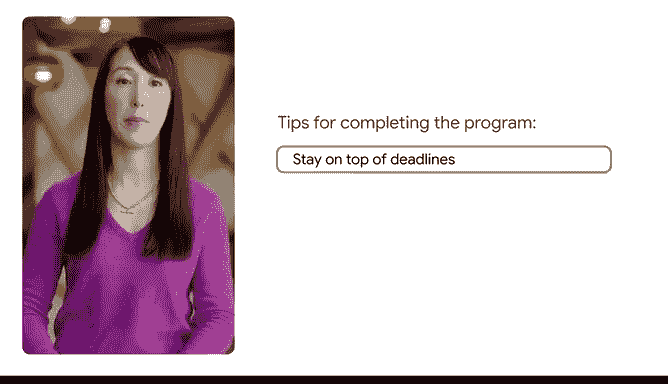
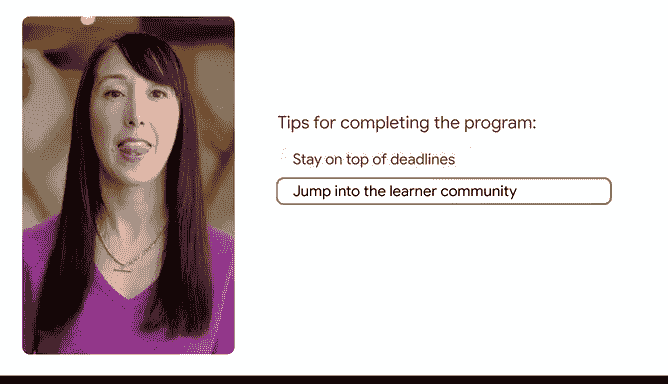
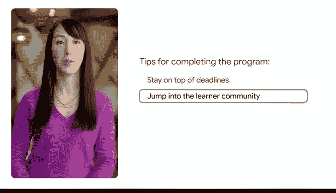
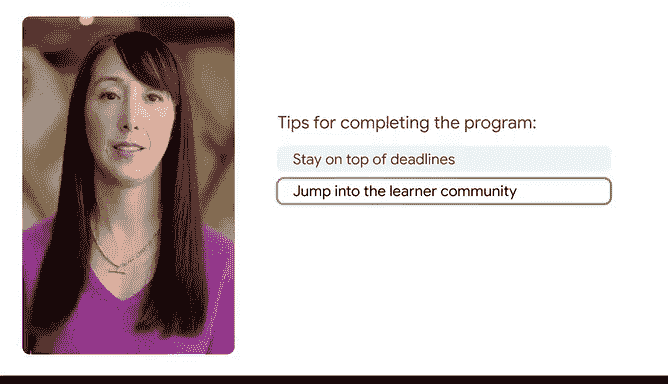

# 003：开启您的谷歌数据分析证书之旅 🚀

在本节课中，我们将了解谷歌数据分析师证书项目的概况、完成后的收获，以及如何高效学习并成功完成课程。

---

## 概述

我是来自“与谷歌共成长”团队的阿曼达。我们是谷歌职业证书项目背后的团队。我们很高兴你决定攻读数据分析证书。谷歌的专家们创建了这个项目，旨在帮助你培养为就业做好准备的技能。完成证书后，你将加入一个由超过100万名毕业生组成的社区，他们正在开启新的职业生涯，并且你将立即解锁帮助你开启职业生涯的资源。

## 完成证书后的收获

完成谷歌数据分析师证书后，你将获得以下专属资源：

*   **行业认可的证书**：获得一份谷歌颁发的、受行业认可的证书，可以添加到你的简历和领英等职业档案中。
*   **求职支持**：我们将在你求职过程中提供支持。我们知道寻找新工作涉及很多方面。因此，在证书项目结束时，你将找到一门课程，向你展示使用人工智能简化求职过程的具体方法。
*   **人工智能辅助**：在人工智能的帮助下，你将识别自己的可转移技能，为不同职位更新简历，并进行面试练习。
*   **额外福利（美国学员）**：对于美国的学员，你可以免费注册一对一职业辅导，并通过Career Circle访问数千个职位发布。

这些宝贵的资源专为谷歌职业证书毕业生提供。

## 成功完成课程的建议

好的开始是确保你完成项目并获取这些资源的最佳方式。以下是我们为你提供的几条重要建议，助你顺利抵达终点线。

以下是帮助你成功完成课程的三条核心建议：

1.  **严格遵守截止日期**：尤其是在最初的几周。做到这一点的学员完成证书的可能性几乎是其他人的两倍。
2.  **立即加入学习者社区**：这是一个获取建议和与像你一样的其他学习者建立联系的好地方。拥有这个社区作为遇到困难时可以求助的资源，能显著提高你的成功几率。
3.  **遇到挑战时不要气馁**：挑战总会发生。记住你来到这里的原因，充分利用可用的支持，并相信只要坚持不懈，你一定能成功。

## 获取最新信息

为了获取谷歌关于职业建议、如何使用人工智能以及新课程通知的最新信息，请订阅我们的新闻通讯，地址是：grow.google/updates。

我们祝愿你在这段激动人心的旅程中一切顺利。我们期待在你获得谷歌职业证书的过程中为你提供支持。

---

## 总结

本节课中，我们一起学习了谷歌数据分析师证书项目的价值、完成后的具体收获，以及三条帮助你高效学习并成功结业的核心建议。记住利用好课程提供的资源和支持，保持学习节奏，你就能顺利开启数据分析领域的职业生涯。