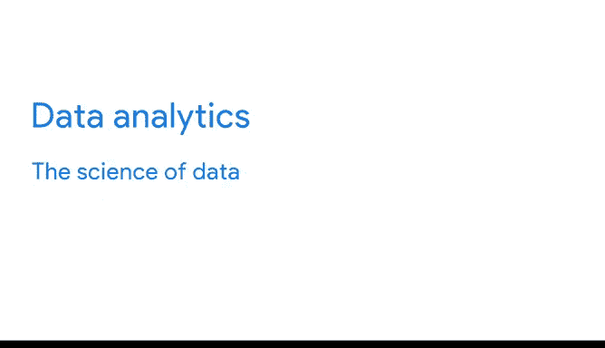

# 006：什么是数据生态系统 🌐

在本节课中，我们将要学习数据生态系统的概念，了解数据分析在其中扮演的角色，并澄清一些数据分析领域中常见的误解。

你已经了解了数据分析师的工作，以及本课程将如何帮助你为未来的职业生涯做好准备。现在，我们来探索数据生态系统，看看数据分析如何融入这个系统，并梳理一些你可能会在该领域遇到的常见误解。

---

## 什么是数据生态系统？ 🤔

简单来说，生态系统是一组相互作用的元素集合。生态系统可以很大，如热带雨林或澳大利亚内陆；也可以很小，如水坑里的蝌蚪或皮肤上的细菌。就像澳大利亚内陆的袋鼠和考拉一样，数据也存在于它自己的生态系统中。

数据生态系统由各种相互作用以**生产、管理、存储、组织、分析和共享数据**的元素组成。这些元素包括硬件、软件工具以及使用它们的人——比如你。

数据也可以存在于所谓的“云”中。云是一个在线存储数据的地方，而不是存储在计算机硬盘上。这意味着数据不是存储在组织内部的网络中，而是通过互联网访问。因此，“云”只是我们用来描述这个虚拟位置的术语。

---

## 数据分析师在生态系统中的角色 ⚙️

云在数据生态系统中扮演着重要角色。作为一名数据分析师，你的工作是利用数据生态系统的力量，找到正确的信息，并为团队提供分析，帮助他们做出明智的决策。

以下是几个数据生态系统如何运作的例子：

*   **零售业示例**：你可以接入零售店的数据库，这是一个充满客户姓名、地址、历史购买记录和客户评价的生态系统。作为数据分析师，你可以利用这些信息来预测这些客户未来的购买行为，并确保商店在需要时有库存产品。
*   **人力资源示例**：人力资源部门使用的数据生态系统可能包括来自招聘网站的职位发布信息、当前劳动力市场统计数据、就业率以及潜在员工的社交媒体数据。数据分析师可以利用这些信息帮助团队招聘新员工，并提高员工敬业度和保留率。
*   **农业与环境示例**：农业公司经常使用包含地质模式和天气变化信息的数据生态系统。数据分析师可以利用这些数据帮助农民预测作物产量。一些数据分析师甚至利用数据生态系统来拯救真实的环境生态系统。例如，在斯克里普斯海洋学研究所，世界各地的珊瑚礁被数字化监控，以便观察生物如何随时间变化、追踪其生长并测量单个群体的增减。

可能性是无穷无尽的。

---

## 澄清常见误解 🧐

现在，我们来讨论一些你可能会遇到的常见误解。

**首先是数据科学家与数据分析师的区别**。两者很容易混淆，但他们的工作实际上非常不同。

*   **数据科学**被定义为利用原始数据创建新的建模和理解未知事物的方法。
*   **一个很好的理解方式是**：数据科学家利用数据**创造新的问题**，而数据分析师则通过从数据源中提取洞察来**回答现有问题**。

**其次，是数据分析与数据科学的区别**。在本课程中，你还会听到许多容易混淆的词语和短语。例如，“数据分析”和“数据科学”听起来相似，但它们实际上是两个不同的概念。

*   **数据分析**：你已经学过，数据分析是**收集、转换和组织数据以得出结论、做出预测并推动明智决策的过程**。
*   **数据科学**：用最简单的话说，数据科学是**关于数据的科学**。它是一个非常广泛的概念，涵盖了从管理和使用数据的工作，到数据工作者每天使用的工具和方法等一切。

因此，当你思考数据、数据分析和数据生态系统时，重要的是要理解所有这些都包含在**数据科学**这把大伞之下。

---

## 总结与展望 📈

本节课中，我们一起学习了数据生态系统的构成，明确了数据分析师在其中的核心作用，并澄清了数据科学家与数据分析师、数据分析与数据科学之间的关键区别。

现在，你对数据生态系统以及数据分析和数据科学之间的区别有了更多了解，接下来就可以探索数据如何被用于做出有效决策了。你将有机会看到数据驱动决策的实际应用。