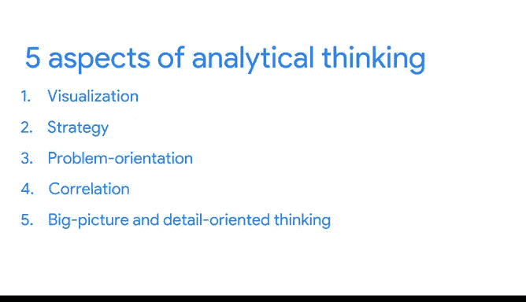

# 010：解析分析性思维 🧠

在本节课中，我们将要学习分析性思维的具体内涵。上一节我们介绍了数据分析师的五项基本技能，本节中我们来看看分析性思维包含哪些关键方面。

分析性思维是指以系统化、分步骤的方式，通过识别和定义问题，并利用数据来解决问题。

作为数据分析师，我们如何进行这种思考呢？为了回答这个问题，我们将介绍分析性思维的五个关键方面。

以下是分析性思维的五个关键方面：

1.  **可视化**
2.  **策略性**
3.  **问题导向**
4.  **相关性**
5.  **宏观与细节导向思维**

## 1. 可视化 📊

可视化是信息的图形化表示。在数据分析中，可视化至关重要，因为它能帮助分析师更有效地理解和解释信息。

例如，向他人解释大峡谷时，展示一张图片远比单纯用语言描述要高效得多。可视化能更快地传达要点。

## 2. 策略性 🎯

面对海量数据，具备策略性思维对于保持专注和方向至关重要。策略性思维帮助数据分析师明确希望通过数据达成的目标以及实现路径。

通过制定策略，我们能提升所收集数据的质量和实用性，确保所有数据都能为实现目标服务。

## 3. 问题导向 ❓

数据分析师采用问题导向的方法来识别、描述和解决问题。其核心是在整个项目过程中始终将问题置于首位。

例如，如果分析师被告知仓库持续缺货的问题，那么无论采取何种策略和流程，首要目标始终是解决库存上架的问题。

数据分析师还会提出大量问题。这有助于改善沟通，并通过专注于解决方案来节省时间。例如，通过调查客户对产品的使用体验，并从这些问题中构建洞察以改进产品。

## 4. 相关性 🔗

分析性思维的第四个方面是识别两个或多个数据片段之间的相关性。相关性就像一种关系。

你可以在数据中发现各种相关性。也许是头发长度与所需洗发水量之间的关系，也可能是多雨季节导致雨伞销量上升的关联。

但在开始识别数据相关性时，有一点必须始终牢记：**相关性不等于因果关系**。

换句话说，仅仅因为两个数据片段呈现相同的趋势，并不必然意味着它们之间存在直接关联。我们将在后续课程中深入探讨这一点。

## 5. 宏观与细节导向思维 🧩

分析性思维的最后一块拼图是宏观思维。这意味着既要能看到全局，也要能关注细节。

拼图游戏是一个很好的类比。宏观思维就像看一幅完整的拼图，你可以欣赏整体画面，而不会纠结于构成它的每一小块。如果只关注单个碎片，你将无法超越局部视野。

因此，宏观思维非常重要，它能帮助你“拉远镜头”，看到各种可能性和机会，从而激发令人兴奋的新想法或创新。

另一方面，细节导向思维则是要弄清楚所有有助于执行计划的方面，也就是构成你拼图的每一块碎片。

商业世界中的各种问题都能受益于同时具备宏观和细节导向思维的员工。大多数人天生更擅长其中一种，但你始终可以培养将两者结合起来的技能。

---

本节课中我们一起学习了分析性思维的五个方面：**可视化**、**策略性**、**问题导向**、**相关性**以及**宏观与细节导向思维**。当你处理数据时，可以运用这些思维方式。随着课程的深入，你将学习如何具体应用它们。