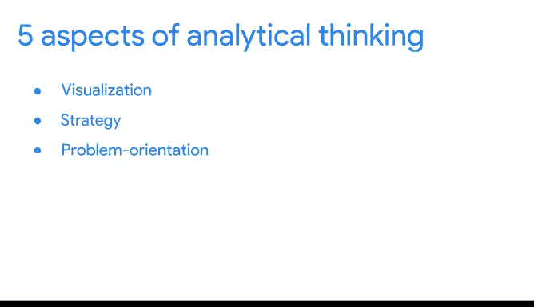
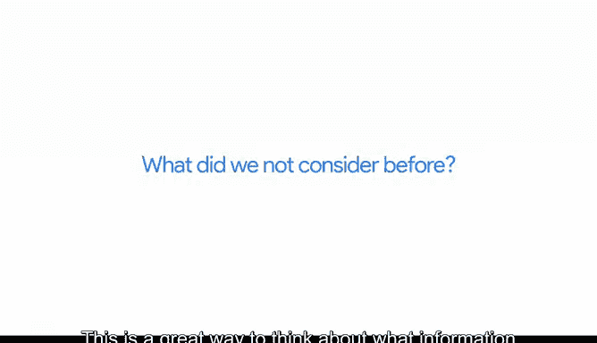

# 011：探索核心分析技能 🧠

在本节课中，我们将要学习数据分析师在解决问题时如何思考与提问。我们将回顾分析性思维的关键方面，并深入探讨几个核心的提问技巧，这些技巧能帮助你发现问题的根本原因、识别流程中的差距，并思考可能被忽略的因素。

---

## 回顾分析性思维

上一节我们介绍了分析性思维的五个关键方面：**可视化**、**策略**、**问题导向**、**相关性**以及**宏观与细节思维**的结合。

我们了解到，你已经在日常生活中运用了这些思维方式。同时，不同的人天生倾向于使用某些类型的思维，但你完全可以培养和发展那些对你来说不那么容易掌握的技能。

这意味着你可以成为一个**多才多艺的思考者**，这是数据分析中非常重要的一部分。你可能天生是一个分析型思考者，但也可以学会创造性和批判性地思考，并在这三个方面都表现出色。

😊 你掌握的思维方式越多，就越容易跳出思维定式，产生新颖的想法。

---

## 为何需要不同的思维方式？

但为什么以不同方式思考很重要呢？因为在数据分析中，解决方案几乎不会直接呈现在你面前。你需要**批判性思考**来找出正确的问题，同时也需要**创造性思考**来获得新颖且意想不到的答案。

---

## 数据分析师的核心提问技巧

以下是数据分析师在寻找解决方案时经常提出的一些问题示例。

### 1. 问题的根本原因是什么？

**根本原因**是问题发生的原因。如果我们能识别并消除根本原因，就能防止问题再次发生。

理解根本原因的一个简单方法是使用一个叫做 **“五问法”** 的过程。在五问法中，你通过连续问五次“为什么”来揭示根本原因。第五个（也是最后一个）答案通常会给你带来一些有用且有时令人惊讶的见解。

以下是一个五问法的实践示例：

假设你想做一个蓝莓派，但找不到蓝莓。你试图通过提问来解决问题：**为什么我不能做蓝莓派？**

*   **第一次问为什么**：答案：商店里没有蓝莓。
*   **第二次问为什么**：为什么商店里没有蓝莓？答案：这个季节蓝莓灌木的果实不够。
*   **第三次问为什么**：为什么果实不够？答案：鸟儿吃掉了所有的浆果。
*   **第四次问为什么**：为什么鸟儿会吃蓝莓？（它们通常更喜欢吃桑葚）答案：因为桑树今年没有结果，所以鸟儿改吃蓝莓了。
*   **第五次问为什么**：为什么桑树没有结果？答案：一场晚霜冻坏了桑树。

😊 所以，你不能做蓝莓派是因为几个月前的一场晚霜。看，五问法可以揭示一些非常令人惊讶的根本原因。这是一个需要了解的好技巧，在数据分析中也是一个非常有帮助的过程。

---

### 2. 我们流程中存在哪些差距？

对于这个问题，许多人会使用一种叫做 **“差距分析”** 的方法。差距分析让你检查和评估当前流程的运作方式，以便达到你未来想要的状态。

企业进行差距分析是为了做各种各样的事情，例如改进产品或提高效率。

差距分析的一般方法是：**理解你当前的状况与你期望的未来状况之间的差距**。然后，你可以识别当前状态和未来状态之间存在的差距，并确定如何弥合它们。

---

### 3. 我们之前没有考虑什么？

这是一个很好的思考方式，用于思考流程中可能缺失了哪些信息或步骤，从而找出方法，以便在未来做出更好的决策和制定更佳的策略。

---

## 总结

本节课中，我们一起学习了数据分析师如何通过特定的提问方式来驱动分析过程。我们回顾了**五问法**用于挖掘根本原因，介绍了**差距分析**用于识别和弥合现状与目标之间的鸿沟，并探讨了思考“**遗漏因素**”的重要性。

这些只是数据分析师日常工作中使用的众多问题类型中的几个例子。随着你开始职业生涯，我相信你会想到更多。数据分析师的思考方式和提问方式在企业决策中扮演着重要角色，这就是为什么分析性思维和懂得如何提出正确问题能对企业的整体成功产生如此巨大的影响。

在后续课程中，我们将更多地讨论数据驱动的决策如何带来成功的成果。