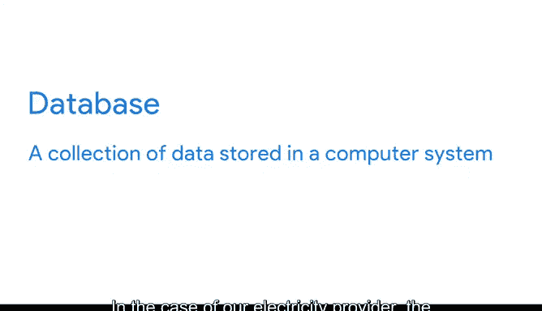
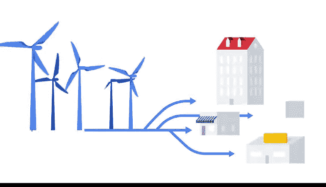

# 016：数据生命周期阶段 🦋

在本节课中，我们将要学习数据生命周期的各个阶段。理解数据从产生到最终处理的完整过程，是掌握数据分析基础的关键一步。

---

当你思考“生命周期”时，首先想到的是什么？无论你想到什么，答案都是正确的。因为万事万物都有其生命周期。一个广为人知的例子是蝴蝶的生命周期：从卵开始，孵化成毛毛虫，然后变成蛹，最终破茧成蝶。

数据同样拥有自己的生命周期。在本视频中，我们将探讨该生命周期的每一个阶段，以帮助你理解数据所经历的各个独立环节。

数据生命周期包括：**规划、获取、管理、分析、归档和销毁**。

---

## 规划阶段 📝

让我们从第一个阶段——规划开始。这个阶段实际上远在分析项目启动之前就发生了。

在规划阶段，企业需要决定它需要何种数据、数据在整个生命周期中如何被管理、由谁负责以及期望达到的最佳结果。

例如，假设一家电力公司希望深入了解如何帮助用户节能。在规划阶段，他们可能决定收集以下信息：客户每年的用电量、供电的建筑类型以及建筑内使用的设备类型。电力公司还会决定由哪些团队成员负责收集、存储和共享这些数据。所有这些都发生在规划阶段，它为项目的后续部分奠定了基础。

---

## 获取阶段 📥

上一节我们介绍了规划，本节中我们来看看下一个阶段：获取数据。

这个阶段是指从各种不同的来源收集数据，并将其引入组织内部。每天都有海量数据被创造出来，因此收集数据的方法几乎是无穷无尽的。

以下是获取数据的常见方法：

*   **从外部资源获取**：例如，如果你正在进行天气模式的数据分析，你可能会从公开的数据集（如国家气候数据中心）获取数据。
*   **从公司内部获取**：数据也可以来自公司自己的文档和文件，这些通常存储在数据库中。

虽然我们之前提到过数据库，但还没有深入探讨它是什么。**数据库是存储在计算机系统中的数据集合**。以我们的电力公司为例，它可能会在其拥有的数据库中测量客户的用电数据。

> **注意**：当你维护一个客户信息数据库时，确保数据的**完整性、可信度和隐私性**都是至关重要的。你将在后续课程中了解更多相关内容。

---

## 管理阶段 🗃️

现在我们已经获取了数据，接下来进入数据生命周期的下一个阶段：管理。

这里我们讨论的是如何照管我们的数据：数据存储的方式和位置、用于保障其安全性的工具，以及为确保其得到妥善维护而采取的行动。这个阶段对于**数据清洗**（我们稍后会讲到）非常重要。

---

## 分析阶段 🔍

接下来，是时候分析你的数据了。这是数据分析师大放异彩的阶段。

在这个阶段，数据被用来解决问题、做出明智的决策并支持业务目标。例如，我们电力公司的目标之一可能是找到帮助客户节能的方法。

---

## 归档阶段 📦

数据生命周期现在演进到归档阶段。

归档意味着将数据存储在一个仍然可用但可能不再被使用的地方。在分析过程中，分析师会处理海量数据。想象一下，如果我们必须筛选所有可用的数据，即使这些数据对我们的工作已不再有用和相关，那将是多么低效。将其归档比一直保留在身边要合理得多。

---

## 销毁阶段 🗑️

最后，是数据生命周期的最后一步：销毁阶段。是的，这听起来有些伤感，但当你销毁数据时，它不会造成任何伤害。

让我们回到电力公司的例子。他们可能将数据存储在多个硬盘上。为了销毁这些数据，公司会使用安全的数据擦除软件。如果存在任何纸质文件，它们也会被粉碎。这对于保护公司的机密信息以及客户的隐私数据非常重要。

---

## 总结

以上就是数据生命周期的全部内容。现在你理解了数据在其生命周期中所经历的不同阶段，就能更好地理解如何处理数据分析过程（我们很快会讨论到）。

本节课中我们一起学习了数据生命周期的六个核心阶段：**规划、获取、管理、分析、归档和销毁**。每个阶段都有其特定的目标和任务，共同构成了数据从产生到终结的完整旅程。