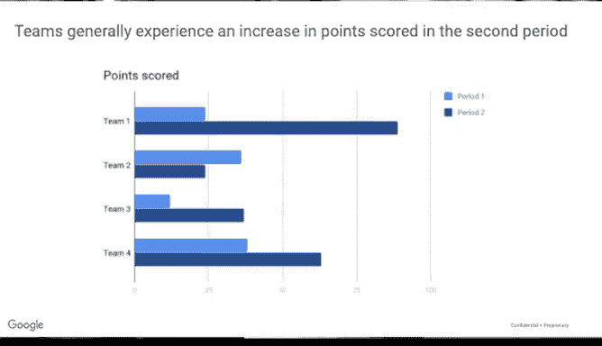

# 017：数据分析阶段与本课程结构 📊

在本节课中，我们将要学习数据分析的各个阶段，并了解本课程是如何围绕这些阶段来设计的。理解这些阶段及其联系，将帮助你规划自己的分析工作，并更好地完成本课程的学习。

你已经了解了数据生命周期的各个阶段。现在，我们将转向数据分析的阶段。这两者听起来相似，但却是两个不同的概念。数据分析不是一个生命周期，而是一个分析数据的过程。接下来，我们将逐一审视数据分析过程的每一步，并探讨它们与你作为数据分析师的工作有何关联。

本课程正是按照数据分析的步骤来设计的。理解这些联系将有助于指导你自己的分析工作以及你在本课程中的学习。

## 数据分析的六个阶段 🧩

你已经了解到，本课程是仿照数据分析过程的阶段来建模的。整个课程被分为多个部分，其中六个核心课程正是基于数据分析的步骤：**提问**、**准备**、**处理**、**分析**、**分享**和**行动**。

现在，让我们从数据分析的第一步开始。

### 第一阶段：提问 ❓

在提问阶段，我们需要完成两件事：**定义待解决的问题**，并**确保我们完全理解利益相关者的期望**。

利益相关者是指在项目中拥有利益的人。他们是那些为我们的项目投入了时间和资源，并对结果感兴趣的人。

以下是这个阶段的两个核心任务：

首先，定义问题意味着审视现状，并找出它与理想状态之间的差距。通常，我们需要清除一个障碍或修复某个错误。例如，一个体育场馆可能希望减少球迷在售票处排队的时间。这里的障碍就是找出如何让顾客更快地入座。

其次，理解利益相关者的期望至关重要。第一步是确定谁是利益相关者。这可能包括你的经理、项目执行发起人或销售合作伙伴。利益相关者可能有很多，但他们的共同点是：他们参与决策、影响行动和策略，并且有希望达成的具体目标。他们也关心这个项目。这就是为什么理解他们的期望如此重要。

例如，如果你的经理分配给你一个与商业风险相关的数据分析项目，明智的做法是确认他们希望涵盖所有可能影响公司的风险类型，还是仅包括与天气相关的风险，如飓风和龙卷风。在整个项目过程中，与利益相关者沟通是确保你保持参与并走在正确轨道上的关键。

因此，作为数据分析师，制定强有力的沟通策略非常重要。提问阶段的这部分工作帮助你专注于问题本身，而不仅仅是问题的表象。正如你之前所学到的，“五个为什么”方法在这里极其有用。

在接下来的课程中，你将学习如何通过与利益相关者合作来提出有效的问题并定义问题。你还将学习一些策略，帮助你以引人入胜的方式分享你的发现。

### 第二阶段：准备 📁

在提问之后，我们将进入数据分析过程的准备步骤。在这个阶段，数据分析师收集并存储他们将在后续分析过程中使用的数据。

你将了解更多关于不同类型的数据，以及如何识别哪些类型的数据对解决特定问题最有用。你还将发现，为什么确保你的数据和结果是客观且无偏见的至关重要。换句话说，基于你分析所做的任何决策都应始终基于事实，并且是公平公正的。

### 第三阶段：处理 🔧

接下来是处理步骤。在这里，数据分析师发现并消除任何可能影响结果准确性的错误和不准确之处。

这通常意味着**清洗数据**：将其转换为更有用的格式，合并两个或多个数据集以使信息更完整，以及**移除异常值**（即任何可能扭曲信息的离群数据点）。

之后，你将学习如何检查你准备的数据，以确保其完整和正确。这个阶段的核心是处理好所有细节。因此，你还需要修正拼写错误、不一致之处或缺失及不准确的数据。最后，你将获得验证并与利益相关者分享数据清洗结果的策略。

### 第四阶段：分析 📈

然后，就到了分析的时候。分析你收集的数据涉及使用工具来转换和组织这些信息，以便你能得出有用的结论、进行预测并推动明智的决策。

数据分析师在工作中会使用许多强大的工具。在本课程中，你将学习其中两种：**电子表格**和**结构化查询语言**（通常缩写为 **SQL**）。

### 第五阶段：分享 📤

下一个课程基于分享阶段。在这里，你将学习数据分析师如何解释结果并与他人分享，以帮助利益相关者做出有效的数据驱动决策。

在分享阶段，**可视化**是数据分析师最好的朋友。因此，本课程将强调为什么可视化对于让他人理解你的数据所传达的信息至关重要。借助合适的视觉呈现，事实和数字变得更容易观察，复杂的概念也更容易理解。

我们将探索不同类型的可视化图表和一些优秀的数据可视化工具。你还将通过创建引人注目的幻灯片演示来练习自己的演示技巧，并学习如何做好充分准备来回答问题。

### 第六阶段：行动 🚀

对于数据分析的最后一个阶段，我们来到“行动”。这是一个激动人心的时刻，企业将采纳你——数据分析师——提供的所有见解，并将其付诸实践，以解决最初的业务问题。在本课程中，你也将对你所学到的知识采取行动。

这时，你将开始为求职做准备，并有机会完成一个案例研究项目。这是一个绝佳的机会，让你能将整个课程中学到的所有内容融会贯通。此外，在你的作品集中添加一个案例研究，有助于你在面试第一份数据分析师工作时从其他候选人中脱颖而出。

## 课程总结 🎯

本节课中，我们一起学习了数据分析过程的不同步骤，以及我们的课程是如何反映这一过程的。现在，你已经掌握了理解本课程如何运作所需的一切知识。

我和我的谷歌同事们将在这里全程指导你每一步的学习。