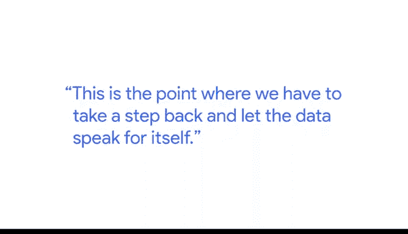

# 018：数据分析流程实例 📊

在本节课中，我们将通过一个具体的实例——员工敬业度调查，来学习数据分析的标准流程。无论分析何种数据，其核心步骤都是相通的。我们将详细拆解从提出问题到采取行动的完整过程。

## 概述：数据分析的通用流程

无论你进行何种类型的数据分析，其流程大体相同。本节将以员工敬业度调查为例进行说明。你可以想象，这个过程几乎适用于你作为分析师将要进行的任何数据分析。

## 第一步：提出问题 ❓

在开始分析之前，你需要提出所有正确的问题，以便更好地理解你的领导和利益相关者需要从这次分析中获得什么。

我通常会提出以下几类问题：
*   **我们试图解决什么问题？**
*   **这次分析的目的是什么？**
*   **我们希望从中学到什么？**

在提出所有正确的问题并明确了分析范围之后，下一步就是准备。

## 第二步：准备数据 📁

我们需要思考，为了回答那些关键问题，我们需要什么类型的数据。

这可能是**定量数据**或**定性数据**。它可能是**横截面数据**（某个时间点的快照），也可能是**纵向数据**（跨越很长一段时间的数据）。

我们还需要思考如何收集这些数据，或者是否需要收集新数据。对于我们的员工敬业度调查，我们通过包含定量和定性问题的问卷来收集数据。

但在许多分析中，你可能发现所需的数据已经存在。那么，问题就变成了与数据所有者合作，确保你能够负责任地利用这些数据。

## 第三步：处理数据 🧹

在完成收集数据的艰苦工作后，现在你需要处理这些数据。处理从**数据清洗**开始。

对我来说，这是数据分析过程中最有趣的部分。你可以把它看作是与数据的初次见面或握手。在这里，你有机会了解数据的结构、特性和细微差别，并真正深入地理解你将处理的数据类型，以及这些数据在回答你所有问题方面的潜力。

这也是一个非常重要的部分，我们需要进行所有的**质量保证检查**。

例如：
*   我们是否拥有预期中的所有数据？
*   数据是随机缺失的，还是以系统性的方式缺失（这可能意味着数据收集工作出了问题）？
*   如果需要，我们是否以正确的方式编码了所有数据？
*   是否存在需要特殊处理的**异常值**？

我们会花大量时间深入挖掘数据的结构和细微差别，以确保能够恰当且负责任地进行分析。

## 第四步：分析数据 🔍

在清洗数据并完成所有质量保证检查之后，现在就到了分析数据的阶段。我们必须确保以尽可能客观、无偏见的方式进行。

我们首先要做的，是根据流程一开始就计划好要回答的问题，运行一系列预先计划好的分析。这个过程中最困难的一点可能是，我们作为分析师，被训练去寻找模式。

随着时间的推移，随着我们工作能力越来越强，我们常常会发现，我们可以开始凭直觉猜测数据中可能有什么，或者对数据将要告诉我们什么有一种隐隐的预感。而正是在这一点上，我们必须退后一步，让数据自己说话。

作为数据分析师，我们是故事的讲述者，但我们也必须记住，这不是我们要讲的故事，这个故事属于数据。我们分析师的工作，是以尽可能无偏见和客观的方式，放大并讲述这个故事。

## 第五步：分享结果 📤

下一步是分享你从分析中得出的所有数据和见解。

通常，对于我们的员工敬业度调查，我们首先与高管团队分享高层次的研究结果。我们希望他们能对组织的整体感受有一个全景式的了解，并确保在他们深入挖掘数据、了解团队和员工个体的感受时，不会出现任何意外。

## 第六步：采取行动 🚀

从提出正确问题，到收集数据，再到分析和分享，所有这些工作，如果我们不对刚刚学到的东西采取行动，就没有太大意义。

对我来说，这是最关键的部分，尤其是对于员工敬业度调查。我常说，调查其实是容易的部分，而根据结果采取行动才是真正工作的开始。

在这里，我们利用所有那些数据驱动的见解，来决定我们想要引入何种类型的干预措施，不仅是在组织层面，也包括在团队层面。

例如，我们可能会发现，组织正在推行一系列干预措施来帮助改善员工体验的某一部分，而各个团队则有额外的角色和责任，要么是加强这些努力，要么是引入新的措施，以更好地满足其团队的优势和待改进领域。

## 总结

数据分析流程是严谨的，也是漫长的。我完全理解，我们作为数据分析师，会非常兴奋地想要直接潜入数据中，做我们最擅长的事。

但挑战在于，如果我们不完整地走完整个流程，如果我们试图跳过步骤，我们将无法得出我们正在寻找的见解。

我非常热爱我的工作。我对数据及其所能做的事情，以及我们能从中得出的见解，怀有深深的敬意。

本节课中，我们一起学习了数据分析的六个核心步骤：**提出问题、准备数据、处理数据、分析数据、分享结果、采取行动**。通过员工敬业度调查的实例，我们看到了这个流程如何应用于实际场景，并理解了每个步骤的重要性，特别是保持客观、让数据说话以及最终将洞察转化为行动的关键性。