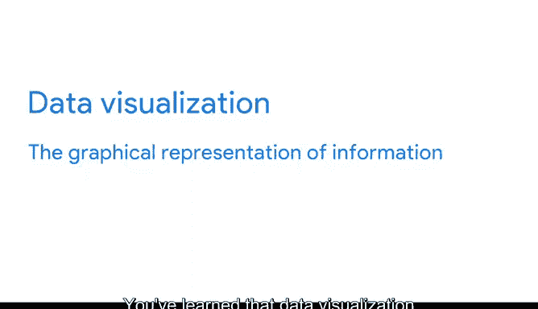

# 019：探索数据分析师工具 🛠️

在本节课中，我们将学习数据分析师在日常工作中最常使用的几种核心工具。我们将了解电子表格、查询语言和可视化工具的基本概念及其作用。

---

## 电子表格 📊

上一节我们介绍了数据分析的整体流程，本节中我们来看看数据分析师的基础工具——电子表格。

电子表格是一种数字工作表，用于存储、组织和排序数据。数据的有效性很大程度上取决于其结构化的程度。将数据放入电子表格后，你可以识别模式、对信息进行分组，并轻松找到所需信息。

电子表格还包含一些非常有用的功能，称为公式和函数。

*   **公式** 是一组指令，利用电子表格中的数据执行特定计算。
    *   例如，一个简单的加法公式可以是：`=A1+B1`
*   **函数** 是预设的命令，能自动利用电子表格中的数据执行特定过程或任务。
    *   例如，求和函数 `=SUM(A1:A10)` 可以快速计算A1到A10单元格的总和，这比手动逐个相加高效得多。

简而言之，函数是一种更简单、更高效地完成通常需要大量时间才能完成的任务的方法。掌握这些基础知识后，你将在后续课程中亲自使用电子表格。

---

## 查询语言 💬

了解了数据整理工具后，我们接下来看看如何与数据库交互，这就需要用到查询语言。

查询语言是一种计算机编程语言，允许你从数据库中检索和操作数据。在本课程中，你将学习一种名为**结构化查询语言**的工具，更广为人知的名称是 **SQL**。

SQL 是一种让数据分析师与数据库通信的语言。数据库是存储在计算机系统中的数据集合。SQL 之所以成为最广泛使用的查询语言，是因为它易于理解，并且能与各种数据库良好地协同工作。

使用 SQL，数据分析师可以通过发出**查询**来访问所需数据。虽然“查询”意为“问题”，但我更倾向于将其视为一种“请求”——即请求数据库为你执行某些操作。

以下是你可以请求数据库执行的一些基本操作：
*   `SELECT` - 从数据库中选择（检索）数据。
*   `INSERT` - 向数据库插入新数据。
*   `UPDATE` - 更新数据库中的现有数据。
*   `DELETE` - 从数据库中删除数据。

以上是对 SQL 的概览。在后续视频中，我们将进一步探索它，并使用 SQL 对数据进行一些非常酷的操作。

---

## 数据可视化 📈

最后，让我们谈谈数据可视化。你已经知道，数据可视化是信息的图形化表示，例如图表、地图和表格。

大多数人处理视觉信息比处理纯文字更容易，这就是可视化如此重要的原因。它们能帮助数据分析师以有效且引人注目的方式将见解传达给他人。

在数据分析过程中，数据经过准备、处理和分析后，其见解会被可视化，以便理解和分享。这使得利益相关者能更容易地得出结论、做出决策并制定策略。

以下是两种流行的可视化工具：
*   **Tableau**：数据分析师喜欢使用 Tableau，因为它能帮助他们创建非常易于理解的图表。这意味着即使是非技术用户也能获得所需信息。
*   **Looker**：Looker 在数据分析师中也颇受欢迎，因为它提供了一种基于查询结果轻松创建图表的方法。使用 Looker，你可以通过向利益相关者展示可视化图表及其相关的实际数据，为他们提供工作的完整图景。

所有可视化工具都有在不同情况下非常有用的强大功能。因此，你将学习如何决定在特定工作中使用哪种工具。

---

## 总结 ✨

本节课中，我们一起学习了数据分析师的三类核心工具：用于数据整理和计算的**电子表格**，用于与数据库交互和提取数据的**查询语言（SQL）**，以及用于呈现和沟通分析结果的**数据可视化工具**。理解这些工具如何协同工作，是成为一名高效数据分析师的关键一步。

在接下来的课程中，你将有机会测试所学知识，并更深入地探索这些工具的具体工作原理。不久之后，你将拥有足够的知识和信心开始亲自使用它们。