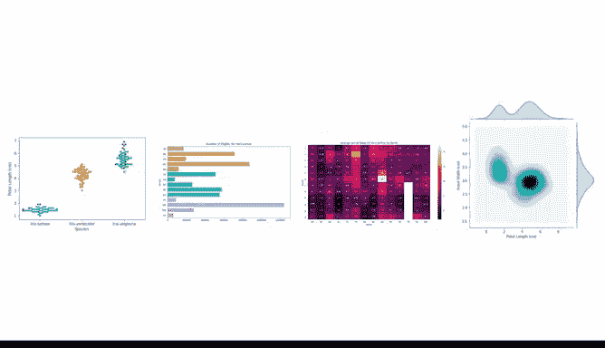

# 020：核心数据工具详解 🛠️

在本节课中，我们将深入学习数据分析师常用的核心工具：电子表格、SQL和数据可视化。我们将逐一拆解它们的基础功能，并通过简单的比喻帮助你理解它们在实际工作中的应用方式。

---

欢迎回来。在接下来的几个视频中，我们将继续深入探讨之前讨论过的数据分析工具。

你将有机会看到这些工具的实际应用。这会让你更清楚地了解如何使用它们。整个课程的后续部分都将建立在你在这里所学的基础上。

## 深入电子表格 📊

上一节我们介绍了数据分析的整体流程，本节中我们来看看第一个核心工具：电子表格。我们将把电子表格分解到最基础的部分，以便更好地理解它的一些特性和功能。

你还将学习如何在数据分析师的工作中使用它们。例如，如何搜索数据以使其更易于使用。我们马上就会找到答案。

以下是电子表格的一些基础功能：
*   **数据存储与组织**：以行和列的网格形式存储数据。
*   **公式与计算**：使用如 `=SUM(A1:A10)` 的公式对数据进行自动计算。
*   **排序与筛选**：快速整理和查找特定数据。
*   **基础图表**：将数据转换为简单的可视化图形。

## SQL 实战演示 🗃️

接下来，我们将看到 SQL 的实际应用。数据分析师在工作中经常使用 SQL。例如，当他们需要在几秒钟内获取大量数据来帮助回答一个紧急的业务问题时。

你可能还不熟悉 SQL。这没关系。

你将了解到，使用 SQL 就像在一家速度极快的餐厅点餐。你的 SQL 查询可能不那么“美味”，但你无需等待太久就能得到你的“订单”。

以下是 SQL 的核心概念：
*   **数据库**：存储数据的仓库。
*   **查询（Query）**：用于从数据库请求数据的指令，例如 `SELECT * FROM customers WHERE city=‘Beijing’;`。
*   **快速检索**：从海量数据中高效提取所需信息。

## 数据可视化：分析的“甜点” 🍰

说到食物，还有什么比甜点更好的话题呢？你可以把数据可视化看作是数据分析这顿大餐后的甜点。它在你完成分析、为某个问题或任务获取了正确数据之后呈现。

我们已经知道可视化有很多形式，如图形或图表。就像甜点一样，它们看起来是一种享受。

你将了解更多关于这些视觉呈现的知识，并看到其他可能的外观示例。然后，你将有机会与其他像你一样的未来数据分析师讨论可视化。

## 课程总结与评估 📝

最后，我们将以一项评估来结束。但在那之前，你会有时间复习所学的内容。

好了，让我们继续吧。顺便问一下，现在还有其他人饿了吗？

在本节课中，我们一起学习了三大核心数据工具：**电子表格**用于组织和计算数据，**SQL**用于快速查询和检索数据库信息，而**数据可视化**则是将分析结果清晰、直观呈现的关键步骤。掌握这些工具是成为一名数据分析师的重要基础。