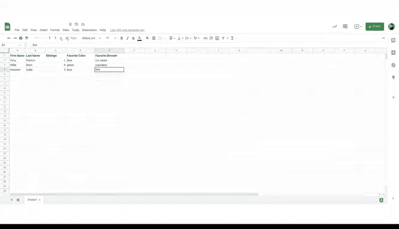
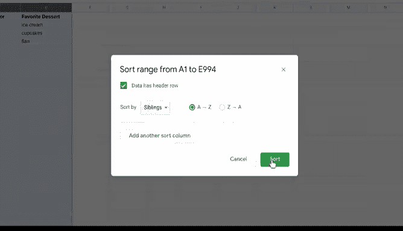
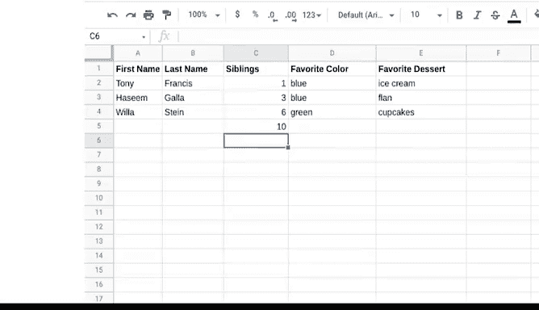

# 021：让电子表格成为得力助手 📊

在本节课中，我们将要学习电子表格的基础知识。电子表格是数据分析的重要组成部分，掌握其基本操作能极大地提升工作效率。我们将从认识电子表格的核心结构开始，逐步学习如何输入数据、组织数据，并进行简单的数据分析。

## 认识电子表格的核心结构

电子表格是数据分析的核心工具。越早熟悉它，对你的工作越有利。电子表格能为你节省大量时间，并让整个工作流程变得更简单。

上一节我们介绍了电子表格的重要性，本节中我们来看看它的基本构成。下图展示了一个组织良好的电子表格示例：

对于电子表格新手，本视频将演示一些基本概念。对于有经验者，这也是一次很好的复习和巩固机会，或许还能学到一两个新技巧。

这张图片清晰地展示了电子表格的三个主要特征：**单元格**、**行**和**列**。它们是你使用电子表格完成任何任务的基础，无论是制作简单的购物清单还是分析复杂的数据集。

## 单元格、行与列

我个人使用电子表格管理各种事务，从个人财务到与朋友每年的聚会策划。作为策划者，我用电子表格来确保一切井然有序。

说到保持有序，列在电子表格中是垂直组织的，并按字母排序。行则是水平组织的，并按数字排序。

因此，当你谈论一个特定的单元格时，你需要结合其所在的**列字母**和**行编号**来命名它。

例如，在上面的电子表格中，单词“row”位于单元格 **D3**。

## 开始使用电子表格

现在，让我们在一个真实的电子表格中开始操作。你可以在几乎任何电子表格程序中完成以下所有步骤。

首先，我们来熟悉一下电子表格界面。我们将从一些基本操作开始。请记住，作为分析师，你并不总是需要自己创建数据集，但为了学习，我们现在就这么做。

以下是输入和格式化数据的基本步骤：

1.  点击单元格 **A2**，输入我的名字。
2.  点击单元格 **B2**，输入我的姓氏。
3.  如果名字在单元格中显示不全，可以通过点击并拖动列右侧边缘来调整列宽，直到名字完全显示。
4.  另一种方法是使用“文本换行”功能。该功能可以设置单元格自动调整高度以容纳文本。要使用此功能，先选择包含文本的单元格、列或行，然后在格式菜单中查找文本换行选项。
    *   **溢出**：默认设置，允许文本溢出到相邻的空单元格。
    *   **换行**：文本在单元格内自动换行，全部可见。
    *   **截断**：只显示单元格内能容纳的文本，其余部分被隐藏。

现在，我们已经成功添加了数据。接下来，让我们为数据添加标签，这对于组织数据至关重要。

## 添加属性（列标签）

在列顶部添加标签将使你在后续分析时更容易引用和查找数据。这些列标签通常被称为**属性**。

**属性**是用于标记表中列的数据特征或质量。更常见的叫法包括列名、列标签、表头或标题行。

让我们为表格添加一些标题：

1.  点击单元格 **A1**，输入“First Name”。
2.  点击单元格 **B1**，输入“Last Name”。
3.  为了让这些属性更突出，我们可以将它们加粗。使用光标选择包含属性的单元格，然后点击加粗图标。

电子表格可能会变得非常大，因此确保数据标签清晰、易于查找非常重要。

准备好添加更多数据了吗？让我们从添加一些新属性开始。

1.  在单元格 **C1** 中输入“Siblings”，添加一个表示兄弟姐妹数量的列。
2.  在接下来的两列中，我们再添加两个属性：“Favorite Color”和“Favorite Dessert”。
3.  同样，将这些新标签加粗，并根据需要调整列宽以适应标签。

请记住，调整列和行大小的方法还有很多。如果你在使用电子表格时遇到问题，快速在线搜索通常能帮你找到答案。我们也提供了包含更多电子表格技巧和信息的阅读材料。

## 添加数据与理解观察值

现在，我可以在相应的单元格中输入我自己的数据：兄弟姐妹的数量、最喜欢的颜色和甜点。

接下来，我再添加两个人的数据。这样，我们就有了三行数据。

在数据集中，一行也被称为一个**观察值**。

**观察值**包含了数据表中某一行所代表的某个事物的所有属性。

在本例中，第3行就是关于“Willist Ste”的一个观察值，因为我们在这一行看到了她的所有属性。

## 组织与排序数据

到目前为止，我们已经知道电子表格可以让你对数据做很多事情，比如像我们刚才那样存储和组织数据。但你还可以更进一步，重新组织现有数据。

假设我们想按每个人的兄弟姐妹数量来组织数据。有一个简单的方法可以做到：

1.  首先，选择所有包含数据的列，以确保所有数据能一起被重新组织。
2.  然后，转到“数据”菜单。这里有一些选项，我们选择“排序范围”。这将让我们选择如何组织列。
3.  接下来，我们选择“A到Z”，这将使我们的数字按从小到大排序。
4.  现在，我们需要留意标题行，即“Siblings”这个属性词。我们需要勾选“数据包含标题行”的复选框。这能确保“Siblings”这个词保持在原位。

好了，现在我们准备排序。看，我们刚刚通过从最小数到最大数排序，重新组织了数据。

随着深入学习，你会发现电子表格中处理数据的其他多种方法，包括函数和公式。让我们以一个简单的公式示例来结束本节。

## 使用公式分析数据

你可以将公式视为在电子表格中操作数据的一种方式。公式就像一个计算器，但功能更强大。

**公式**是一组指令，利用电子表格中的数据执行特定操作。为此，公式使用**单元格引用**来代表它要计算的值。

让我来演示一下：

1.  点击兄弟姐妹列的下一个单元格（例如 **C5**）。
2.  输入等号 **=**。所有公式都以这个符号开头。
3.  接下来，输入我们想要相加的单元格，在本例中，输入 **C2+C3+C4**。
4.  现在按回车键。

看，公式给出了这个数据集中兄弟姐妹的总数。我们刚刚完成了一次简单的数据分析。

## 保存与后续学习

如果你想将数据存储起来以备后用，在 Google Sheets 中，电子表格会自动保存到你的 Google 云端硬盘。对于 Excel 和其他电子表格程序，你需要将其保存为文件。

现在，你已经了解了一些使用电子表格的基础知识。一旦熟悉了这些概念，你将能够学习更多关于电子表格工具的高级功能。

欢迎随时重看本视频并自行练习。你甚至可以用自己的数据创建这个电子表格的个性化版本。

## 总结

本节课中，我们一起学习了电子表格的基础操作。我们从认识单元格、行、列的核心结构开始，逐步练习了输入数据、添加属性标签、调整格式以及排序组织数据。最后，我们还初步接触了如何使用公式对数据进行简单的计算分析。掌握这些基础是成为高效数据分析师的第一步，请务必多加练习。