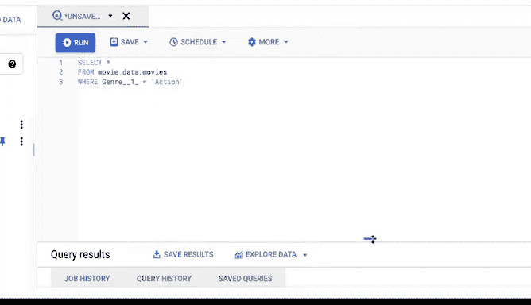

# 022：SQL实战应用 🛠️


在本节课中，我们将学习SQL（结构化查询语言）的实际应用。通过具体示例，你将了解SQL能做什么，以及如何使用它来处理数据。

---

## 概述

你可能还记得，之前我们简要介绍过查询语言SQL。本节视频将展示SQL的实际操作，并通过具体查询示例，帮助你理解SQL的功能。

## SQL与电子表格的对比

SQL能完成许多与电子表格相似的数据操作，例如存储、组织和分析数据。但SQL更像是一个“超级电子表格”，适用于更大规模的数据处理。

例如，当数据集较小时（如仅100行），使用电子表格可能更合适。但如果数据集非常庞大，电子表格处理起来会变得吃力，这时SQL就是更好的选择。

## SQL的工作环境

使用SQL时，需要一个能理解SQL语言的数据库环境。就像去一个语言不通的地方，沟通会变得困难；SQL也需要一个能理解其指令的数据库来执行操作。

目前有多种数据库支持SQL。作为数据分析师，你可能会用到其中几种。但无论使用哪种数据库，SQL的基本工作原理是相同的。

## 查询基础回顾

以下是SQL查询的基本结构：

```sql
SELECT column_name
FROM table_name
WHERE condition;
```

通过这个查询结构，我们可以从表中选择特定数据，并使用`WHERE`子句根据条件过滤数据。

## 实战示例

现在，我们打开数据库，看看SQL如何与其通信以执行简单的数据任务。

首先，我们使用以下查询选择所有数据：

```sql
SELECT *
FROM movies;
```

这条简单的查询会让数据库调出我们需要的表。



接下来，我们添加`WHERE`子句来改变获取的数据：

```sql
SELECT *
FROM movies
WHERE genre = 'action';
```

现在，数据只显示动作类型的电影。

## 总结

本节课我们一起学习了SQL的基本查询结构：`SELECT`、`FROM`和`WHERE`。随着课程的深入，你将有机会亲自使用SQL进行更复杂的查询操作。希望本视频能为你后续的学习提供有用的预览。