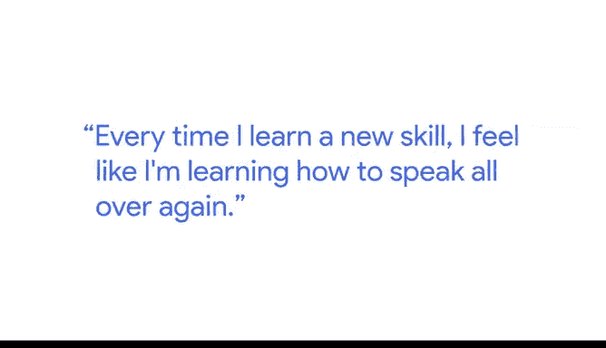

# 023：学习新技能的日常挑战 💪

在本节课中，我们将跟随谷歌工程项目经理Angie的分享，了解学习新技能（特别是数据分析技能）时可能遇到的日常挑战，并学习如何以正确的心态克服这些困难。

---

我是Angie，是谷歌的工程项目经理。我目前正在学习数据分析证书课程，之前我曾在人力分析部门担任研究员。我也曾是一名“分析雇佣兵”，为许多不同的公司工作，帮助他们理解数据。

每当我学习一项新技能时，都感觉像是在重新学习如何说话。

上一节我们介绍了学习新技能的普遍感受，本节中我们来看看一个具体的例子。

我记得第一次学习SQL时，我感到非常沮丧，因为我周围的每个人看起来都像已经精通了。他们很清楚自己在做什么。而我却连最基本的东西都搞不定。

以下是当时遇到的具体困难：
*   就像从数据库表中取出数据这样简单的操作。
*   我记得有人让我计算某个东西的平均值，而我不断收到错误提示。

这种感觉确实就像在学习一门新语言，而你处于初学阶段，周围的人却可能已经非常流利。

---

我的父母在30多岁时移民到这个国家。他们在已经掌握一门语言后，不得不重新开始学习英语。我记得小时候看着他们每天努力学习新语言，只是为了完成一些非常基本的事情。

以下是他们面临的挑战：
*   比如在杂货店请求帮助。
*   我记得我6岁时给有线电视公司打电话，询问账单问题，因为我的父母无法做到。

我记得他们为了学习这门新语言并达到流利程度付出了多么艰辛的努力。每当我学习像SQL或R这样的新数据语言时，我就会想到那对他们来说一定有多难。

我想，如果他们能做到，我就能学会SQL。如果他们能为最基本的事情寻求帮助，我就能向旁边的数据分析师请教。

---

上一节我们看到了榜样的力量，本节我们来总结关键的心态转变。

对我真正有帮助的，就是拥有那种心态，并且知道我可以寻求帮助。

例如，我可以问：“如何编写一个SQL查询语句？”或者“如何从表中提取数据？”

---

本节课中我们一起学习了Angie分享的学习新技能的挑战与心态。核心要点是：学习数据分析工具（如SQL）就像学习一门新语言，初期遇到挫折是正常的。关键在于保持耐心，勇于向他人求助，并将挑战视为成长过程的一部分。记住，每个专家都曾是从“计算平均值”开始的新手。