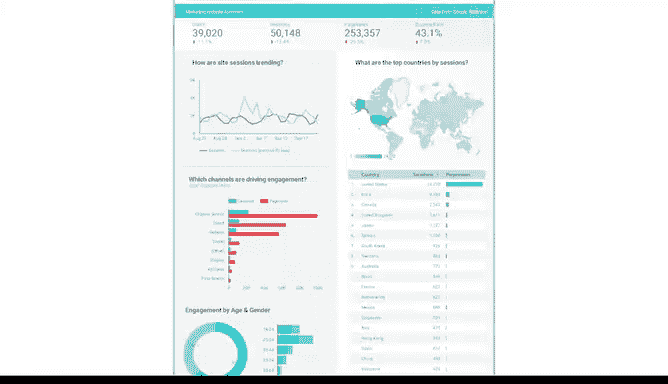
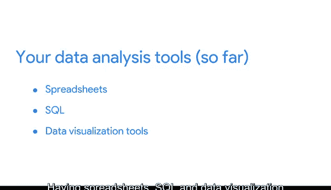

# 024：成为数据可视化专家 📊

在本节课中，我们将要学习数据可视化在数据分析中的核心作用，了解如何利用工具将数据转化为清晰、直观的图表，并探索一个历史上的经典案例。

---

你的数据分析工具箱正在不断充实。掌握电子表格和SQL技能，将使你在数据分析领域走得更远。当然，还有更多知识和工具等待你去学习。你的未来充满光明，并且即将变得更加耀眼。😊

因为接下来，我们将深入探讨数据可视化。

---

## 数据可视化的角色与魅力

上一节我们提到了数据分析工具的扩展，本节中我们来看看数据可视化工具在分析中扮演的具体角色，并将在视频后续部分展示这些工具的实际应用。

数据可视化是信息的图形化表示。对许多数据分析师而言，这是工作中最令人兴奋的部分，因为他们能看到自己的辛勤工作转化为有趣且直观的成果。😊

数据可视化不仅美观，而且极为实用。当我加入谷歌并开始收到季度数据报告邮件时，我被深深震撼了。报告里有一个大型幻灯片，同事们都在其中贡献了自己的可视化作品。😊 这在我开始创建自己的可视化图表时，无疑是一盏明灯。

---

## 一个历史的典范：弗洛伦斯·南丁格尔

如果我的故事还不足以让你印象深刻，让我向你介绍弗洛伦斯·南丁格尔。这个名字你耳熟吗？她奠定了现代护理学的哲学基础。

信不信由你，她还是一位数据分析师。在19世纪50年代的克里米亚战争期间，每天都有数千名士兵死亡。南丁格尔希望找到减少死亡人数的方法。在分析数据后，她发现大多数士兵死于可预防的疾病。

为了说服医院管理人员关注这些情况，她创建了一张图表，显示数月内的死亡人数。图中更大的蓝色部分代表可预防的死亡。她的工作直接导致了病人护理的重大改革，而这一切发生在一百五十多年前，**没有使用计算机**。

南丁格尔创建这个可视化的主要原因之一，是让她的受众更容易理解数据。她认为，使用视觉图表而非单纯的文字和数字，能更成功地说服利益相关者。她是对的。😊

---

## 为什么可视化优于纯数据表格

虽然数据表格对于分析是必要的，但它们无法像可视化图表那样快速、清晰地展示趋势和模式。

想象你接到一个需要在当天完成的任务。你收集了所需数据并制成了表格。你能用这个表格解释你的发现吗？是的，你或许可以。但更好的方法是使用像下面这样的条形图进行可视化。

类似这样的图表让你能更快速地进行解释，并且你还有一个酷炫的图形来支撑你的分析。作为一名数据分析师，你需要创建易于理解且引人注目的可视化图表。

所以，尽情展示它。利益相关者可能没有太多时间深入研究数据，你的工作就是让他们的时间花得有价值。

---

## 动手实践：从表格到图表

让我们回到课程早期创建的那个数据表格。如果你自己创建了练习表格，现在可以打开它，或者稍后再尝试。

这是我们之前添加的数据。让我们通过插入图表来创建数据的可视化——一个条形图。😊

**Boom**，你可以看到电子表格以一种最合理的方式将我们表格中的数据可视化了。它创建了一个条形图（或柱状图）来按姓名比较每个人的年龄。

但你可能已经看出来了。这就是可视化的魅力——它能快速、清晰地展示数据分析。😊

我们可以使用图表编辑器来调整图表。不同的电子表格程序可能有不同的操作方式，但它们都具备可视化功能以及编辑这些可视化的方法。

好的，现在我们先看看推荐的图表。我们可以使用条形图让柱状条水平显示。看起来很棒，让我们关闭图表编辑器。这里有很多选项可以探索，但目前我们保持基础设置。如果你稍后练习，可以自由尝试其他可视化类型。

现在我们可以调整图表，让整个电子表格看起来整洁且专业。

---

## 总结与展望

太棒了。我希望你能学会像我一样热爱数据可视化。也许你会成为像弗洛伦斯·南丁格尔那样的数据可视化先驱。

作为一名初露头角的数据分析师，你已经开始用宝贵的工具填充你的“工具带”，这些工具将在后续的课程中持续使用。掌握电子表格、SQL和数据可视化知识，将帮助你成为一名出色的数据侦探。

在未来的数据分析过程中，你将能够运用这些工具。

接下来，你将完成几个活动来结束本部分的学习。你还将完成一项评估，以检查你对所学内容的理解。这是一个绝佳的机会，去思考你将在本课程及职业生涯中继续探索的一些领域。😊

一如既往，欢迎随时复习视频和阅读材料，以帮助你回顾某些主题和概念，即使你觉得自己已经准备好了。你距离下一门课程只有几步之遥了。这是巨大的进步，请继续保持。