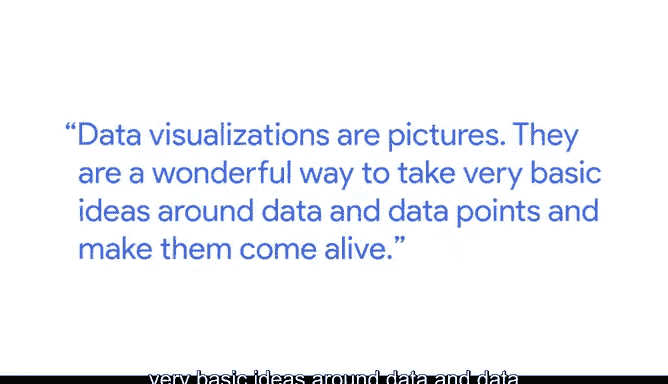

# 025：数据如何讲故事

在本节课中，我们将跟随谷歌云团队的Liah Jones，探讨数据可视化如何将枯燥的数据转化为生动的故事，并成为支持决策的强大工具。

---

我的名字是Liah Jones，我是云团队的一员。我有幸领导一支优秀的团队，专注于帮助客户实现云端数据可视化。

“数据可视化”这个词听起来很长，也可能让人感到枯燥。

但我想，当你小时候和父母在一起，或者你现在和孩子一起进行睡前活动时，你很少会拿着一堆事实和数字去哄他们睡觉。我敢打赌，你很可能是在给他们讲故事，给他们看图片。我知道我一直很喜欢漫画书。

图片能讲述故事。数据可视化就是图片。

它是一种绝佳的方式，能将关于数据和数据点的基本概念变得生动起来。

😊

你可以创建各种不同类型的可视化组合，但其中那些具有交互性的，效果尤为显著。

试想一下，作为企业高管，正在思考是否应该在曼谷开设新站点。这时，如果我们能带着清晰的观点和出色的数据可视化方案进去，说明为什么这个决策是合理的，那么决策就会变得一目了然。

有趣的是，我确实记得第一次遇到一个超级棒的可视化作品，那是在我的个人生活中。我把预算软件从一个供应商换到了另一个。

我换用的新供应商非常专注于一个理念：😊

**“每一块钱都有它的任务”**，并确保你为每一块钱都做好预算。

他们提供的可视化图表会根据你输入的数据而变化。这彻底改变了我对整个预算过程的看法。

所以，拥有数据就像拥有考试的答案。

它让你确信自己将做出正确的决策，因为一切都有数据作为支撑。

---

## 本节总结

本节课中，我们一起学习了数据可视化的核心价值。我们了解到，可视化不仅仅是图表，更是将复杂数据转化为直观故事、支持关键决策的有效工具。从个人预算管理到企业战略规划，优秀的数据可视化能让观点更清晰，让决策过程变得更简单、更有依据。记住，**好的数据可视化 = 清晰的故事 + 有力的证据**。