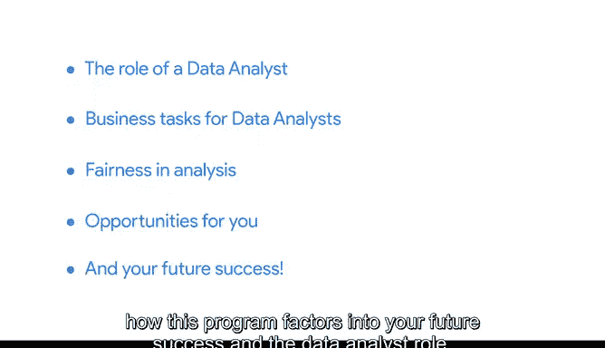

# 026：聚焦商业实践 🎯

在本节课中，我们将探讨企业如何实际运用数据，以及数据分析技能能为你创造哪些机会。我们将了解数据分析师在不同行业中的角色、所需完成的任务，以及在商业分析中保持公平、避免偏见的重要性。最后，我们也会讨论你可以把握的机遇，以及本课程如何助你在数据分析师的道路上取得成功。

---

上一节我们学习了数据分析的实用技能。接下来，我们将转换视角，探讨学习这些技能的目的。这能帮助你更清晰地看到未来可能面临的机会。

以下是数据分析师在不同行业中扮演的角色类型、这些角色所需完成的任务，以及在为商业任务分析数据时保持公平、避免偏见的重要性。

我们还将讨论你可以发掘的机遇，以及本课程如何助你在数据分析师的角色中取得未来的成功。

考虑到以上所有要点，让我们开始学习。

---

本节课中，我们一起探讨了数据分析在商业实践中的具体应用、分析师的角色与任务、公平分析的重要性以及未来的职业机遇。掌握这些背景知识，将帮助你更好地理解所学技能的实际价值，并为你的职业发展指明方向。