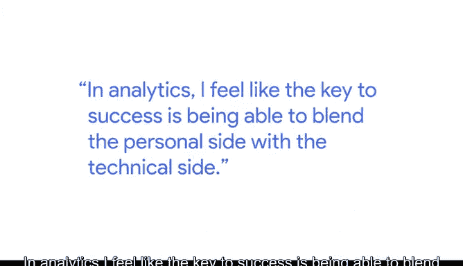

# 028：数据分析师成长之路 🚀

在本节课中，我们将跟随谷歌数据分析师Joey的分享，了解他如何从零开始，成长为一名数据分析项目管理者。我们将学习到数据分析职业发展的关键要素，包括技术能力与软技能的平衡。

---

大家好，我是Joey，目前是Ruuse公司的一名分析项目经理。

Ruuse代表房地产与工作服务。我的工作是将数据和分析引入公司的决策过程，特别是在创造一个安全、有趣的工作环境方面。

我的分析职业道路有些不同，因为我最初并没有计划，也未曾预见到自己会走到今天的位置。

幸运的是，我最初加入了一个名为“人力资源项目”的轮岗计划，隶属于人员运营部门。这个计划让我有机会体验三种不同的角色。

本质上，我先后担任了通才、专家和分析师。我正是在分析工作中找到了热爱与激情。😊

我最初加入的是商业智能团队，其职责是向业务部门提供基于SQL的报告。

当我发现自己享受上班并完成工作的过程时，我意识到数据分析是适合我的职业道路。😊

我认为这可以归结于我的两个热情所在。第一是解决问题。我喜欢处理复杂问题、谜团和难题，并能够找到答案、提出解决方案。😊

第二是能够与人合作并帮助他人。在分析领域，我认为成功的关键在于将人际交往能力与技术能力相结合。

---

在职业生涯初期，我更多地关注技术部分，我希望确保自己拥有足够的技术知识来回答问题。

但我发现，随着时间的推移，我同样需要发展另一方面的能力。

我认为我的职业生涯为我提供了锻炼这两方面“肌肉”的机会，即人际互动部分和技术部分，以确保它们最终都能得到成长。

---

本节课中，我们一起学习了Joey从轮岗计划中发现热情，到平衡技术硬技能与沟通软技能的成长历程。他的经历告诉我们，成功的数据分析师不仅需要扎实的技术功底（如**SQL**），更需要培养解决问题和与人协作的软实力。