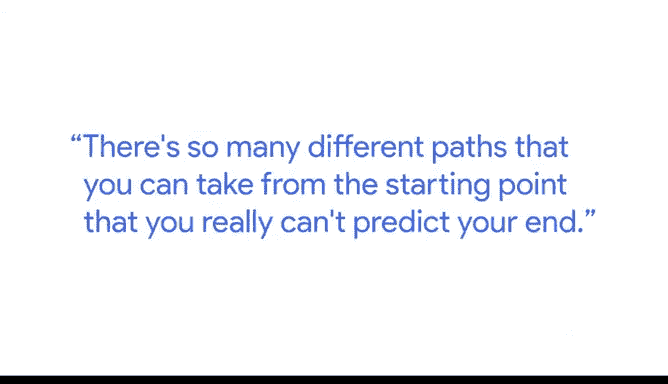

# 029：数据职业发展支持 💼

在本节课中，我们将聆听谷歌财务项目经理Tony分享关于数据职业发展的见解。他将阐述数据技能的重要性、职业发展路径，以及为早期职业人士提供支持的必要性。

对于任何分析师，以及任何处于职业生涯早期阶段的人来说，理解数据、尊重数据并懂得如何运用数据都极其重要。

我的愿景是，未来所有职位在某种程度上都将涉及数据，而学会如何从数据中提取洞察，将成为任何公司组织中关键职位的核心能力。

通常，在职业生涯的前两年，你正在发展使你成为一名优秀通才的核心技能。

在接下来的两到五年里，你将学习与你工作相关的特定领域。

这可能包括你所支持的职能领域，或者一个非常技术性的组成部分。

例如，你可能想成为一名SQL专家，以便能够为财务分析目的处理大型数据集。

同样地，即使你以数据分析师的身份进入财务部门，你也可以跳出财务领域，进入许多人所说的“业务”部门。

这通常指你的运营职能，你可以成为一名业务分析师或数据分析师。

从你的起点出发，有太多不同的路径可供选择，你实际上无法预测你的终点。

---

我对于与年轻人合作并支持他们，真正为他们的职业生涯提供一个跳板，怀有深厚的热情。

这源于我个人的真实经历，在我职业生涯的头两年，我的经理和直接管理层几乎没有给我任何支持。

经历了头两年的这种体验后，我意识到并亲身感受到了这会如何拖慢你的发展。

尤其当你是一个拥有巨大潜力和能力的人时，你会希望身处一个能培养这种能力、真正希望你成长的环境中。

我认为，拥有像这样的项目至关重要，它们能消除所有障碍，打破任何阻碍人们了解在这个行业、在数据分析师这样的职位上取得成功所需条件的藩篱。

这样，他们自己才能畅想职业生涯的未来方向。

我的名字是Tony。我是谷歌的一名财务项目经理。

---

本节课中，我们一起学习了Tony关于数据职业发展的观点。他强调了数据技能在当今职场中的普遍重要性，概述了从通才到专才的典型职业发展路径，并指出了数据技能带来的跨领域流动性。最后，他基于个人经历，强调了为职场新人提供支持性环境以释放其潜力的关键作用。