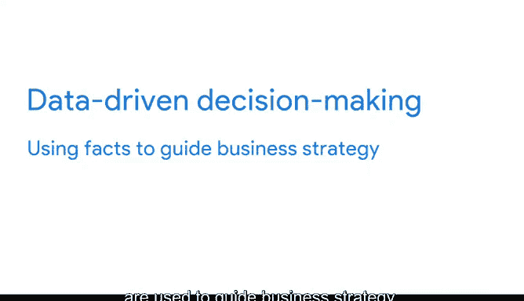

# 030：数据在商业中的力量 📊

在本节课中，我们将要学习数据分析师如何通过处理商业任务来帮助企业利用数据。我们将探讨商业任务的具体含义，并了解其在真实数据分析工作中的实际案例。

---

## 商业任务：数据分析的起点

上一节我们介绍了数据分析在商业中的应用。本节中我们来看看数据分析师需要处理的核心——商业任务。

作为一名数据分析师，你将处理帮助公司利用数据的商业任务。接下来，我们将详细讨论商业任务究竟是什么，并举例说明它们在真实数据分析师工作中的具体形态。

让我们花点时间回顾一下之前看到的商业运用数据分析的真实案例。你可能会注意到每个例子都有一个共同主题：它们都有需要探索的议题、需要回答的问题或需要解决的难题。

这些概念容易混淆。因此，在数据分析领域讨论时，我们可以这样区分它们：
*   **议题** 是一个需要调查的主题或课题。
*   **问题** 旨在发现信息。
*   **难题** 是一个需要解决的障碍或复杂情况。

以下是具体案例：
*   可口可乐曾有一个关于新产品的**问题**。数据分析为他们提供了关于顾客已喜爱的新口味的见解。
*   城市动物园和水族馆曾面临人员配置的**难题**。数据帮助他们找到了最佳的人员配置策略。

这些**问题**和**难题**构成了数据分析师需要帮助解决的各种**商业任务**的基础。

**商业任务**是数据分析为商业所回答的**问题**或解决的**难题**。这将是你未来为雇主所做工作的核心焦点。

---

## 从难题到任务：一个具体案例

让我们继续以动物园为例，设想一下动物园的商业任务可能是什么。

我们知道其**难题**是：不可预测的天气使得动物园难以预估人员配置需求。

因此，其**商业任务**可能是：**分析过去十年的天气数据，以识别可预测的模式**。

随后，数据分析师可以规划出收集、分析和呈现解决此任务所需数据的最佳方式，以实现动物园的目标。然后，利用数据，动物园将能够就其日常人员配置做出明智的决策。

---

## 数据驱动决策的力量

我们在之前的视频中简要讨论过数据驱动决策。但为了帮助你回顾，这里再次说明：**数据驱动决策**是指通过数据分析发现的事实被用来指导商业策略。

思考决策最简单的方式是，它是在不同后果之间做出选择——好的、坏的或两者兼有。

在我们的动物园例子中，动物园拥有做出明智决策以解决其难题所需的数据。但如果他们在没有数据的情况下做出这个决定呢？

假设他们仅仅依靠观察和记忆来追踪天气并制定人员排班表。我们已经知道，这无法长期解决他们的问题。数据分析为他们提供了找到问题最佳解决方案所需的信息。

这就是**数据的力量**。

观察和直觉是决策中的有力工具，但它们的作用有限。当我们仅基于观察和直觉做决定时，我们只看到了部分图景。数据帮助我们看清全貌。有了数据，我们就能全面了解问题及其成因，从而找到我们以前无法看到的新颖且令人惊讶的解决方案。

---

## 总结与展望

本节课中我们一起学习了：
1.  **商业任务**是数据分析工作的核心起点，它源于商业中需要回答的问题或解决的难题。
2.  通过**数据驱动决策**，企业可以利用数据分析得出的客观事实来指导策略，做出更明智的选择。
3.  与仅依赖观察和直觉相比，数据提供了更完整的信息图景，能揭示更深层次的洞察和解决方案。

数据分析帮助企业做出更好的决策，这一切都始于一个商业任务以及它试图通过数据回答的问题。通过在本课程中将学到的技能，你将能够提出正确的问题，规划收集和分析数据的最佳方式，然后以可视化方式呈现数据，武装你的团队，使他们能够做出明智的、数据驱动的决策。这使你对你所服务的任何企业的成功都至关重要。

数据是一个强大的工具，而能力越大，责任也越大。

你正在出色地吸收所有这些信息。接下来，我们将讨论你作为数据分析师的责任，即确保你以公平对待数据所代表人群的方式收集、分析和呈现数据。