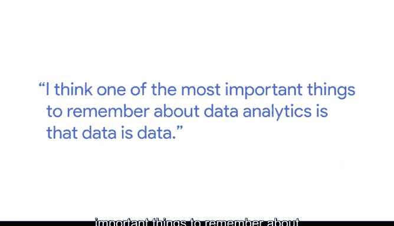
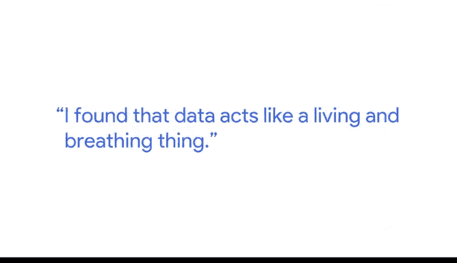

# 031：数据侦探工作 🕵️♀️

在本节课中，我们将跟随Verily公司的业务系统与分析主管Rachel，了解数据分析师如何像侦探一样，从海量数据中挖掘有价值的见解。我们将学习数据分析的核心价值、实际应用案例以及面对复杂数据时的解决策略。

大家好，我是Rachel，目前担任Verily公司的业务系统与分析主管。

数据分析师能够解决多种不同类型的问题。在我的职业生涯中，我很幸运地接触了许多这类问题，处理过多种截然不同的数据类型，并成功将其转化为有意义的答案。关于数据分析，最重要的一点是要记住：**数据就是数据**。

## 从财务数据到商业洞察 💰

上一部分我们提到了数据的多样性，本节中我们来看看一个具体的应用领域——财务数据分析。

我是一名财务数据分析师。我在Verily的职责是处理我们所有的财务信息。这包括我们支出的资金和赚取的收入等所有信息，并将其转化为报告和见解，以便我们的业务负责人能够理解公司的运营状况。

我最近在Verily完成的最重要的工作之一，是帮助为每个业务部门创建所谓的**损益表**。这意味着我们的团队可以实时查看他们的预算以及相对于该预算的支出情况。这样做有助于团队通过增加收入流（从而有更多资金可用）或缩减开支来遵守预算，确保公司保持在正轨上，并实现我们的目标。

我发现数据就像一个活生生的、会呼吸的事物。

## 应对海量数据的挑战 🌊

了解了数据分析的具体价值后，我们不可避免地会遇到一个难题：当数据量极其庞大时，我们该如何入手？

当你拥有海量数据点时，初次坐下来理解它可能会让人不知所措。你会有成吨的列、成吨的记录、成吨的不同数据类型。找到理解这些数据的方法确实非常困难。而这正是数据分析师专业知识的用武之地。

以下是我职业生涯中总结出的应对复杂数据的心得：
*   **保持耐心与坚持**：这是我职业生涯中一些最令人沮丧的时刻，但当一切最终理顺时，也是我做过的最有成就感的工作。
*   **灵活变换角度**：如果你采取的角度行不通，尝试寻找另一个角度。
*   **尝试不同方法**：尝试以不同的方式处理它。
*   **提出新的问题**：尝试提出一个不同的问题。

最终，数据会“屈服”，你将获得你所寻找的洞察。

---

本节课中我们一起学习了数据分析师的核心工作——像侦探一样探索和解读数据。我们通过Rachel的分享，了解了如何将原始的财务数据转化为驱动商业决策的损益表，也学习了面对海量、复杂数据时所需的耐心、灵活性和多种解题策略。记住，**数据本身是客观的，而赋予其意义并找到答案，正是数据分析师的价值所在**。