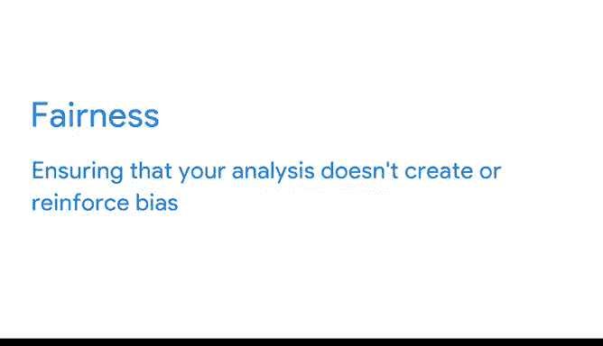

# 032：理解数据与公平性 📊⚖️

在本节课中，我们将要学习数据分析中一个至关重要的概念：**公平性**。我们将探讨公平性的含义、为何它在数据分析中不可或缺，以及如何在实际工作中确保分析的公平性。

到目前为止，我们已经介绍了数据分析师在商业环境中的不同角色及其相关任务。但数据分析师还有另一项重要责任：**确保他们的分析是公平的**。

你可能会想，数据是基于收集到的事实，它怎么会不公平呢？这是一个很好的问题。让我们来探讨在数据分析中“公平”意味着什么，以及为什么作为分析师，牢记公平性至关重要。

## 什么是数据分析中的公平性？

公平性意味着确保你的分析**不会制造或强化偏见**。换句话说，作为一名数据分析师，你的目标是帮助创建对每个人都公平且包容的系统。

这听起来很简单，但公平性与数据分析的棘手之处在于：**它并没有一个标准的定义**。不过，我们刚才的描述可以为你提供一个思考公平性的初步框架。

## 真实但不公平的结论

情况即将变得复杂一些：**有时基于数据得出的结论可能是真实的，但却不公平**。那么，你应该怎么做呢？让我们通过一个例子来找出答案。

假设有一家公司，因其“男性俱乐部”文化而声名狼藉，其他性别的代表很少。这家公司想了解哪些员工表现良好，于是他们开始收集关于员工绩效和公司文化的数据。

数据显示，在这家公司里，只有男性取得了成功。他们的结论是：**应该雇佣更多男性**。毕竟，男性在这里确实做得很好，对吧？

但这个结论并不公平，原因有两点：
1.  它没有考虑所有关于公司文化的可用数据，因此描绘了一幅不完整的图景。
2.  它没有考虑影响数据的其他周边因素。换句话说，这个结论没有考虑到不同性别认同的人在试图应对有毒工作环境时所面临的困难。

如果公司只看这个结论，他们将不会承认并解决其文化的有害性，也不会理解为什么某些人在这种环境中注定会失败。

## 为何公平性至关重要

这就是在分析数据时牢记公平性为何如此重要的原因。**“只有男性在这家公司成功”这个结论是真实的，但它忽略了导致这个问题的其他系统性因素。**

不过别担心，有一种方法可以得出公平的结论。一位有道德的数据分析师可以审视收集到的数据，并得出结论：**公司文化正在阻碍部分员工取得成功，公司需要解决这些问题以提高绩效。**

看到这个结论如何描绘了一幅更完整、更公平的图景了吗？它承认了有些人在这家公司表现不佳的事实，并考虑了可能的原因，而不是在未来歧视大量的求职者。

作为一名数据分析师，你的责任是确保你的分析是公平的，并考虑到可能在你结论中产生偏见的复杂社会背景。从为商业任务开始收集数据，到向利益相关者展示结论，在整个过程中思考公平性都至关重要。

## 一个公平性实践案例

现在，让我们来看一个在结论中很好地考虑了公平性的数据分析案例。

一组哈佛数据科学家正在开发一个移动平台，用于追踪美国一个被称为“中风带”地区的心血管疾病高危患者。需要指出的是，该地区居民风险更高的原因是多种多样的。

考虑到这一点，这些数据科学家认识到，公平性必须成为该项目的优先事项，因此他们将公平性构建到了模型中。该团队采取了多项公平性措施，以确保在检查敏感且可能存在偏见的数据时尽可能公平。

以下是他们采取的关键措施：
*   **跨学科合作**：他们让分析师与社会科学家合作，后者可以提供关于人类偏见及其社会背景的见解。
*   **独立收集敏感数据**：他们在单独的系统中收集自我报告的数据，以避免可能扭曲研究结果、不公平地代表患者的种族偏见。
*   **代表性抽样**：为确保样本群体具有代表性，他们对非主导群体进行了**过采样**，以确保模型将他们包括在内。

很明显，该团队在每一步都将公平性作为首要任务。这帮助他们收集数据并得出结论，而不会对他们所研究的社区产生负面影响。

## 总结

本节课中，我们一起学习了数据分析中的公平性概念。我们了解到，公平性意味着确保分析不制造或强化偏见。我们探讨了为何一个“真实”的结论也可能是不公平的，因为它可能忽略了系统性因素。最后，我们通过一个实际案例，看到了如何在数据分析项目中通过跨学科合作、谨慎处理敏感数据和确保样本代表性等措施，将公平性落到实处。在后续课程中，我们将继续深化对公平性和偏见的理解，并通过一些实践活动进行练习。