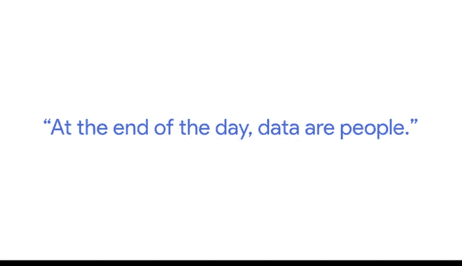

# 033：公平与道德的数据决策 🤔

## 概述

在本节课中，我们将跟随谷歌研究科学家Alex的分享，探讨数据伦理的核心概念。我们将了解什么是道德的数据使用，以及作为数据分析师，为何需要始终将数据背后的人放在首位，并思考如何通过数据决策真正造福社会。

---

## 数据伦理：超越避免伤害

上一节我们介绍了数据分析的基础，本节中我们来看看数据使用的道德维度。当我们谈论数据伦理时，我们思考的是使用数据的正确与良好方式，以及哪些数据使用方式将对人们有益。

数据伦理不仅仅是关于最小化伤害，它更关乎**善行**这一概念：我们如何通过使用数据来真正改善人们的生活。

---

## 审视数据收集的出发点

思考数据伦理时，我们需要审视几个关键问题：**谁**在收集数据、**为什么**收集、**如何**收集以及**为了什么目的**。

由于组织通常有盈利、汇报或提供分析的压力，我们必须时刻牢记，这些数据最终将如何真正使人们受益。数据所代表的人群会因此受益吗？作为数据科学家或数据分析师，这是绝不能忽视的一点。

---

## 核心原则：数据即人

对于有志成为数据分析师的人，需要牢记一个核心原则：你将遇到的大量数据都来源于人。因此，归根结底，**数据即人**。

你需要对那些在数据中被代表的人们负有责任。

以下是随之而来的两个关键考量：

1.  **数据保护与隐私**：在我们的实践中，不能将数据实例视为可以随意抛到网上的东西。必须考虑如何保护这些信息，例如人们的图像、声音或文本，并确保其私密性。
2.  **赋予用户数据控制权**：仅仅说“我们收集了所有数据，请相信我们”是不够的。我们需要确保存在可行的方式，让人们能够同意提供数据，并能够要求撤销或删除数据。随着数据的增长，我们必须赋能人们，让他们能控制自己的数据。

---

## 展望未来：日益重要的议题

数据在不断增长，目前没有任何证据表明数据量在缩减。随着数据的持续膨胀，上述这些关于伦理、隐私和控制权的问题将变得愈发尖锐和重要。作为未来的数据分析从业者，从一开始就将这些原则内化于心至关重要。

---

## 总结

本节课我们一起学习了数据伦理的基本框架。我们认识到，道德的数据决策要求我们超越技术层面，始终关注数据背后的人，确保数据收集和使用过程的透明度，并致力于通过数据创造积极的社会价值。记住，**数据即人**，这是所有数据分析工作的基石。