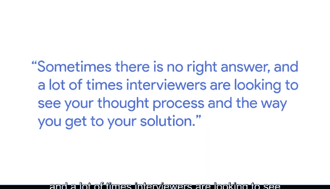
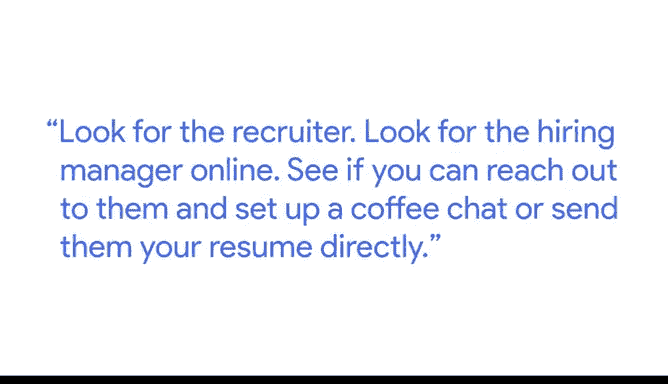

# 035：面试最佳实践 🎤

在本节课中，我们将学习来自谷歌招聘专家萨玛·莫伊的分享，了解数据分析师在求职和面试过程中的关键策略与最佳实践。我们将涵盖如何准备面试、如何展示自己以及如何主动争取机会。

---

我的名字是萨玛·莫伊，我是谷歌大客户销售团队的招聘人员。我的主要工作是为销售团队招聘人才。即使在销售招聘领域内，我也专门负责为谷歌招聘分析类领导岗位。

作为一名招聘人员，我希望候选人尽可能感到自在。如果候选人非常适合团队，我也会作为他们的支持者，以最佳方式展示他们。

---

## 给初入职场数据分析师的建议 💡

上一节我们了解了招聘人员的角色，本节中我们来看看萨玛为刚开始找工作的数据分析师提供的具体建议。

萨玛提供了两条核心建议，以下是详细内容：

**第一条建议：准备一个数据解决问题的实例**

思考一个你曾使用数据解决问题的时刻。这个实例可以来自你的专业工作或个人项目。

**第二条建议：拓展你的专业人脉网络**

拓展专业人脉网络有多种方式。

以下是几种有效的方法：
*   增加你的线上足迹，例如在LinkedIn上联系其他分析师。
*   参加本地与其他数据科学家的聚会。
*   保持你的LinkedIn个人资料及时更新，并利用像Github这样的网站展示你做过的数据分析项目。

---

## 现场面试的实用技巧 🤝

在了解了求职准备后，我们来看看现场面试时需要注意什么。

萨玛强调，在现场面试中，一个重要的技巧是为面试官准备问题。

请确保你准备的问题不是宽泛的，而应是有助于你更好地理解团队和职位的问题。

---

## 如何应对案例研究面试 📊

除了常规问题，数据分析师面试常会遇到案例研究。本节我们重点讨论如何应对这类挑战。

如果你在面试中遇到案例研究，通常会收到一个商业问题和一个样本数据集。接着，你将被要求分析该样本数据并提出解决方案。

你可以通过以下方式为此做准备：
*   确保你的分析紧扣数据，并基于数据得出解决方案。
*   理解很多时候并没有唯一正确答案，面试官通常更关注你的思考过程和解决问题的路径。

---

## 主动争取机会的重要性 ✨

最后，萨玛分享了一个超越被动投递简历的关键策略。

她强烈建议，如果你找到一个感兴趣的职位，不要仅仅提交申请。

请采取下一步行动：在线寻找该职位的招聘人员或招聘经理，尝试联系他们并安排一次咖啡聊天，或直接将你的简历发送给他们。

直接联系招聘经理或招聘人员，能充分显示你对职位的渴望和兴趣。在线申请有时可能如石沉大海，得不到回复。即使主动联系不一定每次都有回音，但你永远不知道，多次尝试中的某一次，来自招聘人员或招聘经理的回复，可能正是你获得心仪工作的契机。

---

## 总结 📝

本节课中，我们一起学习了谷歌招聘专家萨玛·莫伊分享的数据分析师求职与面试最佳实践。我们探讨了如何通过准备具体的数据问题实例和拓展人脉来提升求职竞争力，了解了现场面试中提问的技巧以及应对案例研究的方法，并认识到主动直接联系招聘方对于争取心仪机会的重要性。记住，充分准备并积极展示自己，是迈向成功数据分析师职业生涯的关键步骤。