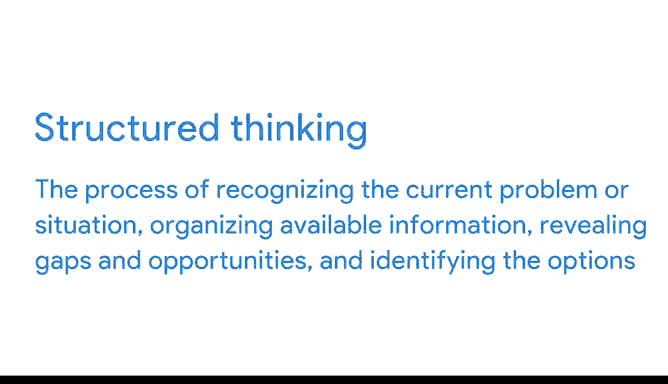

# 001：谷歌数据分析师课程第二课《以数据驱动的决策提出问题》🎯

## 概述

在本节课中，我们将学习如何通过有效提问来驱动数据分析，从而解决实际的商业问题。课程将涵盖问题解决的基础、有效与无效提问的区别、数据类型、结构化思维以及有效沟通的策略。

---

## 欢迎与课程介绍

欢迎来到谷歌数据分析师认证的第二门课程。

如果你完成了第一门课程，我们已经在开始时简短地见过面。但对于刚刚加入的学员，我叫Humana，是谷歌的一名财务数据分析师。

很高兴能和大家一起学习数据分析这个迷人的领域。学习和教育对我而言一直非常重要。我年轻时，母亲常说：“我无法留给你遗产，但我可以给你一份能打开大门的教育。”这句话一直激励我持续学习，而这份教育也给了我申请谷歌工作的信心。

现在，我每天都能从事非常有意义的工作。最近，我在一个名为Verily生命科学的团队担任分析师。我们的工作是帮助将救生医疗物资送达最需要的人手中。为此，我们预测了医疗专业人员需要储备的物资，并将信息分享给相关网络。我们团队提供的信息帮助做出了以数据驱动的决策，这些决策实际上拯救了生命。

我很荣幸能担任本课程的讲师。我们将探讨有效提问与无效提问的区别，并学习如何提出能带来深刻见解、帮助解决商业问题的好问题。

你会发现，有效提问能帮助你在数据分析的各个阶段充分利用数据。你可能还记得，这些阶段包括：提问、准备、处理、分析、分享和行动。

---

## 问题解决与有效提问入门

在“提问”阶段，我们定义要解决的问题，并确保完全理解利益相关者的期望。这有助于你将注意力集中在实际问题本身，从而带来更成功的成果。

因此，本课程将从讨论问题解决以及数据分析师帮助解决的常见商业问题类型开始。

由于本课程侧重于“提问”阶段，你将学习如何构建有效的问题，以帮助你收集正确的数据来解决这些问题。

---

## 数据类型及其应用

接下来，我们将讨论许多不同的数据类型。

你将学习每种类型在何时以及如何最为有用。你还有机会进一步探索电子表格，并发现它们如何帮助你更有效地进行数据分析。

---

## 结构化思维简介

然后，我们将开始学习结构化思维。

结构化思维是一个过程，包括：识别当前问题或情况、组织可用信息、揭示差距和机会、以及确定可选方案。

在这个过程中，你将一个非常复杂的问题分解成更小的步骤来处理。这些步骤将引导你找到一个合乎逻辑的解决方案。

我们将共同努力，确保你完全理解如何在数据分析中运用结构化思维。

---

## 有效沟通策略

最后，我们将学习一些经过验证的有效与他人沟通的策略。

我迫不及待地想与大家分享更多我对数据分析的热情。让我们开始吧！

---

## 总结

本节课中，我们一起学习了数据分析中“提问”阶段的核心价值。我们探讨了如何通过定义问题和理解期望来聚焦于实际挑战，介绍了有效提问的技巧以收集关键数据，概述了不同数据类型的用途，引入了将复杂问题分解的结构化思维方法，并简要提及了有效沟通的重要性。这些基础将帮助你开启以数据驱动决策的旅程。