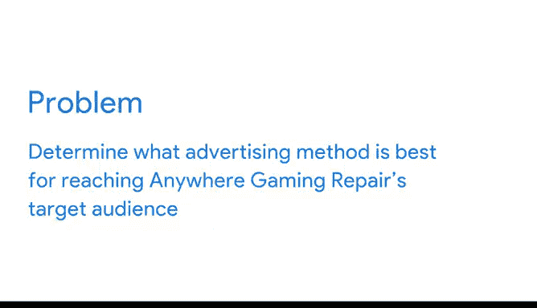

# 002：谷歌数据分析师第二课《以数据驱动的决策提出问题》📊

## 课程概述

在本节课中，我们将通过一个真实的数据分析案例，学习如何运用数据分析流程的六个阶段来解决实际问题。我们将看到，从明确问题到采取行动，数据如何引导一家小型企业做出有效的商业决策。

---

## 案例背景：Anywhere Gaming Repair 🎮

本案例的主角是一家名为“Anywhere Gaming Repair”的小型企业。这家公司提供上门维修视频游戏主机及配件的服务。其所有者希望拓展业务，他知道广告是获取更多客户的有效途径，但面对众多广告策略（如印刷品、广告牌、电视广告、公共交通广告、播客和广播广告），他不知从何入手。

选择广告方法时，需要考虑两个关键因素：**目标受众**和**预算**。

*   **目标受众**：指你希望触达的特定人群。例如，医疗设备制造商若想接触医生，在健康杂志上刊登广告是明智之选。
*   **预算**：不同广告方式的成本差异巨大。例如，电视广告通常比广播广告昂贵，大型广告牌的成本也高于公交车背面的小海报。

企业主聘请了数据分析师玛丽亚来提供建议。

---

## 数据分析流程的应用

上一节我们介绍了案例的背景和核心挑战。本节中，我们来看看数据分析师玛丽亚是如何运用数据分析的六个阶段来解决问题的。

### 第一阶段：提问 (Ask) ❓

玛丽亚从数据分析流程的第一步——“提问”开始。她首先需要**定义待解决的问题**。为此，她必须跳出细节，审视整体背景，以确保关注的是根本问题，而非表面现象。

这引出了问题解决过程的另一个重要部分：**与利益相关者协作并理解他们的需求**。对于Anywhere Gaming Repair而言，利益相关者包括企业主、传播副总裁以及市场与财务总监。

通过协作，玛丽亚与利益相关者共同明确了问题所在：**不了解目标受众偏好的广告类型**。

### 第二阶段：准备 (Prepare) 📁

明确了问题后，玛丽亚进入了“准备”阶段，为即将开始的分析收集数据。

首先，她需要更好地理解公司的目标受众：**拥有视频游戏系统的人群**。之后，玛丽亚收集了关于不同广告方式的数据，以便确定哪种方式在目标受众中最受欢迎。

### 第三阶段：处理 (Process) 🧹

接着是“处理”阶段。在此阶段，玛丽亚**清洗数据**，以消除任何可能影响结果的错误或不准确之处。

正如我们所知，清洗数据意味着将其转换为更有用的格式、创建更完整的信息以及**移除异常值**。

### 第四阶段：分析 (Analyze) 🔍

处理完数据后，便进入了“分析”阶段。玛丽亚希望弄清两件事：
1.  谁最可能拥有视频游戏系统？
2.  这些人最可能在何处看到广告？

通过分析，玛丽亚首先发现**18至34岁的人群**最有可能进行与视频游戏相关的消费。因此，她确认Anywhere Gaming Repair的目标受众应为18至34岁的人群，公司应努力触达这部分人。

考虑到这一点，玛丽亚进一步了解到，**电视广告和播客**在目标受众中都非常受欢迎。但由于玛丽亚知道Anywhere Gaming Repair的预算有限，并且了解电视广告的高昂成本，她的建议是：**在播客上投放广告**，因为这种方式更具成本效益。

### 第五阶段：分享 (Share) 📊

分析完成后，玛丽亚需要分享她的建议，以便公司能做出数据驱动的决策。她使用清晰且具有说服力的分析可视化图表来总结结果，这有助于利益相关者理解针对原始问题的解决方案。

### 第六阶段：行动 (Act) 🚀

最后，Anywhere Gaming Repair采取了行动。他们与一家本地播客制作机构合作，制作了一条关于其服务的32秒广告。该广告在播客上投放了一个月，并且效果显著：**仅第一周后，客户数量就有所增长；到第4周末，他们获得了85位新客户**。

---

## 课程总结 🎯

本节课中，我们一起学习了数据分析六阶段（提问、准备、处理、分析、分享、行动）在解决实际问题中的应用。通过Anywhere Gaming Repair的案例，我们看到了如何从定义商业问题开始，通过数据收集、清洗、分析，最终形成可执行的建议并取得实际成果。这就是**有效的问题解决**，也是**数据分析流程在现实世界中的生动体现**。