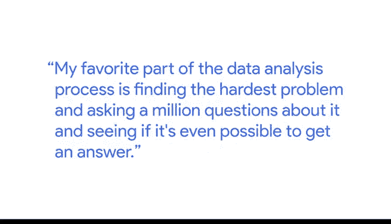

# 003：数据处理流程如何运作 🛠️

在本节课中，我们将跟随谷歌教育评估与研究团队负责人Nikki，学习一个完整的数据处理流程是如何运作的。我们将通过一个具体的案例——谷歌新员工入职培训项目的评估，来了解从提出问题到最终行动的六个关键步骤。

---

## 概述：从问题到行动的数据之旅

Nikki介绍了她最喜爱的数据分析环节：发现最棘手的问题，并提出大量问题以探寻解答的可能性。本节将以谷歌新员工入职培训项目为例，详细拆解整个数据处理流程。

## 第一步：提出问题 ❓

我们首先需要明确分析的核心问题。在谷歌的案例中，团队提出的问题是：**我们如何知道新员工通过新的项目制入职培训项目，比旧的讲座式培训项目入职得更快？**

提出问题是数据分析的起点，它决定了后续所有工作的方向。

## 第二步：准备数据 📊

上一节我们明确了分析目标，本节中我们来看看如何为分析准备数据。

一旦问题确定，下一步就是准备数据。这需要与内容提供方紧密合作，以准确定义“更快入职”的具体含义。数据准备包括：

*   **确定分析对象**：理解我们所考察的新员工总体是谁。
*   **划分样本集**：明确我们的样本集、控制组和实验组分别是谁。
*   **定位数据源**：找到数据来源。
*   **确保数据格式**：确保数据格式干净、规整，便于我们编写正确的分析脚本。

## 第三步：处理数据 ⚙️

数据准备就绪后，我们需要对其进行处理，使其进入可分析状态。

我们的下一步是处理数据，确保其格式适用于SQL等工具进行分析。这包括：

*   **格式化数据**：确保数据处于正确的格式、正确的列和正确的表中。
*   **编写分析脚本**：我们使用 **`SQL`** 和 **`R`** 编写脚本来关联控制组或实验组的数据。
*   **解读数据**：解释数据，以理解我们观察到的行为指标是否有任何变化。

## 第四步：分享结果 📈

分析完所有数据后，我们需要以利益相关者能够理解的方式报告结果。

根据利益相关者的不同，我们准备了多种形式的报告：

*   **书面报告**
*   **数据仪表盘**
*   **演示文稿**

并将这些信息分享出去。

## 第五步：根据结果行动 🚀

报告完成后，我们看到了非常积极的结果，并决定采取行动。

我们决定继续推行基于项目学习的入职培训计划。知道我们有数据支持这一决策，并且该计划确实行之有效，这令人非常满意。

## 总结与收获 🎯

本节课中，我们一起学习了数据处理的全流程。通过谷歌的实例，我们看到了一个数据分析项目如何从提出一个关键问题（“新培训是否更快？”）开始，经历**准备数据**、**处理分析**、**分享见解**，最终推动**实际行动**（继续推行新项目）。整个过程不仅依赖于数据的存在，更让我们确信我们的学员真正学到了东西，并且能更快地在工作中提高效率。