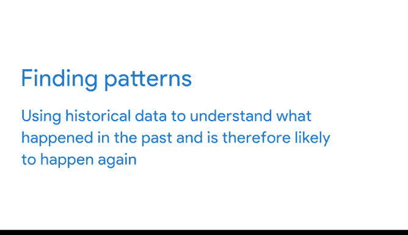

# 004：谷歌数据分析师第二课《以数据驱动的决策提出问题》- 04_01_01_常见问题类型 📊

在本节课中，我们将要学习数据分析师在日常工作中遇到的六种常见问题类型。理解这些类型是解决问题的第一步，它能帮助你更有效地运用数据技能，找到富有创意和洞察力的解决方案。

上一节我们介绍了数据分析如何帮助公司决策，本节中我们来看看数据分析师具体会处理哪些类型的问题。

## 概述：六种常见问题类型

数据分析师处理的问题多种多样，但可以归纳为几种常见类型。以下是数据分析师在工作中最常遇到的六种问题类型：

1.  **做出预测**：利用数据对未来情况做出有根据的决策。
2.  **分类事物**：根据共同特征将信息分配到不同的组或集群中。
3.  **发现异常**：识别与常态不同的数据。
4.  **识别主题**：将信息归类到更广泛的概念中。
5.  **发现关联**：找到不同实体面临的相似挑战，并整合数据与见解来解决它们。
6.  **寻找模式**：利用历史数据理解过去发生的情况，从而预测未来可能发生的情况。

接下来，我们将逐一详细探讨这些类型。

## 1. 做出预测 🧮

这种问题类型涉及使用数据对未来事物的发展做出明智的决策。

例如，一个医院系统可能使用远程患者监测数据来预测慢性病患者的健康事件。患者每天在家测量生命体征，这些信息结合他们的年龄、风险因素和其他重要细节，可以使医院的算法预测未来的健康问题，甚至减少未来的住院次数。

**核心概念**：预测模型通常基于历史数据，其基本思想可以表示为：`未来结果 = f(历史数据, 相关变量)`。

## 2. 分类事物 🗂️

这种类型意味着根据共同特征将信息分配到不同的组或集群中。

以下是这种问题类型的一个例子：一家制造商审查车间员工绩效数据。分析师可能会为工程效率最高和最低的员工创建一个组，为维修和维护效率最高和最低的员工创建一个组，为装配效率最高和低的员工创建一个组，以及许多其他组或集群。

**核心概念**：分类算法（如K-means聚类）的目标是将数据点分组，使得组内相似性高，组间相似性低。

## 3. 发现异常 ⚠️

在这种问题类型中，数据分析师识别与常态不同的数据。

现实世界中发现异常的一个实例是：一个学校系统的注册学生人数突然增加，可能增幅高达30%。数据分析师可能会调查这一激增现象，并发现当年早些时候在该学区建造了几座新的公寓楼。他们可以利用这一分析来确保学校有足够的资源来应对额外的学生。

**核心概念**：异常检测旨在识别不符合预期模式的数据点，通常使用统计方法（如计算Z-score：`Z = (X - μ) / σ`）或机器学习模型。

## 4. 识别主题 🎯

识别主题通过将信息分组到更广泛的概念中，将分类推进了一步。

回到那家刚刚审查了车间员工数据的制造商。首先，这些人按任务类型被分组。但现在，数据分析师可以拿这些类别，并将它们归入“低生产率”和“高生产率”这个更广泛的概念中。这将使企业能够看到谁的生产率最高和最低，从而奖励表现最佳者，并为那些需要更多培训的工人提供额外支持。

**核心概念**：主题识别常通过文本分析技术（如主题建模）实现，从大量文本中提取出抽象的主题。

## 5. 发现关联 🔗

发现关联这种问题类型使数据分析师能够找到不同实体面临的相似挑战，然后结合数据和见解来解决它们。

具体来说：假设一家滑板车公司遇到了其车轮供应商提供的车轮问题。公司将不得不停止生产，直到能重新获得质量合格的车轮库存。但与此同时，车轮公司也遇到了制造车轮所用橡胶的问题。结果发现，其橡胶供应商也找不到合适的材料。如果所有这些实体都能公开讨论他们面临的问题并分享数据，他们会发现很多相似的挑战，并且更能够协作找到解决方案。

**核心概念**：关联分析可以揭示变量之间的关系，例如使用相关性公式：`r = Σ[(Xi - X̄)(Yi - Ȳ)] / √[Σ(Xi - X̄)² Σ(Yi - Ȳ)²]`。

## 6. 寻找模式 📈

数据分析师通过使用历史数据来理解过去发生的事情，从而寻找可能再次发生的模式。

电子商务公司经常使用数据来寻找模式。数据分析师查看交易数据，以了解客户在一年中某些时间点的购买习惯。他们可能会发现，客户在飓风来临前会购买更多罐头食品，或者在较温暖的月份购买较少的帽子、手套等冷天配件。电子商务公司可以利用这些洞察，确保在这些关键时期储备合适数量的产品。

**核心概念**：模式识别依赖于时间序列分析或序列模式挖掘，以发现数据中的重复规律或趋势。

## 总结

本节课中我们一起学习了数据分析师面临的六种基本问题类型：**做出预测**、**分类事物**、**发现异常**、**识别主题**、**发现关联**和**寻找模式**。理解这些类型是有效解决问题的基石，它将帮助你在未来的数据分析师生涯中，更系统、更高效地应对各种挑战。在接下来的课程中，我们将进一步探讨这些类型，并通过更多实际案例加深理解。