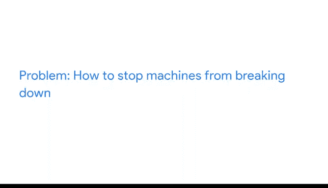

# 005：六类常见商业问题应用详解 🎯

在本节课中，我们将继续探索数据分析师在商业环境中常遇到的六类问题，并通过具体实例理解它们如何被应用于解决实际挑战。我们将逐一回顾**预测、分类、发现异常、识别主题、发现关联和寻找模式**这六类问题，并学习如何将它们转化为数据驱动的解决方案。

---

## 预测问题：预见未来结果

上一节我们介绍了六类常见问题，本节中我们来看看第一类：**预测**。预测问题旨在利用现有数据推断未来可能发生的情况。

以下是预测问题的一个应用实例：

*   **背景**：Anywhere Gaming Repair公司希望吸引新客户。
*   **问题**：如何确定针对目标受众的最佳广告投放方式？
*   **解决方案**：公司分析在不同平台投放广告的历史数据，预测各种方案可能带来的效果，从而做出更明智的决策。

虽然无人能预知未来，但数据可以帮助我们评估不同决策可能产生的结果。

## 分类问题：将事物系统化分组

接下来，我们探讨第二类问题：**分类**。分类问题涉及根据特定标准将数据点分配到不同的组别中。

以下是分类问题的一个应用实例：

*   **背景**：某公司希望提升客户满意度。
*   **问题**：如何评估并提升客服质量？
*   **解决方案**：数据分析师可以分析客服通话录音，识别通话中的关键词或短语，并将它们分类，例如：
    *   **礼貌程度**
    *   **满意度**
    *   **不满意度**
    *   **同理心表达**

通过分类，公司可以识别出表现优异的客服代表以及需要额外培训的员工，从而提升整体客户满意度和服务评分。

## 发现异常问题：识别意外情况

现在，让我们讨论第三类问题：**发现异常**。这类问题专注于识别数据中与常规模式显著不同的点或事件。

以下是发现异常问题的一个应用实例：

*   **背景**：智能健康设备持续收集用户生理数据。
*   **问题**：如何及时发现潜在的健康风险？
*   **解决方案**：设备（如同数据分析师）持续监测心率等数据。例如，一位用户的静息心率通常为**70次/分钟**，但某晚设备监测到心率突然飙升至**120次/分钟**，这触发了异常警报。用户据此就医，及时发现了可能危及生命的健康问题。

## 识别主题问题：提炼核心观点

紧接着，我们来看第四类问题：**识别主题**。这类问题常用于用户体验等领域，旨在从大量定性数据中归纳出核心观点或模式。

以下是识别主题问题的一个应用实例：

*   **背景**：用户体验设计师希望了解用户对其公司生产的咖啡机的看法。
*   **问题**：如何从海量用户反馈中提取有效改进信息？
*   **解决方案**：设计师分析匿名调查数据，将零散的见解归纳为更广泛的**主题**。例如，他发现一个常见主题是“用户难以判断咖啡机是否已启动”。基于此，他优化了开关按钮的位置和指示灯设计，从而提升了产品体验。

## 发现关联问题：揭示事物间的联系

然后，我们进入第五类问题：**发现关联**。这类问题旨在找出不同数据集或变量之间的相互关系。

以下是发现关联问题的一个应用实例：

*   **背景**：第三方物流公司面临卡车等待时间过长的问题。
*   **问题**：如何减少因发货方未准备好货物导致的卡车等待时间？
*   **解决方案**：通过共享数据，合作双方可以查看彼此的时间线，**发现关联**。例如，他们可能发现延误是因为一方仅在周一、三、五发货，而另一方仅在周二、四收货。通过调整日程至同一天，即可有效减少等待时间。

## 寻找模式问题：洞察重复规律

最后，我们探讨第六类问题：**寻找模式**。这类问题通过分析历史数据，发现重复发生的规律或趋势。

以下是寻找模式问题的一个应用实例：

*   **背景**：石油天然气公司需要确保设备持续正常运行。
*   **问题**：如何预防机器故障？
*   **解决方案**：数据分析师研究历史数据，**寻找模式**。他们可能发现，当设备维护周期超过**15天**时，故障率会显著上升。基于这一模式，公司可以实施更严格的定期维护计划，并在类似问题再次出现迹象时及时干预。

---

本节课中，我们一起学习了数据分析六类常见问题在真实商业场景中的应用。从预测未来趋势到分类归纳，从发现异常警报到识别核心主题，再到发现事物关联并寻找潜在模式，数据为各行各业提供了强大的决策支持。理解这些问题的类型及其应用场景，是成为合格数据分析师的关键一步。