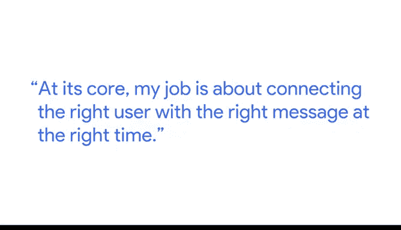

# 006：从假设到结果 🧪

在本节课中，我们将跟随谷歌营销团队高级营销分析负责人 Anmol 的讲解，学习如何将一个初步的假设，通过数据分析与测试，最终转化为可执行的商业策略和推荐。这个过程是数据驱动决策的核心。

---

我的核心工作是在正确的时间，将正确的信息传递给正确的用户。

## 第一步：识别广泛模式

第一步是广泛地识别正在发生的某种模式。

例如，我们发现某个特定的用户群体对某类内容的反应更积极。

## 第二步：通过数据验证假设

一旦我们能够通过数据观察到这个假设，我们会进行测试以确保假设是正确的。

以下是测试流程：

1.  **设计测试**：我们会测试向这个用户群体发送这类内容。
2.  **控制环境**：在一个受控的环境中实际验证。
3.  **验证指标**：确认该类内容对该群体的响应率是否确实更高。

验证过程可以用一个简单的逻辑表示：
`if (测试组响应率 > 对照组响应率) { 假设成立 } else { 假设不成立 }`

## 第三步：向利益相关者汇报结果

一旦我们能够验证这个假设，我们会回到利益相关者（这里指我们的营销人员）那里进行汇报。

我们会说：“我们已经在相当高的确定度下证明，这个特定群体对这类内容反应更积极。因此，我们建议你们生产更多这类内容。”

## 第四步：共同见证从假设到策略的演变

我们的利益相关者得以亲眼看到从假设到已验证概念的整个演变过程。

他们能够与我们一同经历我们如何验证这些假设，并最终将其转化为商业策略和建议的旅程。

---

## 成果与影响

这个过程的成果是，我们得以真正改变整个营销团队的工作方式。

我们使其变得更加以用户为中心。

从我们的视角来看，这意味着一个根本性的转变：

*   **旧方式**：我们先构思我们认为用户需要的内容。
*   **新方式**：我们先弄清楚用户需要什么，证明他们需要或不需要某些东西，然后利用这些信息反馈给营销人员，再创作出满足他们需求的内容。

这彻底改变了我们生产内容的方向。

---

## 总结

本节课中，我们一起学习了数据驱动决策中“从假设到结果”的完整闭环。这个过程始于对业务模式的观察和假设形成，关键在于通过严谨的测试在数据中验证假设，最终将验证后的结论转化为具体的、以用户为中心的商业行动建议。掌握这一流程，是成为高效数据分析师的重要一步。