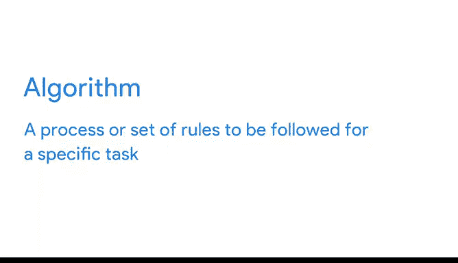

# 010：数据如何赋能决策

在本节课中，我们将探讨数据如何在决策过程中发挥作用，并初步了解数据驱动决策与数据启发决策的区别。我们将通过实际例子，理解数据如何从原始事实转化为有价值的知识，并最终赋能决策。

---

我们已经讨论过数据的定义及其在决策中的作用。目前我们了解到：**数据是事实的集合**；**数据分析能揭示数据中的重要模式和洞见**；**数据分析能帮助我们做出更明智的决策**。

本节中，我们将具体观察数据如何融入决策流程，并快速区分数据驱动决策与数据启发决策。

---

## 🔍 数据在现实决策中的应用

回想一下你最近一次使用“附近餐厅”搜索，并按评分排序来帮助决定去哪家就餐的经历。这就是一个利用数据做出决策的实例。

企业和组织同样时刻利用数据来优化决策。它们主要通过两种方式实现：**数据驱动决策** 或 **数据启发决策**。我们稍后会详细讨论数据启发决策，这里先给出一个简要定义：

> **数据启发决策**通过探索不同数据源，找出它们之间的共同点。

以谷歌为例，我们每天以各种令人惊喜的方式运用数据。例如，通过分析人工智能收集的多年数据，我们做出了帮助**将数据中心冷却能耗降低超过40%** 的决策。

谷歌的人力运营团队也利用数据来改进招聘流程与新员工入职体验。我们希望确保不错过任何有才华的申请人，并让新员工顺利适应角色。在分析了申请、面试和新员工培训流程的数据后，我们开始采用一种**算法**。

> **算法**是为完成特定任务而遵循的一系列过程或规则集。

借助该算法，我们重新审核了未通过初筛的申请人，以发现优秀候选人。数据还帮助我们确定了能带来最佳招聘决策的理想面试次数。此外，我们制定了新的入职计划，以帮助新员工更好地开启工作。

---

## 🌐 数据的潜力与转化

数据无处不在。科学家估计，**全球90%的数据是在过去短短几年内产生的**。这蕴含着巨大潜力：我们拥有的数据越多，能解决的问题就越大，解决方案也越有力。

然而，负责任地收集数据只是过程的一部分。我们还需**将数据转化为能帮助我们制定更好解决方案的知识**。正如谷歌同事所说：

> 仅仅拥有海量数据是不够的，我们必须用它来做有意义的事。数据本身提供的价值很小。

引用推特和Square创始人杰克·多西的话：

> “我们在世界上所做的每一个行动都会触发一定量的数据。在有人对其加以解读或赋予叙事之前，这些数据大多毫无意义。”

数据是直白的：**`数据 = 收集在一起的事实，描述某物的数值`**。

单个数据点在收集和结构化后会变得更有用，但其本身仍缺乏意义。我们需要**解读数据以将其转化为信息**。

以迈克尔·菲尔普斯在200米个人混合泳比赛中的成绩为例，“1分54秒”这个数据本身信息有限。

但当我们将其与比赛中其他选手的时间进行比较时，就能看出迈克尔获得了第一名，赢得了金牌。

我们的分析获取了数据（即迈克尔一系列比赛的成绩列表），并通过与其他数据对比，将其转化为了信息。**上下文至关重要**：我们需要知道这是一场奥运会决赛，而非普通比赛，才能确定这是金牌成绩。

但这仍未成为知识。当我们**消化信息、理解并应用它**时，数据才发挥最大效用。换句话说，我们由此得知：**迈克尔·菲尔普斯是一位速度极快的游泳运动员**。

---

## ⚠️ 数据分析的局限性

但请记住，数据分析存在局限性。有时我们无法获取所需的全部数据，或者不同项目对数据的衡量方式不同，这可能导致难以找到确凿的例证。我们将在后续课程中更详细地探讨这些，但现在开始思考它们非常重要。

---

## 🎯 总结与展望

现在你已了解数据如何驱动决策，也明白了数据分析师角色对企业的重要性。数据是决策的强大工具，而你可以帮助企业获得解决问题和做出新决策所需的信息。

但在那之前，你需要进一步了解将要处理的数据类型以及如何处理它们。我们将在接下来的课程中展开学习。

---

**本节课中，我们一起学习了：**
1.  数据在现实生活和企业决策中的具体应用实例。
2.  数据驱动决策与数据启发决策的初步概念。
3.  数据如何从原始事实，经过解读和对比转化为信息，并最终通过应用成为知识。
4.  认识到数据分析存在获取和衡量标准等方面的局限性。
5.  明确了数据分析师在将数据转化为决策知识过程中的关键作用。