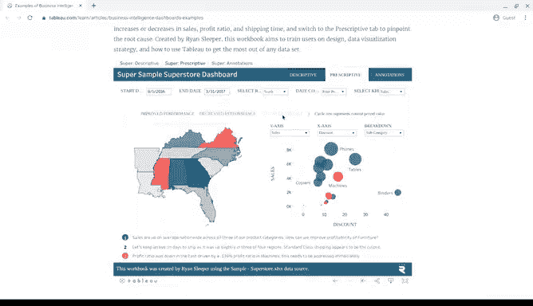

# 012：成果展示 - 分享你的发现 📊

在本节课中，我们将学习如何有效地组织和展示数据分析成果。数据本身很有价值，但若无法清晰传达数据背后的故事，它对任何人都没有用处。因此，我们需要掌握将数据转化为信息的方法。本节将重点介绍两种数据展示工具：报告和仪表盘。

---

## 报告与仪表盘：两种可视化工具

上一节我们介绍了数据的重要性，本节中我们来看看如何展示数据。报告和仪表盘都是有用的数据可视化工具，但各有优缺点。

报告是定期提供给利益相关者的静态数据集合。仪表盘则用于监控实时传入的数据。

---

## 深入了解报告 📄

报告非常适合展示组织的高层次历史数据快照。例如，一家金融公司的月度销售额。

以下是报告的主要优点：

*   报告可以定期设计和发送，通常按周或按月进行，是组织有序且易于参考的信息。
*   只要持续维护，报告设计快捷且易于使用。
*   报告使用静态数据（即记录后不再更改的数据），因此反映的是已经过清理和排序的数据。

当然，报告也有一些缺点需要注意：

*   报告需要定期维护，并且视觉吸引力通常不强。
*   由于报告不是自动或动态的，因此无法显示实时演变的数据。

---

## 探索仪表盘 🖥️

若需要实时反映传入的数据，您需要设计一个仪表盘。

仪表盘之所以出色，原因有很多：

*   仪表盘让您的团队能更多地访问正在记录的信息。
*   您可以通过使用筛选器与数据进行交互。
*   由于是动态的，仪表盘具有长期价值。如果利益相关者需要持续访问信息，使用仪表盘比反复提取报告更高效，这为您节省了大量时间。
*   最后同样重要的是，仪表盘看起来更美观。

但仪表盘也有一些缺点：

*   仪表盘设计需要大量时间，如果使用频率不高，其效率可能反而不如报告。
*   如果底层数据表在任何时候出现问题，仪表盘需要大量维护才能恢复运行。
*   仪表盘有时会因信息过多而让人不知所措。如果不习惯查看仪表盘上的数据，可能会在其中迷失方向。

---

## 选择正确的沟通方式

作为数据分析师，您需要决定向利益相关者传达信息的最佳方式。

例如，如果您的利益相关者对公司社交媒体参与度感兴趣，那么一份告知其页面新增关注者数量的月度报告是否有用？还是一个能监控多个平台实时社交媒体参与度的仪表盘更有用？

在后续课程中，您将创建自己的报告和仪表盘来练习使用这些工具。但现在，我想向您展示报告和仪表盘可能是什么样子。

---

## 使用电子表格创建报告示例

我们将从一个熟悉的工具——电子表格开始。让我们看看电子表格数据在报告中可视化的一种方式。

这个电子表格包含一家公司的订单详情数据集。信息量很大。从标题行可以看出，这里记录了不同的内容，例如订单日期、销售人员、单价和每笔记录交易的收入。

这些都是有用的信息，但有点难以理解。我们需要一份更易读的报告。

假设您的利益相关者希望快速查看按销售人员划分的收入情况。利用这些数据，您可以为他们制作一个数据透视表，并附上显示该信息的图表。

数据透视表是一种用于数据处理的数据汇总工具。它用于汇总、排序、重组、分组、计数数据，或计算数据库中存储数据的平均值。它允许用户将列转换为行，将行转换为列。我们稍后会深入学习数据透视表，但我先快速演示一下。

我们将选择“数据”菜单，点击“数据透视表”按钮。它可以从这个表格中提取数据，所以我们只需点击“创建”，它就会在这里调出一个新的工作表。它为我们提供了可供选择的数据透视表字段。

我选择“销售人员”和“收入”。就这样，它为我们制作了一个图表。此时，您可以调整图表的外观，但所有信息都已呈现。

---

## 仪表盘示例

如果您需要一种更动态的方式与利益相关者共享信息，仪表盘是您的得力助手。

您可能会创建类似这样的 Tableau 仪表盘，其中包含交互式图表，展示数据的多个视图。用户可以通过点击仪表盘上的不同元素，来更改位置、日期范围或他们正在查看数据的任何其他方面。很酷，对吧？

在本课程的后续部分，我们将探讨如何制作自己的数据可视化。在达到那个水平之前，我们还有很多东西要学，但我希望这是对不同可视化工具的一次激动人心的初探，这些工具将是您作为数据分析师要使用的。

---

## 总结

本节课中我们一起学习了如何通过报告和仪表盘来分享数据分析发现。报告适合提供定期的、静态的历史数据快照，而仪表盘则擅长展示动态的、实时的数据交互视图。作为分析师，根据利益相关者的具体需求选择合适的工具至关重要。我们通过电子表格初步了解了报告的制作，并预览了交互式仪表盘的功能，为后续深入学习数据可视化奠定了基础。