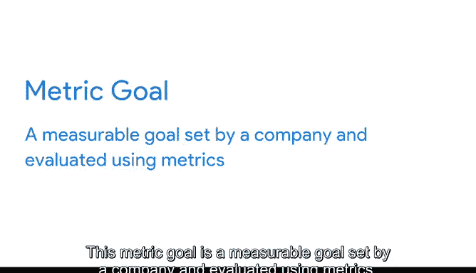

# 013：数据与指标对比

在本节课中，我们将要学习数据与指标之间的区别，以及如何利用指标将原始数据转化为有用的信息。我们将探讨指标的定义、如何选择正确的指标，以及不同行业如何运用指标来达成业务目标。

---

在上一节视频中，我们学习了如何通过报告和仪表板可视化数据，以有趣的方式展示发现。在其中一个例子中，公司希望查看每位销售人员的销售额，这一具体的数据测量正是通过指标完成的。

本节中，我们将进一步探讨数据与指标的区别，以及指标如何将数据转化为有用信息。

## 什么是指标？ 📈

**指标**是一种可量化的单一数据类型，可用于测量。

可以这样理解：数据最初是一堆原始事实的集合，直到我们将它们组织成代表单一数据类型的个体指标。

指标还可以组合成公式，你可以将数值数据代入这些公式进行计算。

在我们之前的销售额例子中，除非使用特定的指标来组织数据，否则所有数据意义不大。

以每位销售人员的收入作为我们的指标，现在我们就能看出哪位销售人员带来了最高的收入。

## 指标通常涉及简单数学运算 ➕

例如，**收入**的计算公式是：`收入 = 销售数量 × 销售单价`。

选择正确的指标是关键。数据包含大量关于我们所探索问题的原始细节，但我们需要正确的指标来获得我们寻找的答案。

## 不同行业的指标应用 🏢

不同行业会使用各种指标来测量数据集中的事物。

以下是不同行业企业使用指标的一些方式，以便你了解如何将指标应用于你收集的数据。

### 投资回报率

你听说过**ROI**吗？公司经常使用这个指标。**ROI**，即投资回报率，本质上是一个使用指标设计的公式，它让企业了解一项投资的表现如何。

ROI由两个指标组成：**一段时间内的净利润**和**投资成本**。通过比较这两个指标——利润和投资成本，公司可以分析他们拥有的数据，以评估其投资表现。这进而可以帮助他们决定未来如何投资以及优先考虑哪些投资。

### 客户保留率

我们在市场营销中也看到指标的应用。例如，指标可用于帮助计算**客户保留率**，即公司长期留住客户的能力。

客户保留率可以帮助公司比较一个时期开始和结束时的客户数量，以查看其保留率。这样，公司就能知道他们的营销策略有多成功，以及是否需要研究新方法来吸引更多回头客。

## 指标目标 🎯

不同行业使用各种不同的指标，但它们都有一个共同点：都试图通过测量数据来实现特定目标。

**指标目标**是公司设定的、可使用指标进行评估的可衡量目标。就像有许多可能的指标一样，也有许多可能的目标。

也许一个组织希望达到一定的月销售额，或者达到一定比例的回头客。

通过使用指标来关注数据的各个具体方面，你可以开始理解数据所讲述的故事。

## 总结 📝

本节课中，我们一起学习了数据与指标的核心区别。指标是将原始数据转化为可测量、可分析信息的关键工具。我们了解了指标的定义、基本运算方式，并通过投资回报率和客户保留率等例子，看到了指标在不同行业的具体应用。最后，我们认识到设定明确的指标目标对于利用数据驱动决策至关重要。指标和公式是衡量和理解数据的有效方法，但并非唯一途径，我们将在课程后续继续探讨如何解读和理解数据。