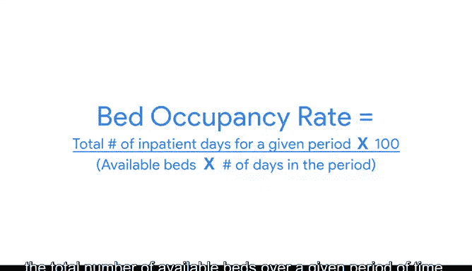

# 014：数学思维

在本节课中，我们将学习如何运用数学思维来解决问题。数学思维是一种强大的技能，它能帮助你分析问题并发现新的解决方案。我们将探讨数学思维的含义，以及如何开始运用它。

---

## 什么是数学思维？🧠

上一节我们介绍了数据可视化和指标，本节中我们来看看数学思维。运用数学方法并不意味着你必须突然成为数学专家。它意味着观察问题，并逻辑地将其分解为逐步的步骤，以便你能看到数据中的关系与模式，并利用这些来分析问题。

这种思维方式还能帮助你确定最适合的分析工具，因为它让你看到问题的不同方面，并选择最合理的分析方法。

---

## 选择分析工具时的考量因素🔧

选择最有用的分析工具时，需要考虑许多因素。

以下是决定使用哪种工具的一种方式：

*   **数据规模**：处理数据时，你会发现数据有大小之分。
    *   **小数据**：这类数据可能非常小，通常由在短而明确的时间段内与特定指标相关的数据组成，例如你一天喝了多少水。小数据可用于日常决策，比如决定多喝水，但它对业务运营等更大的框架影响不大。刚开始时，你可能会使用电子表格来组织和分析较小的数据集。
    *   **大数据**：另一方面，大数据具有更大、更不具体的数据集，覆盖更长的时间段。它们通常需要被分解才能进行分析。大数据有助于审视大规模的问题，并帮助公司做出重大决策。处理这种规模的数据时，你可能会转向使用 SQL。

---

## 数学思维应用实例🏥

让我们看一个例子，看看在医院工作的数据分析师如何运用数学思维和正确的工具来解决问题。

医院可能发现存在床位使用过度或不足的问题。基于此，医院可以将床位优化设为目标。他们希望确保需要床位的患者有床位可用，但又不浪费医院在维护空床位上的空间或金钱等资源。

运用数学思维，你可以将这个问题分解为逐步的过程，以帮助你在数据中发现模式。

这个场景中有很多变量，但为了简化，我们先关注几个关键变量。

以下是与此问题相关、可能显示数据模式的指标：

*   一段时间内**开放的床位数量**。
*   一段时间内**使用的床位数量**。

实际上，这已经有一个公式，称为**床位占用率**。它的计算使用给定时间段内的**总住院天数**和**总可用床位数**。

**公式：床位占用率 = (总住院天数 / 总可用床位数) × 100%**

我们现在要做的是，提取关键变量，并观察它们之间的关系如何向我们展示可以帮助医院做出决策的模式。

为此，我们必须选择适合此任务的工具。

医院在很长一段时间内会产生大量的患者数据。因此，从逻辑上讲，一个能够处理大数据集的工具是必需的。**SQL** 是一个很好的选择。

在这种情况下，你发现医院总是有未使用的床位。了解到这一点，他们可以选择减少一些床位，从而节省空间和资金，这些资源可以用于购买和储存防护设备。

通过逻辑地考虑这个问题的所有独立部分，数学思维帮助我们看到了新的视角，从而找到了解决方案。

---

## 课程总结✨

本节课中我们一起学习了如何运用数学思维进行问题解决。我们了解到，数学思维是一种逻辑分解问题、发现数据模式的方法，它不要求你是数学专家，但能帮助你选择正确的分析工具（如针对小数据的电子表格或针对大数据的SQL）。通过一个医院床位优化的实例，我们看到了如何将实际问题转化为可分析的指标和公式，并最终得出有效的解决方案。

---

接下来，我们将开始学习电子表格基础知识。这将帮助你将所学知识付诸实践，并掌握一个在数据分析过程中有用的新工具。

我们下次见。