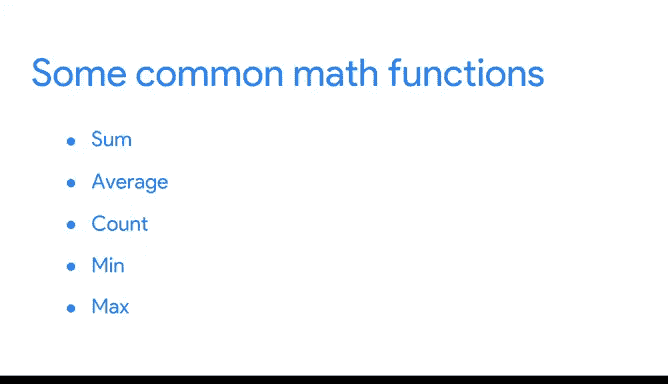

# 015：谷歌数据分析师课程第二课《以数据驱动的决策提出问题》 📊

## 第15讲：强大的电子表格 💪

在本节课中，我们将重新审视电子表格这一工具。电子表格功能强大且用途广泛，是数据分析师几乎所有工作的核心组成部分。当你尝试回答数据驱动的问题时，电子表格很可能是你首先使用的工具。

因此，在你明确了需要用数据做什么之后，你将借助电子表格来构建证据，进而将其可视化并用于支持你的发现。电子表格通常是数据世界中默默无闻的英雄，它们并不总能得到应有的赞赏。但作为一名数据侦探，你绝对会希望将它们纳入你的证据收集工具箱。

我知道电子表格不止一次帮我解决了大问题。我曾将采购订单数据添加到表格中，在一个工作表里设置好公式，然后让相同的公式在其他工作表中为我完成工作。这为我节省了时间，让我可以在白天处理其他事务。我无法想象不使用电子表格会怎样。

数学是每位数据分析师工作的核心部分，但并非每位分析师都喜欢它。幸运的是，电子表格可以让计算变得更有趣，我的意思是更简单。让我们看看它是如何做到的。

上一节我们介绍了电子表格的重要性，本节中我们来看看它如何进行计算。

电子表格可以自动执行基本和复杂的计算。这不仅有助于你更高效地工作，还能让你看到结果并理解其由来。以下是你执行计算时会用到的一些函数。

*   **SUM**: 对一系列单元格中的数值求和。
*   **AVERAGE**: 计算一系列单元格中数值的平均值。
*   **COUNT**: 计算包含数字的单元格数量。
*   **MAX**: 找出一系列单元格中的最大值。
*   **MIN**: 找出一系列单元格中的最小值。

许多函数也可以作为数学公式的一部分使用。

函数和公式还有其他用途，我们也将探讨这些。我们将通过使用来自数据库的真实数据进行练习，将学习更进一步。这是你重组电子表格、进行实际数据分析并享受数据乐趣的机会。

本节课中我们一起学习了电子表格在数据分析中的核心作用，特别是其强大的自动计算功能。通过掌握基本函数，你可以更高效地处理数据，为后续的可视化和决策支持打下坚实基础。