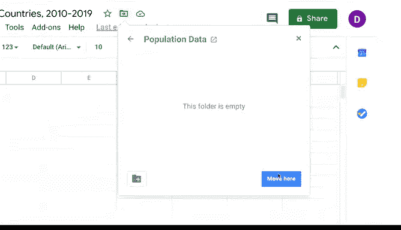

# 017：基础电子表格操作

在本节课中，我们将学习如何利用电子表格进行基础数据整理与操作。电子表格不仅是组织数据的强大工具，还能帮助我们高效执行计算任务。接下来，我们将通过实际步骤，演示数据分析师常用的电子表格基础功能。

---

## 🚀 开始创建电子表格

上一节我们介绍了电子表格在数据整理中的重要性，本节中我们来看看如何从零开始创建一个电子表格。

作为数据分析师，您可能不会总是从空白表格开始工作，但掌握创建方法仍然很有必要。

以下是创建新电子表格的步骤：

1.  打开 Excel、Google Sheets 或其他您使用的电子表格软件。
2.  选择新建一个空白文件。

打开新表格后，第一件事是为其命名。一个专业建议是：标题应**简短、清晰**，并能准确说明表格中的数据内容。这能极大方便后续的文件查找。

为电脑创建一个专门存放电子表格及相关文件的文件夹，也能帮助您更轻松地管理文件。对于本例，我们的文件已保存在云端硬盘中。我们打开“文件”菜单，点击“移动”，然后创建一个名为“人口数据”的新文件夹，并将电子表格移动至此。

这样，我们的表格就有了专属位置。当您需要查找此文件时，这将为您节省大量不必要的点击和时间。

---

## 📥 获取与导入数据

数据分析师获取数据的途径多种多样，具体取决于工作需求。您可能会使用开源数据、被分配数据，或被要求自行寻找数据。在本课程后续部分，您将体验到所有这些方式。

网络上有许多向公众开放的**开源数据源**。例如，我们将使用来自世界银行（Worldbank.org）的数据，这些数据已经以电子表格形式提供。该数据显示了2010年至2019年拉丁美洲和加勒比地区国家的人口数据。

让我们打开这个电子表格。

---

## 🧹 整理数据以备分析

现在，是时候为数据分析做准备了。我们将从选择整个工作表开始。

为了让数据更清晰地显示，我们可以通过拖动某一列的边界来加宽所有列。之后，再根据需要调整个别列宽。当然，加宽列还有其他方法，但目前这种方法就足够了。

电子表格的**第一行用于存放数据属性或变量**，其本质是为每列的数据类型添加标签。为了让属性行与其他行区分开来，我们可以选中它并填充颜色，同时将标签加粗。

如果需要在两个现有属性之间添加新的数据属性，我们随时可以插入新列。只需点击任意列中的一个单元格，然后使用“插入”菜单添加新列即可。新列将出现在您最初点击的列旁边，操作非常简单。

删除列同样简单：右键单击要删除列中的任意单元格，选择删除选项即可。

> **请注意**：我们演示的步骤可能因您使用的电子表格程序而异，但大体上应该相似。

让我们再为数据表添加一项内容：**边框**。边框可以帮助您更清晰地查看每个数据单元格。要添加边框，首先点击表格左上角的“全选”按钮（这个按钮很实用，因为当您需要对工作表中所有单元格进行更改时，都可以点击它），然后点击菜单中的边框按钮，选择您想要的边框类型。

为了保持表格格式统一，我们选择为所有单元格添加边框。

就这样，我们的表格从原始状态变得精致起来。现在，我们的电子表格不仅填满了数据，而且看起来也更加美观。在开始分析前使用这些整理工具，能帮助您在分析过程中更专注于数据本身。

---

## 📝 总结

本节课中，我们一起学习了电子表格用于整理数据的一些基本方法。您现在应该已经准备好开始亲自操作电子表格了。在后续课程中，您将了解更多关于电子表格的知识，包括一些常见错误及其解决方法。