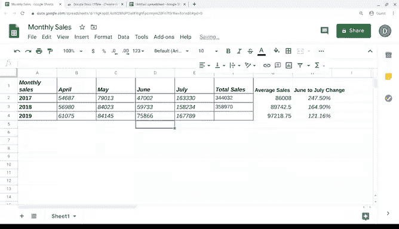

# 018：谷歌数据分析师课程第二课《以数据驱动的决策提出问题》 📊

## 第18讲：成功公式

在本节课中，我们将学习如何在电子表格中进行计算。你将掌握使用公式进行求和、求平均值、寻找最大值和最小值等基本操作，并通过一个销售数据分析的实例来巩固所学知识。

---

### 公式基础

上一节我们介绍了如何整理数据，使其为分析做好准备。本节中，我们来看看如何利用公式进行计算。

公式是一组执行特定计算的指令。在数据分析中，公式能自动为你完成数学运算，其功能远不止于此，你将在后续的分析过程中学习其更多用途。

公式基于运算符构建。运算符是用于命名要执行的操作或计算类型的符号。例如，加号 `+` 就是一个常见的运算符。数据分析中使用的公式通常至少包含一个运算符。

### 数学表达式

数学表达式或方程可以有很多种形式，你可能已经对它们很熟悉了。

以下是表达式的例子：
*   `3 - 1`
*   `15 + 8 / 2`
*   `846 * 513`

在数学课上，你很可能学过通过包含等号和结果来完成一个表达式。但在电子表格中创建公式时，情况略有不同：**你用一个等号 `=` 来开始公式**。

例如，如果我们想进行减法运算，我们输入一个等号，然后输入表达式的其余部分，公式中不能有任何空格。

现在，让我们尝试一个更具挑战性的表达式。我们输入：
`=317982 - 17795`
然后按回车键进行计算。

在处理大数字或多步骤的表达式时，你很可能会以这种方式使用公式。

以下是完成公式所需的运算符：
*   **加号 `+`** 用于加法。
*   **减号或连字符 `-`** 用于减法。
*   **星号 `*`** 用于乘法。
*   **正斜杠 `/`** 用于除法。

除法和乘法的符号可能与你习惯的不同。这些是小变化，但很重要，需要记住。

### 单元格引用

如果你的电子表格中已有数据，你可以在公式中使用**单元格引用**，而不是直接输入数字。

单元格引用是工作表中可以在公式中使用的单个单元格或单元格区域。单元格引用包含数据所在列的字母和行的编号。

单元格区域是两个或更多单元格的集合。一个区域可以包括同一行或同一列的单元格，也可以包括不同列和行组合在一起的单元格。我们将在后续视频中展示一个例子。

### 实践：销售数据分析

现在，让我们将刚刚学到的知识应用到一些销售数据中。

假设我们想将这些数字相加，以找到第一行数据的总销售额。你可以点击单元格 F2。

从那里，我们以一个等号开始，并使用单元格引用来输入表达式中的值。我们从单元格 B2 开始，因为 A2 中的年份不是我们想加到总额中的值。

公式如下：
`=B2 + C2 + D2 + E2`
然后按回车键。就这样，你的总销售额就计算出来了。

但是，如果你发现数据中某个值是错误的怎么办？没问题。你可以更改公式中使用的任何单元格的值，总额将自动更新。

使用单元格引用的一个巨大好处是，当公式被复制到新单元格时，它们也会自动更新。这节省了大量时间。因此，无需为每一组新的单元格引用再次输入相同的公式，只需使用菜单或键盘快捷键（如 `Ctrl + C`）复制公式，然后使用 `Ctrl + V` 将其粘贴到你想应用的地方。公式会自动更新所有新的单元格和值。

### 计算平均值

现在，假设你还想计算平均销售额。你可以在另一个单元格中创建一个新公式。

要在公式中对值进行分组，请使用括号 `()`。这能让你的电子表格知道哪些值要一起计算，以及要执行的操作顺序。

例如，要计算平均值：
`=(B2 + C2 + D2 + E2) / 4`
你正在将四个单元格中的值相加，然后使用斜杠 `/` 将总和除以四。和上一个公式一样，我们可以复制并粘贴这个公式。

### 计算百分比变化

如果你想计算六月和七月之间销售额的百分比变化，可以使用另一个公式。

公式如下：
`=(C2 - B2) / B2`
公式计算出值后，你可以使用百分比按钮将该值更改为百分比格式。当你将此公式应用到其他行时，公式和百分比格式都会自动更新。

### 处理错误

哦，这看起来不像正确答案。我们好像遇到了一个错误。别担心，错误可能发生在数据分析的任何阶段，包括使用电子表格时。公式必须是严密的，如果某个单元格引用有问题，它就无法工作。

那么我们的错误是什么？我们可以看到，单元格 D4 中的值缺失了。你可能需要花一些时间并查找资料来找到正确的值，但这是值得的，因为你希望你的分析尽可能准确。当你添加了正确的值后，公式会自动处理其余的计算。

---

### 总结

本节课中，我们一起学习了电子表格中公式的基础知识。我们介绍了运算符、数学表达式、单元格引用的概念，并通过销售数据实例实践了求和、求平均值以及计算百分比变化。我们还学习了如何复制公式以提高效率，以及如何处理公式中可能出现的错误。掌握这些技能将使你的分析更高效，工作更轻松。很快，你就可以在自己的电子表格中应用这些知识了。祝你使用愉快！