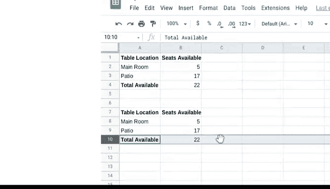

# 019：电子表格错误与修复


在本节课中，我们将学习如何识别和修复电子表格中常见的公式错误。掌握这些技巧对于数据分析师至关重要，因为错误排查是数据分析工作的重要组成部分。

## 🔍 常见错误类型与修复方法

上一节我们介绍了电子表格公式的基础知识，本节中我们来看看几种常见的错误类型及其解决方法。

### 1. #DIV/0! 错误

当公式试图用某个单元格的值除以0或空单元格时，就会出现#DIV/0!错误。

以下是一个示例：在电子表格中，C列的“完成百分比”是通过将“已完成任务”列的值除以“所需任务”列的值来计算的。C列已格式化为百分比。

```excel
#DIV/0! 错误出现在单元格C4，因为我们除以了0，即单元格A4中的值。
```

为避免此问题，我们可以让电子表格在A列包含0时自动输入“不适用”，从而避免错误。

为此，我们使用`IFERROR`函数。如果遇到因单元格包含0而导致的错误，将插入短语“不适用”。我们还可以将公式复制到C列的其余单元格，以检查其他包含零的单元格。

### 2. #ERROR! 错误

在Google Sheets中，#ERROR!告诉我们公式无法按输入的方式被解释。这也称为解析错误。

假设我们想统计B列和C列的总任务数，我们使用`SUM`函数。但公式`=SUM(B2:B6 C2:C6)`会导致#ERROR!。

仔细检查后，我们发现单元格范围`B2:B6`和`C2:C6`之间缺少一个逗号。我们可以通过在单元格范围之间插入逗号来修复此问题，以指示每个数据项的结束。这称为分隔符。

现在，公式可以正确计算出总任务数为25。

### 3. #N/A 错误

#N/A错误表示电子表格无法找到公式中的数据。通常，这意味着数据不存在。此错误最常在使用`VLOOKUP`等函数时发生，该函数在列中搜索特定值以返回相应的信息。

这里我们看到一个坚果及其价格的主列表。使用`VLOOKUP`，电子表格在列表中查找价格，然后使用指定的加价计算每家商店的价格。但我们在单元格B49和C49中遇到了#N/A错误。`VLOOKUP`公式是正确的。

那么问题出在哪里？如果我们仔细查看坚果的名称，“almond”在查找表中没有匹配项。查找表使用的是复数形式“almonds”。因此，我们将“almond”改为“almonds”，修复了这个拼写错误后，正确的价格就被填入了。

### 4. #NAME? 错误

有时，拼写错误会导致#NAME?错误。当公式的名称未被识别或理解时，就会发生#NAME?错误。

假设我们在净价电子表格中看到一个#NAME?错误。如果我们仔细观察，单元格B21中的`VLOOKUP`函数拼写错误，多了一个“O”。这导致商店的价格和加价计算都出现了#NAME?错误。

要修复此错误，我们可以删除`VLOOKUP`中多余的“O”。

### 5. #NUM! 错误

有时，错误是由不一致或错误的数据引起的。例如，#NUM!错误告诉我们无法按照数据指定的方式执行公式计算。数据对该计算没有意义。

假设我们正在处理一个大型建筑项目，并使用电子表格跟踪达到关键里程碑所需的月数。我们可以使用`DATEDIF`函数计算开始日期和结束日期之间的月数。

该函数要求开始日期位于第一个引用的单元格中，结束日期位于第二个引用的单元格中。在我们的例子中，分别是单元格B2和C2。“M”代表月份，因为我们希望电子表格计算开始日期和结束日期之间的月数。

但我们在单元格D6中得到了#NUM!错误。我们注意到结束日期在开始日期之前，因此`DATEDIF`函数无法计算两者之间的月数。很可能是开始日期和结束日期被意外互换了。

我们可以请求验证数据以确保正确。同时，让我们反转公式中单元格的顺序以暂时绕过错误。现在，结果是9个月。

### 6. #VALUE! 错误

如果客户的名字被意外插入到电子表格的开始日期中会怎样？我们得到了#VALUE!错误。#VALUE!错误可能表示公式或引用单元格存在问题。通常，问题并不立即明确，因此修复此错误可能需要更多努力。

在这种情况下，“John Wety”被输入为开始日期，使得`DATEDIF`函数在单元格D6中无法进行计算。因此，我们只需将文本“John Wety”替换为正确的开始日期“2016年9月1日”。

### 7. #REF! 错误

最后是#REF!错误，当公式中引用的单元格已被删除时，经常会出现此错误，从而使公式无法执行计算。

这是一个用于计算公司午餐可用座位数的电子表格。假设公司决定不开放二楼，因此我们删除了第4行。这导致在计算单元格B5中的总可用座位数时出现#REF!错误。

要修复此问题，我们可以将公式更改为添加单元格B2和B3中的值。此外，在这种情况下，我们可以通过使用`SUM`函数和单元格范围，而不是通过直接引用添加单元格值，来防止#REF!错误。

现在，如果我们删除第10行，`SUM`函数会计算总可用座位数。

## 📝 总结




本节课中我们一起学习了电子表格中七种常见的公式错误：#DIV/0!、#ERROR!、#N/A、#NAME?、#NUM!、#VALUE!和#REF!。我们了解了每种错误的含义、常见原因以及相应的修复方法。错误排查是数据分析的重要组成部分，因此能够找到解决方案是数据分析师的一项关键技能。当你再次看到这些错误时，你将知道它们的含义以及如何处理。