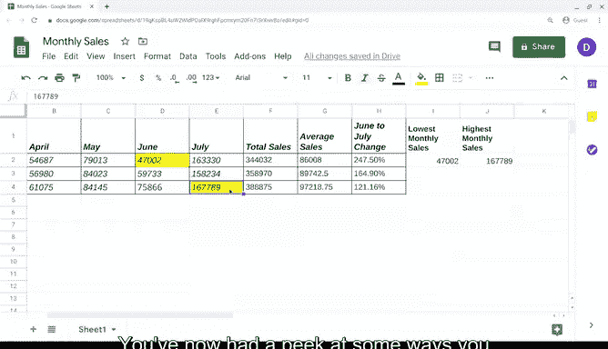

# 020：谷歌数据分析师第二课《以数据驱动的决策提出问题》- 函数入门 📊


在本节课中，我们将学习电子表格中函数的基本概念和应用。函数是预设的命令，能自动对数据执行特定计算或任务，是提升数据分析效率的强大工具。我们将通过实际销售数据的例子，演示几个常用函数的使用方法。

---

## 什么是函数？ 🤔

上一节我们介绍了公式，本节中我们来看看函数。在电子表格的世界里，函数是一种预设命令，它能自动使用数据执行特定的过程或任务。你可以把函数看作是最有用的快捷方式。好消息是，很多电子表格函数的名称直接表明了它们的功能。

随着你不断使用电子表格，你会发现某些函数会经常使用，而另一些则很少或根本不用。

---

## 应用函数：计算总销售额 💰

现在，让我们看看如何将函数应用到上一视频的销售数据中。我们将从计算总销售额开始。

我们将使用 **`SUM`** 函数。操作步骤如下：

1.  选择希望显示计算结果的单元格（例如 `F2`）。
2.  输入等号 `=`。
3.  输入函数名 `SUM`。
4.  输入开括号 `(`。
5.  选择要相加的单元格范围（例如 `B2:E2`）。冒号 `:` 表示一个范围。
6.  输入闭括号 `)`，然后按回车。

**代码示例：**
```excel
=SUM(B2:E2)
```
按回车后，总销售额就会显示出来。

与公式一样，函数也可以复制粘贴到同一列的其他单元格中。

---

## 使用填充柄快速复制 📋

除了复制粘贴，电子表格还有一个名为“填充柄”的工具。当你点击一个单元格时，其右下角会出现一个小方框，这就是填充柄。

以下是使用填充柄的方法：
*   将光标悬停在填充柄上。
*   按住并拖动到同一行或同一列的其他单元格。
*   原单元格中的任何公式或函数都会自动添加到被填充的单元格中。
*   填充柄会自动更新公式，使单元格引用与所填充单元格的行或列相匹配。

这意味着公式会基于每一行或每一列的独立数据进行计算。填充柄并非适用于所有情况，但它是一个非常实用的技巧。

---

## 计算平均值与百分比变化 📈

现在，让我们使用 **`AVERAGE`** 函数找出每个月的平均销售额。

不同的函数执行不同的计算，但它们的运作方式相同。请记住，并非你遇到的所有计算都有对应的函数来帮助你。

例如，要计算六月和七月之间的销售额百分比变化，你需要使用之前视频中学过的相同公式。

---

## 查找极值：最小与最大值 🔍

假设你需要找出数据集中的最低月销售额。有一个专门的函数，叫做 **`MIN`** 函数，代表最小值。

以下是它的工作原理。假设你需要找出整个数据集中的最低月销售额，你只需设置函数，然后在开括号后选择所有三行的数值。

**代码示例：**
```excel
=MIN(B2:E4)
```
这可能是你的利益相关者需要的重要信息，因此我们可以在数据集中为该数值所在的单元格添加颜色以突出显示。

操作步骤如下：
1.  点击包含该值的单元格（例如 `D2`）。
2.  点击“填充颜色”图标（看起来像一个油漆桶）。
3.  选择一种颜色，例如黄色。

你可以遵循相同的步骤，使用 **`MAX`** 函数来查找最高销售额。

---

## 排查常见错误 ⚠️

看起来我们收到了一条错误信息。可能出了什么问题？啊，我们忘记在函数后加上开括号了。别担心，这很容易修复。

但这提醒我们，在使用函数和公式时要持续检查其格式。我们将在后面学习更多关于错误信息以及如何处理它们的知识。



现在，我们也将为包含最高销售额的单元格添加颜色。这只是突出显示关键数据的一种方式，你稍后会了解到其他一些方法。

---

## 总结 🎯

本节课中，我们一起学习了电子表格中函数的基础知识。你初步了解了如何在电子表格中添加和组织数据，也看到了公式和函数在应用于真实世界数据时的强大力量。

作为数据分析师，这只是你使用电子表格经验的开始。你很快会发现电子表格能提供的功能远不止这些。在此期间，你可以自由练习这些公式、函数和其他操作。尝试探索电子表格的所有功能会很有趣。

接下来，我们将从电子表格转向结构化思维。数据分析的拼图正在一块块拼合起来，激动人心的内容即将到来，请继续关注。