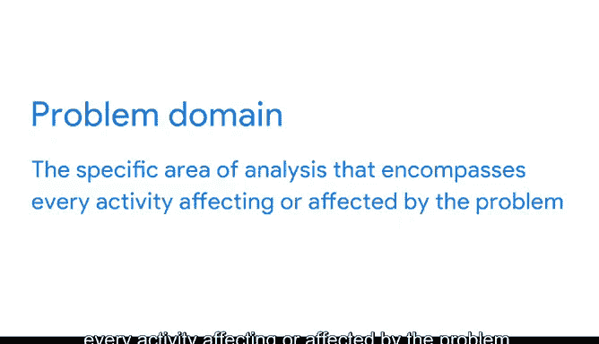

# 021：解决问题前先理解问题 🧩

在本节课中，我们将学习如何通过结构化思维来清晰定义问题。这是数据分析的第一步，也是确保后续所有工作方向正确的关键。

---

阿尔伯特·爱因斯坦曾说：“如果给我一小时来拯救地球，我会花59分钟定义问题，用1分钟解决它。” 这听起来或许有些极端，但它确实向我们展示了在尝试解决问题之前，清晰定义问题是多么重要。

很多时候，团队会直接跳入数据分析，几个月后才意识到他们要么在解决错误的问题，要么没有正确的数据。在本视频中，我们将学习如何建立一种结构化方法来定义问题领域。这一点至关重要，因为如果你从一开始就清晰地定义了问题，解决起来就会更容易，从而节省大量时间、金钱和资源。

在数据领域，我们称这第一步为“问题领域”，即分析中涵盖所有受问题影响或影响问题的活动的特定范围。

---

在开始任何其他工作之前，我们需要理解问题领域及其所有组成部分和相互关系，以便发现完整的情况。实际上，将其称为“第一块拼图”让我想到了拼图游戏。

假设你有一副拼图，让我们把这副拼图看作一个问题领域。你拥有全部500块拼图，但丢失了盒子，因此你不知道拼图最终会呈现什么图像。它会是一只动物、一处瀑布，还是一碗橙子？无论是什么，在没有参考图像的情况下试图将其拼凑起来都将非常困难。即使是银河系中最厉害的拼图高手，也需要新的方法和大量时间才能完成这副拼图。

数据分析师也面临着类似的挑战。你可能记得，在项目开始时，数据分析师并不总是能获得完整的图景。他们工作的一个重要部分是建立结构化方法并运用批判性思维来寻找最佳解决方案，而这始于理解问题领域。

---

这正是结构化思维发挥作用的地方。要作为一名数据分析师成功解决问题，你需要训练你的大脑进行结构化思考。这正是接下来你将学习的内容。

---

## 总结

本节课中，我们一起学习了定义问题领域的重要性。我们了解到，像爱因斯坦强调的那样，花时间清晰定义问题是高效解决问题的前提。通过将问题领域比作一副丢失了参考图的拼图，我们明白了在没有完整背景信息时进行分析的挑战。最后，我们认识到，结构化思维是数据分析师应对这些挑战、确保工作方向正确的核心能力。