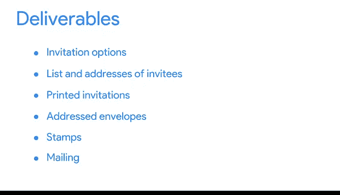

# 022：谷歌数据分析师第二课《以数据驱动的决策提出问题》 📊

## 第二讲：工作范围与结构化思维

在本节课中，我们将要学习如何通过定义清晰的工作范围和运用结构化思维来高效地解决问题，从而节省时间、金钱和资源，并确保数据分析工作的顺利进行。

---

### 结构化思维的价值

上一节我们探讨了如何提出有效的问题。本节中我们来看看如何通过结构化思维来组织和执行分析工作。

结构化思维是一个过程，它包括：识别当前的问题或状况，组织现有信息，揭示信息缺口与机会，并识别各种选项。换句话说，这是一种让你做好充分准备的方式。它意味着你有一份清晰的待交付成果清单、主要任务和活动的时间表，以及检查点，以便团队了解你的工作进展。

结构化思维不仅能帮助节省时间和精力，也让数据分析师的工作变得更轻松，因为它能让我们更好地理解正在执行的工作。

在商业环境中，团队常常花费大量宝贵时间试图解决一个重要问题，最终却可能回到起点。这不仅导致初始问题未能解决，还浪费了数小时的时间。这种结果对你、你的团队乃至整个组织都会产生负面影响。

然而，这种情况通常是可以避免的。很多时候，问题源于对议题的理解不够充分。结构化思维将帮助你在宏观层面理解问题，从而识别出需要深入调查和理解的领域。

结构化思维的起点是**问题域**。一旦你明确了分析的具体领域，就可以在开始调查之前，设定基础，并列出所有需求和假设。有了坚实的基础，你就能准备好应对任何可能出现的障碍。

### 可能遇到的障碍

那么，会遇到什么样的障碍呢？假设你被要求根据给定的数据预测一栋公寓楼的未来价值。你手头有数百个变量，每一个对你的分析都至关重要。但如果有一个变量（例如“平方英尺”）被意外遗漏了，你就必须回头重做所有辛苦的工作。这是因为缺失变量可能导致不准确的结论。

### 运用工作范围避免错误

实践结构化思维、避免错误的另一种方法是使用**工作范围**。工作范围是一份关于你将在项目中执行工作的、经双方同意的纲要。对许多企业而言，它包括工作细节、时间表和客户可以期待的交付报告等内容。

作为一名数据分析师，你的工作范围会更偏技术性。它会包含我们刚才提到的基本项目，但你还会重点关注诸如数据准备、验证、定量与定性数据集分析、初步结果，甚至可能包括一些可视化图表，以便更清晰地传达观点。

### 工作范围实例解析

让我们通过一个简单的例子让工作范围变得生动起来。假设一对夫妇雇佣了一位婚礼策划师。我们将只关注其中一项任务：婚礼请柬。

以下是工作范围可能包含的内容：

以下是工作范围的核心组成部分：

*   **交付成果**
*   **时间表**
*   **里程碑**
*   **报告**

让我们详细拆解其中一个交付成果。婚礼策划师和这对夫妇需要决定请柬样式、制作宾客名单、收集地址、打印请柬、填写信封、贴邮票并寄出。

现在，让我们看看时间表。你会注意到其中的日期和里程碑，它们确保我们按计划推进。

最后，我们还有报告。报告会告知这对夫妇每个步骤何时完成，让他们安心。

工作范围可以是一个简单但强大的工具。凭借一份扎实的工作范围，你能够预先解决关于数据的任何困惑、矛盾或疑问，并确保这些潜在的障碍不会阻碍你的进程。这是一个简单的工作范围示例，稍后你将有机会练习构建自己的。

---

### 总结与下节预告

本节课中我们一起学习了结构化思维的重要性，以及如何通过定义清晰的工作范围来规划数据分析项目、避免返工和资源浪费。一份好的工作范围是项目成功的基石。

接下来，我们将从另一个角度审视潜在障碍，学习**数据情境化**和**避免偏见**的重要性。期待与你分享更多精彩的见解。