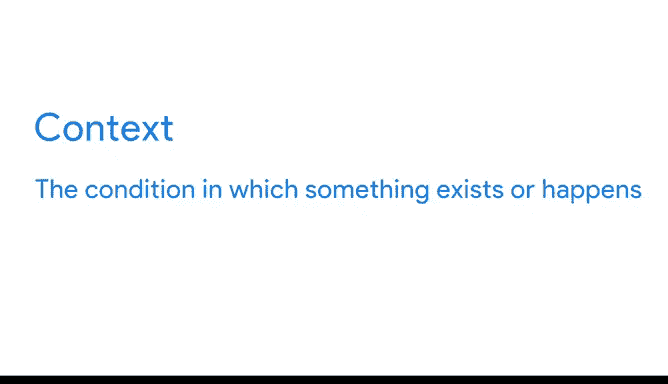
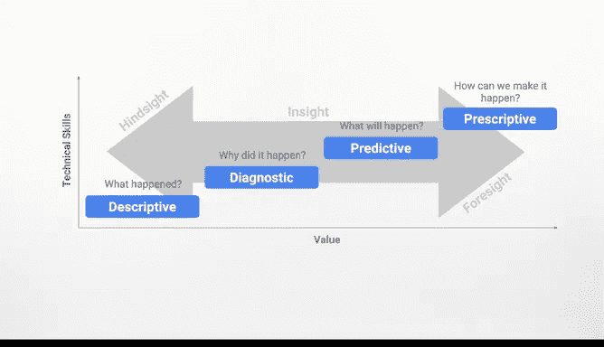

# 023：保持客观性 📊

在本节课中，我们将探讨数据情境化的重要性以及如何识别数据偏见。我们将学习如何将数据置于正确的背景中，并保持分析的客观性，从而得出准确的结论。

---

上一节我们介绍了数据驱动决策的基本概念，本节中我们来看看如何确保数据的客观性和情境化。

数据并非孤立存在，它总是存在于特定的情境中。我们之前了解到，情境是某物存在或发生的条件。因此，某些行为在一种情境下可能是合适的，但在另一种情境下可能就不合适。

例如，在一种情境下大喊“让开”可能显得粗鲁，比如当你的朋友正站在电视机前时。但在另一种情境下，这完全是恰当的，比如当那位朋友即将被一个骑三轮车的孩子撞到时。你看出区别了吗？😊

在数据世界中，没有情境的数字意义不大。随着我们可获得的数据越来越多，我们可以以日益复杂的方式利用这些数据，并从中产生更强大的见解。

我们可以在许多不同层面使用数据。有时我们的数据是描述性的，回答诸如“上个月我们在差旅上花了多少钱？”这样的问题。当我们能够生成诊断性和预测性见解时，数据就变得更有价值，例如理解为什么上个月的差旅支出增加了。然而，当我们能够生成规范性见解时，数据最有价值，例如“我们如何利用数据来激励更高效的差旅？”

弄清楚数据的含义与收集数据同等重要。作为数据分析师，你工作的一个重要部分就是将数据置于情境中。在得出结论之前，保持客观并认识到论点的所有方面也取决于你。

关于情境的一个特点是它非常个人化。如果两个人整理相同的数据集并遵循相同的指示，他们最终可能会得到不同的结果。为什么？因为不存在一套通用的情境解释，每个人都以自己的方式来处理。即使数据收集过程是正确的，分析仍然可能被误解。

结论可能会受到你自身意识和潜意识偏见的影响，这些偏见基于文化、社会和市场规范。例如，如果你问一个波士顿居民哪支棒球队是最好的，他们很可能会说是波士顿红袜队。这引出了数据分析的一个主要局限性：如果分析不客观，结论就可能具有误导性。

要真正理解数据的含义，你必须思考**谁、什么、哪里、何时、如何以及为什么**。最好问自己一些问题，例如：

以下是关于数据来源和背景的关键问题：
*   **谁**收集了数据？数据是关于**什么**的？
*   数据在现实中代表什么？它与其他数据有何关联？
*   **何时**收集的数据？鉴于当前情况，一段时间前收集的数据可能存在某些局限性。例如，如果我们收集了过去一个世纪的电话号码，在某个时间点移动电话被引入，导致需要额外的电话号码字段。
*   你还应该思考数据是在**哪里**收集的？法律可能因城市、州和国家而异。以及数据是**如何**收集的？例如，调查可能不如面对面访谈有效。
*   当然还有**为什么**。“为什么”可能与偏见有特别强烈的关系。因为有时数据是为了服务于某个议程而被收集，甚至是被编造出来的。

为了确保数据的公平性和准确性，你能做的最好的事情就是确保你从一个准确的人群代表开始，并以最合适、最客观的方式收集数据。这样，你就能获得可以传递给团队的事实。

---

本节课中我们一起学习了数据情境化的关键作用以及识别和避免偏见的重要性。我们了解到，没有背景的数据可能产生误导，而客观的分析对于得出可靠结论至关重要。通过思考“谁、什么、哪里、何时、如何、为什么”，我们可以更好地理解数据，确保分析的公平与准确。

接下来，我们将探讨如何让数据“活”起来。