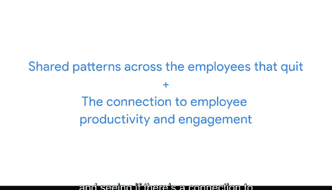

# 025：平衡团队需求与期望 📊

在本节课中，我们将学习如何平衡团队中不同成员的需求与期望。作为数据分析师，理解并满足利益相关者的期望是项目成功的关键。我们将探讨利益相关者期望的重要性，并通过一个具体案例来展示如何在项目中协调各方需求。

---

## 什么是利益相关者？ 👥

上一节我们介绍了数据驱动决策的基本概念，本节中我们来看看项目中的关键角色——利益相关者。

利益相关者是指那些在数据分析师所参与的项目中投入了时间、兴趣和资源的人。换句话说，他们在你所做的事情中持有“利益”。他们很可能需要你的工作成果来完成他们自己的任务。因此，确保你的工作符合他们的需求，并与团队中的所有利益相关者进行有效沟通，至关重要。

利益相关者通常会希望讨论以下内容：
- 项目目标
- 达成目标所需的资源
- 你遇到的任何挑战或顾虑

这些对话有助于在你的工作中建立信任和信心。

---

## 项目中的多层次需求 🎯

以下是项目中不同层级的团队成员可能对你的需求：

想象你是一家公司人力资源部门的数据分析师。该公司员工流失率（即员工离职率）有所上升。人力资源部门希望了解原因，并请你帮助找出潜在的解决方案。

**人力资源副总裁**：关注识别离职员工的共同模式，并查看这些模式是否与员工生产力和参与度有关。作为数据分析师，你的工作是专注于人力资源部门的问题并帮助他们找到答案。但副总裁可能太忙，无法管理日常任务，或者可能不是你的直接联系人。

**项目经理**：你将更定期地向项目经理汇报。项目经理负责规划和执行项目，他们的部分工作是确保项目按计划进行并监督整个团队的进展。在大多数情况下，你需要定期向他们提供更新，告知他们你需要什么才能成功，并告诉他们你是否遇到任何问题。

**其他团队成员**：例如，人力资源管理员需要知道你使用的指标，以便他们设计有效收集员工数据的方法。你可能还会与其他负责数据不同方面的数据分析师合作。

了解项目中的利益相关者和其他团队成员非常重要，这样你才能有效地与他们沟通，并为他们提供在项目中推进各自角色所需的信息。

---

## 案例：协调需求与交付成果 🔄

回到我们的例子，通过分析公司数据，你发现员工在公司工作13个月后，参与度和绩效有所下降。这可能意味着员工开始感到缺乏动力或与工作脱节，然后在几个月后经常离职。

另一位专注于招聘数据的分析师也分享说，公司在18个月前大幅增加了招聘。你将此信息与所有团队成员和利益相关者沟通，他们就如何与副总裁分享此信息提供了反馈。

最终，你的副总裁决定实施一项深入的管理层检查，针对即将在公司工作满12个月的员工，以识别职业发展机会。这从第13个月开始降低了员工流失率。

这只是一个如何平衡团队需求和期望的例子。你会发现，在你作为数据分析师参与的几乎每个项目中，从人力资源副总裁到你的数据分析师同事，团队中的不同人员都需要你的专注和沟通，才能将项目推向成功。

---

## 总结与展望 🌟

本节课中我们一起学习了平衡团队需求与期望的重要性。专注于利益相关者的期望将帮助你理解项目目标，在团队中更有效地沟通，并在你的工作中建立信任。

接下来，我们将讨论如何确定你在团队中的定位，以及如何以专注和决心帮助推动项目前进。