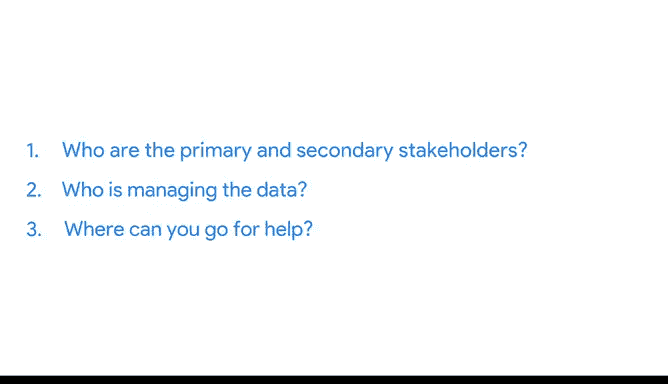

# 026：聚焦关键事项 🎯

在本节课中，我们将学习如何在处理多个利益相关者和团队成员的需求时，保持对项目目标的专注。我们将探讨三个核心问题，帮助你在复杂项目中高效工作，避免分心。

---

上一节我们介绍了在团队中平衡各方需求的重要性。本节中，我们来看看如何在实际工作中保持对核心目标的专注。

当与许多需求不同、意见各异的同事合作时，保持专注可能具有挑战性。但在每个任务开始时，通过问自己几个简单的问题，你可以确保在平衡利益相关者需求的同时，始终聚焦于目标。

让我们回顾上一视频中的员工流失率案例。在那个案例中，我们需要与许多不同的团队成员和利益相关者打交道，例如经理、行政人员，甚至其他分析师。作为数据分析师，你会发现平衡每个人的需求有时会有些混乱。但你的部分工作就是透过纷扰，保持对目标的专注。

专注于重要事项而不分心至关重要。作为数据分析师，你可能同时参与多个项目，与许多人合作。但无论你正在处理哪个项目，关注以下三点将帮助你保持任务专注：

以下是三个帮助你保持专注的核心问题：

1.  **主要和次要利益相关者是谁？**
2.  **谁在管理数据？**
3.  **遇到困难时可以向谁求助？**

让我们尝试将这些问题应用到我们的示例项目中。

---

**第一个问题：识别利益相关者**

这个项目的主要利益相关者可能是人力资源副总裁，他希望通过本项目的发现来制定新的公司政策决策。

你还需要向你的项目经理、团队成员或依赖你的工作来完成其任务的其他数据分析师汇报进展。这些是你的次要利益相关者。

在每个项目开始时，花时间识别你的利益相关者及其目标。然后，了解团队中还有哪些成员以及他们的角色是什么。

---

**第二个问题：明确数据管理者**

接下来，你需要询问谁在管理数据。例如，考虑与本项目中的其他分析师合作。你们都是数据分析师，但可能在项目中管理不同的数据。

在我们的例子中，有另一位数据分析师专注于管理公司的招聘数据。他关于18个月前搜索和招聘情况的见解，最终成为你分析的关键部分。如果你没有与此人沟通，你可能需要花费大量时间自行收集或分析招聘数据，甚至可能根本无法将其纳入你的分析。

相反，你能够与另一位数据分析师沟通你的目标，并利用现有的工作成果来丰富你的分析。

通过了解谁在管理数据，你可以更高效地利用时间。

---

**第三个问题：确定求助渠道**

接下来，你需要知道在需要帮助时可以去找谁。这是你在开始任何项目时都应该了解的事情。如果在完成任务的过程中遇到障碍，你需要知道谁能最好地帮你扫清这些障碍。

当你知道谁能提供帮助时，你将花更少的时间担心项目的其他方面，而将更多的时间专注于目标。

那么，如果在这个项目中遇到问题，你可以找谁呢？项目经理通过管理项目时间表、提供指导和资源以及建立高效的工作流程来支持你和你的工作。他们对项目有宏观的把握，因为他们知道你和其他团队成员在做什么。这使他们成为你遇到问题时的绝佳资源。

在员工流失率的例子中，你需要能够访问员工离职调查数据以纳入你的分析。如果你在获取该数据的访问权限时遇到困难，可以与你的项目经理沟通，让他帮你扫清障碍，以便你继续推进项目。

---

你的团队依赖你专注于自己的任务，以便作为一个团队共同找到解决方案。通过在开始新项目时问自己这些简单的问题，你将能够满足利益相关者的需求，对数据管理者有清晰的了解，并在需要时获得帮助，从而让你能够“紧盯目标”——即项目目标。

---

本节课中，我们一起学习了在团队协作中保持专注的三个关键问题：识别利益相关者、明确数据管理者以及确定求助渠道。通过应用这些方法，你可以更有效地管理复杂项目，确保工作始终围绕核心目标展开。

接下来，我们将探讨一些成为更有效沟通者的实用方法，以确保团队能够达成其目标。